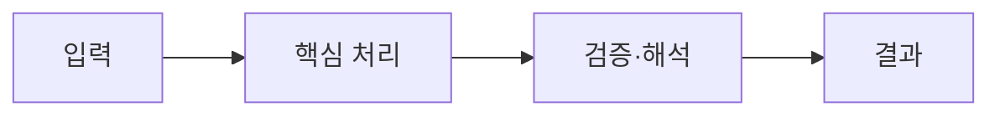

> [!abstract] 한 줄 요약
> 스트리밍 알고리즘은 디스크에 모두 저장하거나 반복 접근하기 어려운 입력을 한 번의 흐름에서 요약·일반화한다. 핵심은 ==입력·계산·결과의 연결==을 분명히 구분하는 데 있다.

## 핵심 구조

스트림은 언제 종료되는지 모를 수 있고 빠르게 시스템에 도착한다. 저장·반복 접근이 비실용적일 때 일반화와 요약이 핵심 질문이 된다. 강의는 O(N) 처리와 single pass, sampling을 주요 주제로 든다.

<Tabs>
  <Tab label="입력">
  스트림은 언제 종료되는지 모를 수 있고 빠르게 시스템에 도착한다.
  </Tab>
  <Tab label="처리">
  저장·반복 접근이 비실용적일 때 일반화와 요약이 핵심 질문이 된다.
  </Tab>
  <Tab label="결과">
  강의는 O(N) 처리와 single pass, sampling을 주요 주제로 든다.
  </Tab>
</Tabs>



> [!important] 먼저 확인할 점
> 저장·반복 접근이 비실용적일 때 일반화와 요약이 핵심 질문이 된다. 따라서 도구 이름만으로 결과를 판단하지 않고, 어떤 입력을 어떤 규칙으로 바꾸는지 추적해야 한다.

```html preview h=150
<div style="font-family:system-ui,sans-serif;padding:16px;color:var(--foreground);background:var(--card);border:1px solid var(--border);border-radius:var(--radius)">
  <div style="font-size:15px;font-weight:700;margin-bottom:9px">07. 스트리밍 알고리즘의 학습 흐름</div>
  <svg viewBox="0 0 720 78" width="100%" role="img" aria-label="독자 제작 학습 흐름 도식"><g font-family="system-ui,sans-serif" text-anchor="middle"><rect x="18" y="17" width="155" height="42" rx="9" fill="var(--card)" stroke="var(--border)"/><rect x="283" y="17" width="155" height="42" rx="9" fill="var(--card)" stroke="var(--border)"/><rect x="548" y="17" width="155" height="42" rx="9" fill="var(--card)" stroke="var(--border)"/><path d="M185 38h84M450 38h84" stroke="var(--muted-foreground)" stroke-width="3"/><text x="95" y="43" font-size="13" fill="currentColor">관찰</text><text x="360" y="43" font-size="13" fill="currentColor">변환</text><text x="625" y="43" font-size="13" fill="currentColor">해석</text></g></svg>
</div>
```

<details>
<summary>강의 자료에서 이 흐름을 읽는 법</summary>

자료의 표현처럼 record가 들어오고 처리된 뒤 사라지는 흐름에서는 전체 데이터를 다시 읽는 전략을 기본값으로 둘 수 없다.

</details>

## 실무적 선택

저장·반복 접근이 비실용적일 때 일반화와 요약이 핵심 질문이 된다. 이 선택은 속도, 메모리, 반복 가능성 또는 해석 가능성처럼 무엇을 우선하는지에 따라 달라진다.

```html preview h=154
<div style="font-family:system-ui,sans-serif;padding:16px;color:var(--foreground);display:flex;gap:10px;flex-wrap:wrap">
<div style="flex:1;min-width:150px;padding:13px;border:1px solid var(--chart-1);border-radius:var(--radius)"><b>입력 조건</b><br><span style="font-size:12px;color:var(--muted-foreground)">무엇이 주어졌는가</span></div>
<div style="flex:1;min-width:150px;padding:13px;border:1px solid var(--chart-3);border-radius:var(--radius)"><b>처리 규칙</b><br><span style="font-size:12px;color:var(--muted-foreground)">어떻게 바꾸는가</span></div>
<div style="flex:1;min-width:150px;padding:13px;border:1px solid var(--chart-2);border-radius:var(--radius)"><b>확인 결과</b><br><span style="font-size:12px;color:var(--muted-foreground)">무엇을 검증하는가</span></div>
</div>
```

> [!note] 범위 점검
> 배치와 스트림 처리는 입력의 종료·저장·재접근 가능성이 다르므로 같은 알고리즘 가정을 그대로 적용하지 않는다.

<details>
<summary>학습 체크리스트</summary>

1. 입력이 무엇인지 적는다.
2. 핵심 변환 또는 계산 규칙을 적는다.
3. 결과가 어떤 의사결정이나 확인에 쓰이는지 적는다.

</details>

> [!success] 핵심 정리
> 스트리밍 알고리즘은 디스크에 모두 저장하거나 반복 접근하기 어려운 입력을 한 번의 흐름에서 요약·일반화한다.

### 스스로 점검

**Q.** single pass가 필요한 조건은 무엇인가?

**A.** 입력이 계속 오거나 저장·반복 접근이 비실용적이어서 데이터를 한 번만 처리해야 할 때다.
