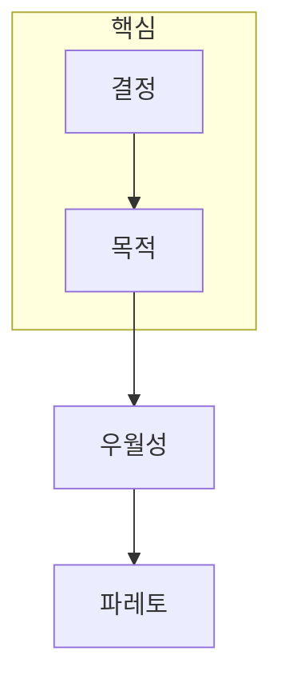

> [!abstract] 한 줄 요약
> 다목적 최적화에서는 하나의 최고점 대신, 다른 목적을 악화시키지 않고 개선할 수 없는 ==파레토 해 집합==을 찾는다.

## 이 노트의 지도



## 1. 여러 목적은 한 숫자로 바로 비교되지 않는다

다목적 문제는 여러 목적 함수를 동시에 최소화하거나 최대화한다. 한 해가 다른 해보다 모든 목적에서 나쁘지 않고 적어도 하나에서 더 좋을 때 우월하다고 하며, 우월되지 않는 해들이 파레토 집합을 이룬다.

$$
\min_{\mathbf{x}}\ \mathbf{f}(\mathbf{x})=
[f_1(\mathbf{x}),\ldots,f_M(\mathbf{x})]^\mathsf{T}
$$

<details>
<summary>파레토 프론트와 파레토 집합의 차이</summary>

파레토 집합은 의사결정 변수 공간의 해 집합이다. 그 해들을 목적 함수 값 공간으로 옮겨 만든 경계가 파레토 프론트다.

</details>

> [!caution] 가중합의 한계
> 가중합은 목적을 하나의 값으로 바꾸기 쉽지만, 가중치 설정이 어렵고 비볼록 파레토 영역을 놓칠 수 있다.

## 2. 방법은 선호를 어떻게 반영할지에 따라 달라진다

가중합, ε-제약, 이상점과의 거리, 집단 기반 진화 알고리즘은 서로 다른 방식으로 트레이드오프를 탐색한다. ==목적값의 스케일==을 맞추지 않으면 가중치가 의도와 다르게 작동할 수 있다.

## 가중치 제어

```html preview
<div style="font-family:system-ui,sans-serif;padding:20px;color:var(--foreground)">
  <label for="amt" style="font-size:14px;font-weight:600">첫 번째 목적의 가중치</label>
  <div id="out" style="font-size:30px;font-weight:700;color:var(--chart-1);margin:6px 0">50%</div>
  <input id="amt" type="range" min="0" max="100" step="1" value="50"
    style="width:100%;accent-color:var(--primary)" />
  <p style="font-size:13px;color:var(--muted-foreground)">가중치는 목적의 상대적 중요도를 나타내며, 목적값 정규화와 함께 해석해야 한다.</p>
  <script>
    var amt = document.getElementById('amt');
    var out = document.getElementById('out');
    amt.addEventListener('input', function () {
      out.textContent = Number(amt.value) + '%';
    });
  </script>
</div>
```

<Tabs>
  <Tab label="관계">우월성으로 해 사이의 상대적 우열을 판단한다.</Tab>
  <Tab label="해집합">우월되지 않는 해를 파레토 집합으로 본다.</Tab>
  <Tab label="탐색">가중합·제약·진화 방식으로 트레이드오프를 찾는다.</Tab>
</Tabs>

## 핵심 정리

| 개념 | 하는 일 | 주의할 점 |
| :-- | :-- | :-- |
| 우월성 | 해의 상대 비교 | 모든 목적 방향을 맞춘다 |
| 파레토 집합 | 비지배 해 보존 | 하나의 정답이 아니다 |
| 가중합 | 단일 목적화 | 가중치·비볼록성 |
| ε-제약 | 다른 목적을 제약화 | 한계값 선택 |

> [!question]- 스스로 점검
> **Q.** 파레토 프론트의 두 해 중 하나를 자동으로 고르기 어려운 이유는 무엇인가?
>
> **A.** 한 목적의 개선이 다른 목적의 악화를 동반할 수 있어, 선호·제약 같은 추가 기준이 필요하기 때문이다.

## 출처

- 공개 노트에는 원본 강의 자료, 자산 이미지, 페이지 단위 근거를 포함하지 않는다.
