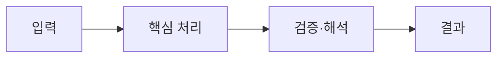

> [!abstract] 한 줄 요약
> MLflow 실습은 실행 환경을 준비하고 tracking URI로 run을 기록한 뒤 UI에서 실험과 모델 등록을 확인하는 흐름이다. 핵심은 ==입력·계산·결과의 연결==을 분명히 구분하는 데 있다.

## 핵심 구조

자료는 Docker와 pyspark-notebook image로 코드·데이터가 있는 작업 경로를 연결한다. MLflow를 설치하고 backend store와 artifact root를 지정한 서버를 실행한다. tracking URI를 설정해 여러 Spark run을 기록하고 UI에서 experiments와 model registration을 확인한다.

<Tabs>
  <Tab label="입력">
  자료는 Docker와 pyspark-notebook image로 코드·데이터가 있는 작업 경로를 연결한다.
  </Tab>
  <Tab label="처리">
  MLflow를 설치하고 backend store와 artifact root를 지정한 서버를 실행한다.
  </Tab>
  <Tab label="결과">
  tracking URI를 설정해 여러 Spark run을 기록하고 UI에서 experiments와 model registration을 확인한다.
  </Tab>
</Tabs>



> [!important] 먼저 확인할 점
> MLflow를 설치하고 backend store와 artifact root를 지정한 서버를 실행한다. 따라서 도구 이름만으로 결과를 판단하지 않고, 어떤 입력을 어떤 규칙으로 바꾸는지 추적해야 한다.

```html preview h=150
<div style="font-family:system-ui,sans-serif;padding:16px;color:var(--foreground);background:var(--card);border:1px solid var(--border);border-radius:var(--radius)">
  <div style="font-size:15px;font-weight:700;margin-bottom:9px">09. MLFlow 설치와 실행의 학습 흐름</div>
  <svg viewBox="0 0 720 78" width="100%" role="img" aria-label="독자 제작 학습 흐름 도식"><g font-family="system-ui,sans-serif" text-anchor="middle"><rect x="18" y="17" width="155" height="42" rx="9" fill="var(--card)" stroke="var(--border)"/><rect x="283" y="17" width="155" height="42" rx="9" fill="var(--card)" stroke="var(--border)"/><rect x="548" y="17" width="155" height="42" rx="9" fill="var(--card)" stroke="var(--border)"/><path d="M185 38h84M450 38h84" stroke="var(--muted-foreground)" stroke-width="3"/><text x="95" y="43" font-size="13" fill="currentColor">관찰</text><text x="360" y="43" font-size="13" fill="currentColor">변환</text><text x="625" y="43" font-size="13" fill="currentColor">해석</text></g></svg>
</div>
```

<details>
<summary>강의 자료에서 이 흐름을 읽는 법</summary>

강의 자료는 같은 분류기를 여러 실행 인자로 반복 수행해 run을 만들고, 각 실행이 추적되는지 UI에서 확인하는 과제를 제시한다.

</details>

## 실무적 선택

MLflow를 설치하고 backend store와 artifact root를 지정한 서버를 실행한다. 이 선택은 속도, 메모리, 반복 가능성 또는 해석 가능성처럼 무엇을 우선하는지에 따라 달라진다.

```html preview h=154
<div style="font-family:system-ui,sans-serif;padding:16px;color:var(--foreground);display:flex;gap:10px;flex-wrap:wrap">
<div style="flex:1;min-width:150px;padding:13px;border:1px solid var(--chart-1);border-radius:var(--radius)"><b>입력 조건</b><br><span style="font-size:12px;color:var(--muted-foreground)">무엇이 주어졌는가</span></div>
<div style="flex:1;min-width:150px;padding:13px;border:1px solid var(--chart-3);border-radius:var(--radius)"><b>처리 규칙</b><br><span style="font-size:12px;color:var(--muted-foreground)">어떻게 바꾸는가</span></div>
<div style="flex:1;min-width:150px;padding:13px;border:1px solid var(--chart-2);border-radius:var(--radius)"><b>확인 결과</b><br><span style="font-size:12px;color:var(--muted-foreground)">무엇을 검증하는가</span></div>
</div>
```

> [!note] 범위 점검
> 이 문서는 특정 개인 경로·run ID·제출 화면을 재현하지 않고, 환경 준비 → 추적 → 확인·등록이라는 원본의 작업 순서만 정리한다.

<details>
<summary>학습 체크리스트</summary>

1. 입력이 무엇인지 적는다.
2. 핵심 변환 또는 계산 규칙을 적는다.
3. 결과가 어떤 의사결정이나 확인에 쓰이는지 적는다.

</details>

> [!success] 핵심 정리
> MLflow 실습은 실행 환경을 준비하고 tracking URI로 run을 기록한 뒤 UI에서 실험과 모델 등록을 확인하는 흐름이다.

### 스스로 점검

**Q.** tracking URI를 설정하는 목적은 무엇인가?

**A.** 실행 결과가 지정한 MLflow 서버로 기록되어 UI에서 run과 실험을 확인할 수 있게 하기 위해서다.
