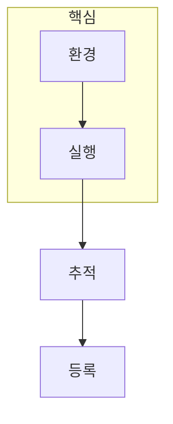

> [!abstract] 한 줄 요약
> MLflow의 핵심은 모델 하나를 실행하는 것이 아니라, ==여러 run의 조건과 결과==를 남겨 비교 가능한 실험으로 만드는 데 있다.

## 이 노트의 지도



## 1. 환경 준비와 실험 추적은 분리해서 확인한다

Docker 기반 PySpark 환경과 MLflow 서버는 실행 기반을 제공한다. 그 위에서 experiment와 run을 구분해, 어떤 파라미터·데이터·모델이 어떤 결과를 만들었는지 기록한다.

<details>
<summary>run ID가 필요한 이유</summary>

같은 알고리즘을 여러 번 실행하면 결과값만으로는 어떤 조건에서 나온 모델인지 구분하기 어렵다. run ID는 저장된 아티팩트와 결과를 특정 실행에 연결한다.

</details>

> [!caution] 재현성의 최소 단위
> 점수만 남기면 재현이 어렵다. 데이터 버전, 파라미터, 실행 환경, 산출 모델의 연결을 함께 기록해야 비교가 가능하다.

## 2. 여러 run을 비교한 뒤 모델을 등록한다

강의 과제는 랜덤 포레스트 분류기를 여러 차례 실행하고, 적어도 다섯 run의 결과를 확인하도록 요구한다. ==반복 실행==은 우연한 한 번의 성능을 보고 결론내리지 않기 위한 최소한의 비교 단위다.

## 추적 카드

```html preview
<div style="font-family:system-ui,sans-serif;padding:20px">
  <div id="cards" style="display:flex;gap:14px;flex-wrap:wrap"></div>
  <script>
    var stats = [
      ['환경', 'Docker', '실행 기반', 'var(--chart-1)'],
      ['Run', '5+', '반복 비교', 'var(--chart-2)'],
      ['ID', 'runs', '산출물 연결', 'var(--chart-3)']
    ];
    document.getElementById('cards').innerHTML = stats.map(function (s) {
      return '<div style="flex:1;min-width:150px;padding:16px;background:var(--card);' +
        'color:var(--card-foreground);border:1px solid var(--border);' +
        'border-radius:var(--radius)">' +
        '<div style="font-size:13px;color:var(--muted-foreground)">' + s[0] + '</div>' +
        '<div style="font-size:26px;font-weight:700;margin-top:4px">' + s[1] + '</div>' +
        '<div style="font-size:12px;font-weight:600;margin-top:4px;color:' + s[3] + '">' +
        s[2] + '</div>' +
        '</div>';
    }).join('');
  </script>
</div>
```

<Tabs>
  <Tab label="실행">서버·작업 환경이 준비됐는지 확인한다.</Tab>
  <Tab label="기록">파라미터·지표·아티팩트를 run에 남긴다.</Tab>
  <Tab label="비교">여러 run을 보고 등록 후보를 판단한다.</Tab>
</Tabs>

## 핵심 정리

| 단위 | 남기는 것 | 확인할 질문 |
| :-- | :-- | :-- |
| Experiment | 비교 맥락 | 어떤 과제를 묶는가 |
| Run | 조건·결과 | 무엇이 달랐는가 |
| Artifact | 모델·출력 | 어디에 저장됐는가 |
| Registry | 승인 모델 | 어떤 기준으로 선택했는가 |

> [!question]- 스스로 점검
> **Q.** 가장 높은 한 run을 바로 등록하면 안 되는 이유는 무엇인가?
>
> **A.** 데이터 분할·무작위성·파라미터 차이를 다른 run과 비교하지 못해 결과의 안정성을 판단할 수 없기 때문이다.

## 출처

- 공개 노트에는 원본 강의 자료, 자산 이미지, 페이지 단위 근거를 포함하지 않는다.

---

## 원본 강의 흐름 인터랙티브

```html preview
<div style="font-family:system-ui,sans-serif;padding:20px;color:var(--foreground)">
  <label for="noteFlow662774" style="font-size:14px;font-weight:600">MLFlow 설치와 실행 단계</label>
  <div id="noteFlow662774-out" style="font-size:26px;font-weight:700;color:var(--chart-1);margin:6px 0">MLFlow 설치와 실행 핵심 개념</div>
  <input id="noteFlow662774" type="range" min="1" max="3" step="1" value="1" style="width:100%;accent-color:var(--primary)" />
  <p style="font-size:13px;color:var(--muted-foreground)">슬라이더를 움직이면 원본 PDF에서 정리한 이 노트의 흐름을 확인합니다.</p>
  <script>
    var noteFlow662774 = document.getElementById('noteFlow662774');
    var noteFlow662774Out = document.getElementById('noteFlow662774-out');
    var noteFlow662774Steps = ["MLFlow 설치와 실행 핵심 개념","MLFlow 설치와 실행 처리 절차","MLFlow 설치와 실행 검증·응용"];
    noteFlow662774.addEventListener('input', function () { noteFlow662774Out.textContent = noteFlow662774Steps[Number(noteFlow662774.value) - 1]; });
  </script>
</div>
```
