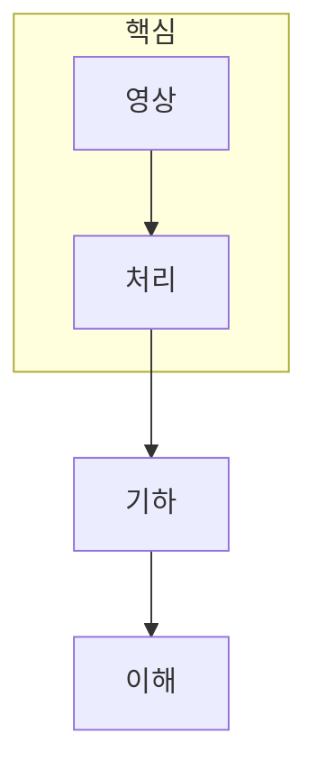

> [!abstract] 한 줄 요약
> 컴퓨터 비전은 픽셀을 처리하고, 대응과 기하를 거쳐 장면의 구조를 추정하는 학습 흐름이다.

## 강의 흐름 지도

[00. computer-vision 강의 흐름 지도](<./notes/00. computer-vision 강의 흐름 지도.md>)

## 이 과정의 지도



<Tabs>
  <Tab label="표현">2D 영상에서 밝기·경계·영역을 어떻게 표현하는지 점검한다.</Tab>
  <Tab label="대응">특징과 매칭으로 서로 다른 관측을 연결한다.</Tab>
  <Tab label="복원">카메라와 시차를 이용해 깊이·좌표를 추정한다.</Tab>
</Tabs>

```html preview
<div style="font-family:system-ui,sans-serif;padding:20px">
  <div id="cards" style="display:flex;gap:14px;flex-wrap:wrap"></div>
  <script>
    var stats = [
      ['2D', '처리', '픽셀과 변환', 'var(--chart-1)'],
      ['대응', '매칭', '특징과 모델', 'var(--chart-2)'],
      ['3D', '복원', '깊이와 카메라', 'var(--chart-3)']
    ];
    document.getElementById('cards').innerHTML = stats.map(function (s) {
      return '<div style="flex:1;min-width:150px;padding:16px;background:var(--card);' +
        'color:var(--card-foreground);border:1px solid var(--border);' +
        'border-radius:var(--radius)">' +
        '<div style="font-size:13px;color:var(--muted-foreground)">' + s[0] + '</div>' +
        '<div style="font-size:26px;font-weight:700;margin-top:4px">' + s[1] + '</div>' +
        '<div style="font-size:12px;font-weight:600;margin-top:4px;color:' + s[3] + '">' +
        s[2] + '</div>' +
        '</div>';
    }).join('');
  </script>
</div>
```

<details>
<summary>과정 사용법</summary>

각 노트에서 입력·가정·출력을 먼저 구분한 뒤, 표와 점검 질문으로 오류 조건을 되짚는다.

</details>

> [!tip] 학습 순서
> ==픽셀 표현==을 이해한 뒤 대응과 카메라 기하를 읽으면 깊이와 복원의 조건을 더 분명하게 구분할 수 있다.

## 노트 목록

- [컴퓨터 비전 개요](<./notes/01. 컴퓨터 비전 개요.md>)
- [2D 영상 처리와 기하 변환](<./notes/02. 2D 영상 처리와 기하 변환.md>)
- [코너·분할과 영상 품질](<./notes/03. 코너·분할과 영상 품질.md>)
- [특징 매칭과 호모그래피](<./notes/04. 특징 매칭과 호모그래피.md>)
- [스테레오 비전과 깊이 추정](<./notes/05. 스테레오 비전과 깊이 추정.md>)
- [3D 기하와 카메라 파라미터](<./notes/06. 3D 기하와 카메라 파라미터.md>)

| 구간 | 학습 질문 | 다음 연결 |
| :-- | :-- | :-- |
| 2D | 픽셀과 좌표를 어떻게 다루는가 | 특징 |
| 대응 | 같은 장면점을 어떻게 찾는가 | 기하 |
| 3D | 깊이와 카메라를 어떻게 추정하는가 | 장면 이해 |

> [!question]- 스스로 점검
> **Q.** 이 과정에서 결과를 해석하기 전에 먼저 적어야 할 세 가지는 무엇인가?
>
> **A.** 입력 관측, 기하·모델 가정, 원하는 출력이다.

## 출처

- 공개 노트에는 원본 강의 자료, 자산 이미지, 페이지 단위 근거를 포함하지 않는다.
