 > [!abstract] 사용법
 > 이 지도는 현재 폴더의 원본 PDF를 파일 순서대로 묶어 **강의 진행 → 핵심 단서 → 점검 포인트**를 연결합니다. 세부 개념은 같은 폴더의 주제 노트와 함께 대조하세요.

## 강의 흐름

```mermaid
flowchart LR
    A["01 — 1_overview_v1.1"]
    B["02 — 2_2D_Image_Processing_v1.1"]
    C["03 — 3_2D_Image_Processing_2_v1.1 2"]
    D["04 — 3_2D_Image_Processing_2_v1.1"]
    E["05 — 4_Feature_Extraction_and_Matching_v1.5"]
    F["06 — 5_Stereo_Vision_v1.5 2"]
    G["07 — 5_Stereo_Vision_v1.5"]
    H["08 — 6_3D_Geometry_and_Camera_Parameters_v1."]
    A --> B
    B --> C
    C --> D
    D --> E
    E --> F
    F --> G
    G --> H
```



<Tabs>
  <Tab label="파일 순서">파일명에 포함된 주차·장·버전 표기를 먼저 읽어 강의의 큰 흐름을 잡습니다.</Tab>
  <Tab label="중복 자료">같은 접두사나 버전이 겹치면 앞 자료를 기준으로 뒤 자료의 보충·실습 여부를 비교합니다.</Tab>
  <Tab label="검증">첫 페이지 단서는 방향만 제시하므로 정의·식·코드·수치는 원본 PDF에서 다시 확인합니다.</Tab>
</Tabs>

## 원본 PDF 목록

| 파일 | 쪽수 | 첫 페이지 단서 |
| :-- | --: | :-- |
| 1_overview_v1.1.pdf | 33 | 컴퓨터 비전 Computer Vision - Overview - 동아대학교 소프트웨어대학 AI학과 2026년 1학기 임한신 |
| 2_2D_Image_Processing_v1.1.pdf | 19 | 명암 조절 • 화면의 밝기(Luminance)를 밝거나 어둡게 조정 • 감마 조절(gamma correction) • 화면의 밝기를 인간의 시각 특성에 맞게 비선형적으로 조절하는 과정 • 사람은 어두운 곳에서의 변화에는 민감하게 반응하지만, 아주 밝은 곳에서의 변화에는 상대적으로 둔감 • 아래의 수식에서 γ (감마, gamma)값으로 화면의 밝기를 조절 L = 보통 256 𝑓̇ : 0~25 |
| 3_2D_Image_Processing_2_v1.1 2.pdf | 26 | 코너 검출 • 코너 검출(Corner detection) 알고리즘 왼쪽 영상의 a, b, c 중 오른쪽 영상에서 가장 찾기 쉬운 것은? |
| 3_2D_Image_Processing_2_v1.1.pdf | 26 | 코너 검출 • 코너 검출(Corner detection) 알고리즘 왼쪽 영상의 a, b, c 중 오른쪽 영상에서 가장 찾기 쉬운 것은? |
| 4_Feature_Extraction_and_Matching_v1.5.pdf | 21 | Homography(호모그래피) 추정 • Homography(호모그래피)의 개념 • 평면형 물체(planar object)를 카메라로 찍었을 때 원래의 물체와 영상 평면에 투영된 물체 사이에 성립 되는 기하학적 변환 관계 • homogeneous coordinates에서 3x3 행렬 H로 표현 Homography(호모그래피) |
| 5_Stereo_Vision_v1.5 2.pdf | 87 | 컴퓨터 비전 Computer Vision - Stereo Vision - 동아대학교 소프트웨어대학 AI학과 2026년 1학기 임한신 |
| 5_Stereo_Vision_v1.5.pdf | 87 | 컴퓨터 비전 Computer Vision - Stereo Vision - 동아대학교 소프트웨어대학 AI학과 2026년 1학기 임한신 |
| 6_3D_Geometry_and_Camera_Parameters_v1.1 2.pdf | 24 | 컴퓨터 비전 Computer Vision - 3D Geometry and Camera Parameters - 동아대학교 소프트웨어대학 AI학과 2026년 1학기 임한신 |
| 6_3D_Geometry_and_Camera_Parameters_v1.1.pdf | 24 | 컴퓨터 비전 Computer Vision - 3D Geometry and Camera Parameters - 동아대학교 소프트웨어대학 AI학과 2026년 1학기 임한신 |
| 중간고사_컴퓨터비전_정밀분석_정리 2.pdf | 31 | 텍스트 추출 단서 없음 |
| 중간고사_컴퓨터비전_정밀분석_정리.pdf | 31 | 텍스트 추출 단서 없음 |
| 컴퓨터비전_기말고사_예상문항 2.pdf | 28 | 텍스트 추출 단서 없음 |
| 컴퓨터비전_기말고사_예상문항.pdf | 28 | 텍스트 추출 단서 없음 |
| 컴퓨터비전_기말고사_정리 2.pdf | 61 | 텍스트 추출 단서 없음 |
| 컴퓨터비전_기말고사_정리.pdf | 61 | 텍스트 추출 단서 없음 |
| LMS.pdf | 19 | 컴퓨터 비전 Computer Vision - 최근 깊이 추정 및 3D 복원 관련 기술들- 동아대학교 소프트웨어대학 AI학과 2026년 1학기 임한신 |

## 원본 단계 인터랙티브

```html preview
<div style="font-family:system-ui,sans-serif;padding:20px;color:var(--foreground)">
  <label for="flow1675203092" style="font-size:14px;font-weight:600">원본 자료 단계</label>
  <div id="flow1675203092-out" style="font-size:24px;font-weight:700;color:var(--chart-1);margin:6px 0">1_overview_v1.1</div>
  <input id="flow1675203092" type="range" min="1" max="16" step="1" value="1" style="width:100%;accent-color:var(--primary)" />
  <p style="font-size:13px;color:var(--muted-foreground)">슬라이더를 움직이면 파일명 순서대로 자료의 위치를 확인합니다.</p>
  <script>
    var flow1675203092 = document.getElementById('flow1675203092');
    var flow1675203092Out = document.getElementById('flow1675203092-out');
    var flow1675203092Steps = ["1_overview_v1.1","2_2D_Image_Processing_v1.1","3_2D_Image_Processing_2_v1.1 2","3_2D_Image_Processing_2_v1.1","4_Feature_Extraction_and_Matching_v1.5","5_Stereo_Vision_v1.5 2","5_Stereo_Vision_v1.5","6_3D_Geometry_and_Camera_Parameters_v1.1 2","6_3D_Geometry_and_Camera_Parameters_v1.1","중간고사_컴퓨터비전_정밀분석_정리 2","중간고사_컴퓨터비전_정밀분석_정리","컴퓨터비전_기말고사_예상문항 2","컴퓨터비전_기말고사_예상문항","컴퓨터비전_기말고사_정리 2","컴퓨터비전_기말고사_정리","LMS"];
    flow1675203092.addEventListener('input', function () {
      flow1675203092Out.textContent = flow1675203092Steps[Number(flow1675203092.value) - 1] || '';
    });
  </script>
</div>
```

## 점검 포인트

- **범위:** 16개 PDF, 총 606쪽.
- **근거:** 표의 쪽수와 첫 페이지 단서는 현재 sources/ 파일에서 직접 추출했습니다.
- **학습 순서:** 흐름도와 슬라이더를 먼저 훑은 뒤, 주제 노트의 정의·절차·실습 결과를 순서대로 대조합니다.

> [!warning] 과해석 방지
> 이 지도에는 파일명·쪽수·첫 페이지 추출 단서만 기록했습니다. PDF에 없는 구현 세부, 성능 수치, 권장 설정은 추가하지 않습니다.

<details>
<summary>다음 읽기</summary>

현재 단계의 원본을 열어 제목·절차·도식을 확인한 뒤, 같은 폴더의 주제 노트에 해당 근거가 반영되었는지 점검하세요.

</details>
