> [!abstract] 사용법
> 이 문서는 원본 PDF의 **순서 → 핵심 단서 → 학습 점검**을 한 번에 보는 지도입니다. 세부 개념은 같은 폴더의 주제 노트와 원본 PDF를 함께 대조하세요.

## 강의 흐름

```mermaid
flowchart LR
    A["1_overview_v1.1"]
    B["2_2D_Image_Processing_v1.1"]
    C["3_2D_Image_Processing_2_v1.1 2"]
    D["3_2D_Image_Processing_2_v1.1"]
    E["4_Feature_Extraction_and_Match"]
    F["5_Stereo_Vision_v1.5 2"]
    G["5_Stereo_Vision_v1.5"]
    H["6_3D_Geometry_and_Camera_Param"]
    A --> B
    B --> C
    C --> D
    D --> E
    E --> F
    F --> G
    G --> H
```



<Tabs>
  <Tab label="파일 순서">파일명과 주차·장 제목을 강의 진행 신호로 삼아 처음부터 읽습니다.</Tab>
  <Tab label="읽기 전략">이론에서 실습·평가로 이동하며 같은 주제의 중복 PDF는 보조 자료로 비교합니다.</Tab>
  <Tab label="검증">텍스트가 빈약한 자료는 추출되지 않은 도식·수식을 임의로 채우지 않고 원본에서 확인합니다.</Tab>
</Tabs>

## 원본 PDF 목록

| 파일 | 쪽수 | 첫 페이지 단서 |
| :-- | --: | :-- |
| 1_overview_v1.1.pdf | — | 컴퓨터 비전
  Computer Vision
    - Overview -

동아대학교 소프트웨어대학 AI학과
     2026년 1학기

       임한신 |
| 2_2D_Image_Processing_v1.1.pdf | — | 명암 조절

 •   화면의 밝기(Luminance)를 밝거나 어둡게 조정
 •   감마 조절(gamma correction)
      • 화면의 밝기를 인간의 시각 특성에 맞게 비선형적으로 조절하는 과정
      • 사람은 어두운 곳에서의 변화에 |
| 3_2D_Image_Processing_2_v1.1 2.pdf | — | 코너 검출

 • 코너 검출(Corner detection) 알고리즘


                  왼쪽 영상의 a, b, c 중 오른쪽 영상에서 가장 찾기 쉬운 것은? |
| 3_2D_Image_Processing_2_v1.1.pdf | — | 코너 검출

 • 코너 검출(Corner detection) 알고리즘


                  왼쪽 영상의 a, b, c 중 오른쪽 영상에서 가장 찾기 쉬운 것은? |
| 4_Feature_Extraction_and_Matching_v1.5.pdf | — | Homography(호모그래피) 추정
 • Homography(호모그래피)의 개념
   • 평면형 물체(planar object)를 카메라로 찍었을 때 원래의 물체와 영상 평면에 투영된 물체 사이에 성립
     되는 기하학적 변환 관계
   • ho |
| 5_Stereo_Vision_v1.5 2.pdf | — | 컴퓨터 비전
  Computer Vision
   - Stereo Vision -

동아대학교 소프트웨어대학 AI학과
     2026년 1학기

        임한신 |
| 5_Stereo_Vision_v1.5.pdf | — | 컴퓨터 비전
  Computer Vision
   - Stereo Vision -

동아대학교 소프트웨어대학 AI학과
     2026년 1학기

        임한신 |
| 6_3D_Geometry_and_Camera_Parameters_v1.1 2.pdf | — | 컴퓨터 비전
         Computer Vision
- 3D Geometry and Camera Parameters -

      동아대학교 소프트웨어대학 AI학과
           2026년 1학기

               임한신 |
| 6_3D_Geometry_and_Camera_Parameters_v1.1.pdf | — | 컴퓨터 비전
         Computer Vision
- 3D Geometry and Camera Parameters -

      동아대학교 소프트웨어대학 AI학과
           2026년 1학기

               임한신 |
| 중간고사_컴퓨터비전_정밀분석_정리 2.pdf | — | 텍스트 추출 빈약 — 원본 시각 자료 확인 필요 |
| 중간고사_컴퓨터비전_정밀분석_정리.pdf | — | 텍스트 추출 빈약 — 원본 시각 자료 확인 필요 |
| 컴퓨터비전_기말고사_예상문항 2.pdf | — | 텍스트 추출 빈약 — 원본 시각 자료 확인 필요 |
| 컴퓨터비전_기말고사_예상문항.pdf | — | 텍스트 추출 빈약 — 원본 시각 자료 확인 필요 |
| 컴퓨터비전_기말고사_정리 2.pdf | — | 텍스트 추출 빈약 — 원본 시각 자료 확인 필요 |
| 컴퓨터비전_기말고사_정리.pdf | — | 텍스트 추출 빈약 — 원본 시각 자료 확인 필요 |
| LMS.pdf | — | 컴퓨터 비전
      Computer Vision
- 최근 깊이 추정 및 3D 복원 관련 기술들-

    동아대학교 소프트웨어대학 AI학과
         2026년 1학기

           임한신 |

## 원본 단계 인터랙티브

```html preview
<div style="font-family:system-ui,sans-serif;padding:20px;color:var(--foreground)">
  <label for="flowdatacomputervision" style="font-size:14px;font-weight:600">원본 자료 단계</label>
  <div id="flowdatacomputervision-out" style="font-size:24px;font-weight:700;color:var(--chart-1);margin:6px 0">1_overview_v1.1</div>
  <input id="flowdatacomputervision" type="range" min="1" max="16" step="1" value="1" style="width:100%;accent-color:var(--primary)" />
  <p style="font-size:13px;color:var(--muted-foreground)">슬라이더를 움직이면 파일명 순서대로 자료의 역할을 확인합니다.</p>
  <script>
    var flowdatacomputervision = document.getElementById('flowdatacomputervision');
    var flowdatacomputervisionOut = document.getElementById('flowdatacomputervision-out');
    var flowdatacomputervisionSteps = ["1_overview_v1.1","2_2D_Image_Processing_v1.1","3_2D_Image_Processing_2_v1.1 2","3_2D_Image_Processing_2_v1.1","4_Feature_Extraction_and_Matching_v1.5","5_Stereo_Vision_v1.5 2","5_Stereo_Vision_v1.5","6_3D_Geometry_and_Camera_Parameters_v1.1 2","6_3D_Geometry_and_Camera_Parameters_v1.1","중간고사_컴퓨터비전_정밀분석_정리 2","중간고사_컴퓨터비전_정밀분석_정리","컴퓨터비전_기말고사_예상문항 2","컴퓨터비전_기말고사_예상문항","컴퓨터비전_기말고사_정리 2","컴퓨터비전_기말고사_정리","LMS"];
    flowdatacomputervision.addEventListener('input', function () {
      flowdatacomputervisionOut.textContent = flowdatacomputervisionSteps[Number(flowdatacomputervision.value) - 1];
    });
  </script>
</div>
```

## 점검 포인트

- **범위:** 16개 PDF, 총 0쪽.
- **근거:** 첫 페이지 추출 단서를 표에 남겨 주제명과 흐름을 확인했습니다.
- **시각 자료:** 6개 파일은 첫 페이지 텍스트가 빈약하므로 필요한 경우 승인된 크롭 후보로만 별도 검토합니다.

> [!warning] 과해석 방지
> 이 지도에는 파일명·쪽수·추출된 첫 페이지 단서만 기록했습니다. PDF에 없는 구현 세부, 성능 수치, 권장 설정은 추가하지 않습니다.

<details>
<summary>다음 읽기</summary>

현재 단계의 파일을 선택한 뒤, 같은 폴더의 주제 노트에서 정의·절차·실습 결과를 대조하세요.

</details>
