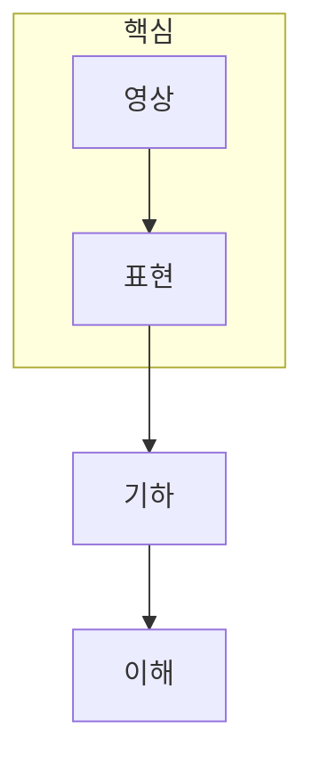

> [!abstract] 한 줄 요약
> 컴퓨터 비전은 ==영상의 픽셀==을 기하·의미 정보로 바꾸어 장면에 관한 질문에 답하는 분야다.

## 이 노트의 지도



## 1. 비전의 문제는 표현 수준을 바꾸는 데 있다

입력은 2D 격자 위의 밝기와 색이지만, 과제는 물체의 경계·위치·깊이·행동처럼 더 높은 수준의 정보를 얻는 일이다. 따라서 영상 처리, 특징 추출, 3D 복원, 인식은 분리된 기능이면서도 앞 단계의 출력을 다음 단계가 사용한다.

<details>
<summary>2D 처리와 3D 기하를 구분하는 질문</summary>

2D 처리는 한 장의 영상에서 밝기·경계·영역을 다룬다. 3D 기하는 여러 관측 또는 카메라 모델을 이용해 좌표·깊이·카메라 위치를 추정한다.

</details>

> [!caution] 범위
> 한 장의 영상만으로 모든 3D 정보를 자동으로 알 수 있는 것은 아니다. 관측 조건과 기하 가정이 결과를 제한한다.

## 2. 학습할 때는 출력보다 입력·가정을 추적한다

같은 객체 인식 결과라도 입력이 단일 영상인지, 두 시점인지, 시간 축이 있는지에 따라 필요한 표현과 오류 원인이 달라진다. ==무엇을 관측했는가==를 먼저 기록하면 알고리즘 이름을 외우는 것보다 문제를 안정적으로 분해할 수 있다.

## 관점 카드

```html preview
<div style="font-family:system-ui,sans-serif;padding:20px">
  <div id="cards" style="display:flex;gap:14px;flex-wrap:wrap"></div>
  <script>
    var stats = [
      ['2D 처리', '픽셀', '변환과 경계', 'var(--chart-1)'],
      ['3D 기하', '좌표', '깊이와 자세', 'var(--chart-2)'],
      ['장면 이해', '의미', '객체와 행동', 'var(--chart-3)']
    ];
    document.getElementById('cards').innerHTML = stats.map(function (s) {
      return '<div style="flex:1;min-width:150px;padding:16px;background:var(--card);' +
        'color:var(--card-foreground);border:1px solid var(--border);' +
        'border-radius:var(--radius)">' +
        '<div style="font-size:13px;color:var(--muted-foreground)">' + s[0] + '</div>' +
        '<div style="font-size:26px;font-weight:700;margin-top:4px">' + s[1] + '</div>' +
        '<div style="font-size:12px;font-weight:600;margin-top:4px;color:' + s[3] + '">' +
        s[2] + '</div>' +
        '</div>';
    }).join('');
  </script>
</div>
```

<Tabs>
  <Tab label="입력">밝기·색·공간 좌표처럼 관측 가능한 값을 정한다.</Tab>
  <Tab label="변환">필터, 특징, 기하 모델로 표현을 바꾼다.</Tab>
  <Tab label="출력">영역, 대응점, 깊이, 의미를 과제에 맞게 읽는다.</Tab>
</Tabs>

## 핵심 정리

| 관점 | 대표 질문 | 학습상 의미 |
| :-- | :-- | :-- |
| 영상 처리 | 픽셀을 어떻게 바꾸는가 | 신호와 경계 |
| 기하 | 카메라와 장면은 어디에 있는가 | 좌표와 깊이 |
| 이해 | 무엇이 보이는가 | 의미와 판단 |

> [!question]- 스스로 점검
> **Q.** 객체 인식 전에 2D 처리나 기하 정보가 필요한 상황은 언제인가?
>
> **A.** 입력의 품질·시점·좌표계가 결과 해석을 바꾸는 상황이다.

## 출처

- 공개 노트에는 원본 강의 자료, 자산 이미지, 페이지 단위 근거를 포함하지 않는다.

---

## 원본 강의 흐름 인터랙티브

```html preview
<div style="font-family:system-ui,sans-serif;padding:20px;color:var(--foreground)">
  <label for="noteFlow908610" style="font-size:14px;font-weight:600">컴퓨터 비전 개요 단계</label>
  <div id="noteFlow908610-out" style="font-size:26px;font-weight:700;color:var(--chart-1);margin:6px 0">컴퓨터 비전 개요 핵심 개념</div>
  <input id="noteFlow908610" type="range" min="1" max="3" step="1" value="1" style="width:100%;accent-color:var(--primary)" />
  <p style="font-size:13px;color:var(--muted-foreground)">슬라이더를 움직이면 원본 PDF에서 정리한 이 노트의 흐름을 확인합니다.</p>
  <script>
    var noteFlow908610 = document.getElementById('noteFlow908610');
    var noteFlow908610Out = document.getElementById('noteFlow908610-out');
    var noteFlow908610Steps = ["컴퓨터 비전 개요 핵심 개념","컴퓨터 비전 개요 처리 절차","컴퓨터 비전 개요 검증·응용"];
    noteFlow908610.addEventListener('input', function () { noteFlow908610Out.textContent = noteFlow908610Steps[Number(noteFlow908610.value) - 1]; });
  </script>
</div>
```
