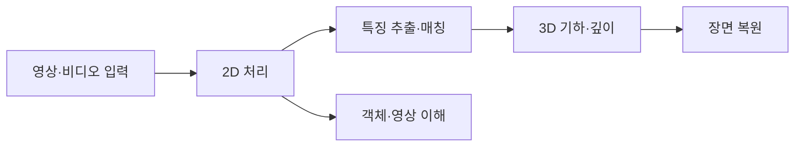

> [!abstract] 한 줄 요약
> 컴퓨터 비전은 카메라가 얻은 영상·비디오에서 ==구조와 의미를 추론==하는 기술이며, 2D 처리부터 3D 복원과 영상 이해까지가 하나의 학습 흐름을 이룬다.

## 비전이 다루는 입력과 목표

강의는 컴퓨터 비전을 인간의 시각 능력을 컴퓨터가 모방해 데이터를 이해하고 처리하는 기술로 소개한다. 입력은 보통 영상 센서가 만든 영상 또는 비디오이며, 목표는 단순한 픽셀 저장이 아니라 **무엇이 보이는지**를 알아내는 데 있다.

> [!important] 컴퓨터 비전과 딥러닝
> 둘은 같은 말이 아니다. 딥러닝은 비전 문제를 푸는 강력한 방법이지만, 영상 표현·기하·측정이라는 비전의 문제 자체를 대체하지는 않는다.



```html preview h=188
<div style="font-family:system-ui,sans-serif;padding:16px;color:var(--foreground);background:var(--card);border:1px solid var(--border);border-radius:var(--radius)">
  <div style="font-size:15px;font-weight:700;margin-bottom:12px">픽셀에서 장면 이해까지</div>
  <svg viewBox="0 0 720 108" width="100%" role="img" aria-label="독자 제작 컴퓨터 비전 학습 흐름">
    <g font-family="system-ui,sans-serif" text-anchor="middle">
      <g fill="var(--card)" stroke="var(--border)"><rect x="12" y="28" width="126" height="52" rx="10"/><rect x="205" y="28" width="126" height="52" rx="10"/><rect x="398" y="28" width="126" height="52" rx="10"/><rect x="591" y="28" width="117" height="52" rx="10"/></g>
      <g font-size="14" font-weight="700" fill="currentColor"><text x="75" y="59">입력 영상</text><text x="268" y="59">구조 추출</text><text x="461" y="59">기하 추론</text><text x="650" y="59">장면 이해</text></g>
      <g stroke="var(--muted-foreground)" stroke-width="3"><path d="M145 54h50"/><path d="M338 54h50"/><path d="M531 54h50"/></g>
    </g>
  </svg>
</div>
```

> [!note] 2D 영상의 단서
> 1D 신호가 한 독립변수에 따라 달라지는 반면, 영상은 보통 공간 좌표 $x,y$에 따라 달라지는 2D 신호다. 가까운 픽셀은 비슷할 가능성이 크고, 에지·코너·텍스처·패턴 같은 구조를 가진다.

<details>
<summary>2D 처리에서 “구조”를 먼저 보는 이유</summary>

픽셀 값 하나는 국소적인 밝기 정보일 뿐이다. 그러나 이웃 픽셀과 비교하면 밝기가 급변하는 **에지**, 에지가 교차하는 **코너**, 반복되는 **텍스처**를 찾을 수 있다. 이후의 매칭·분할·복원은 이런 구조 단서를 입력으로 사용한다.

</details>

## 특징에서 대응점까지

특징은 영상 안의 특정 지점이나 영역을 다른 곳과 구별하게 해 주는 의미 있는 정보다. 강의는 에지·코너·텍스처, 그리고 주변 정보를 벡터로 요약한 descriptor를 예로 든다.

<Tabs>
  <Tab label="검출">
  코너나 에지처럼 특징이 될 만한 위치를 찾는다.
  </Tab>
  <Tab label="기술">
  검출 지점 주변의 픽셀 정보를 descriptor 벡터로 바꾼다.
  </Tab>
  <Tab label="매칭">
  여러 영상의 descriptor 거리를 비교해 같은 지점 후보를 연결하고, RANSAC으로 outlier를 줄인다.
  </Tab>
</Tabs>

> [!tip] 좋은 특징의 세 조건
> ==불변성==은 크기·회전·조명 변화에도 값이 크게 흔들리지 않는 성질이고, 변별성은 다른 영역과 구분되는 성질이며, 재현력은 다른 영상에서도 다시 검출되는 성질이다.

```html preview h=176
<div style="font-family:system-ui,sans-serif;padding:16px;color:var(--foreground)">
  <div style="display:flex;gap:10px;flex-wrap:wrap">
    <div style="flex:1;min-width:150px;padding:14px;border:1px solid var(--border);border-radius:var(--radius);background:var(--card)"><b>불변성</b><br><span style="font-size:13px;color:var(--muted-foreground)">관찰 조건 변화에 견딤</span></div>
    <div style="flex:1;min-width:150px;padding:14px;border:1px solid var(--border);border-radius:var(--radius);background:var(--card)"><b>변별성</b><br><span style="font-size:13px;color:var(--muted-foreground)">다른 위치와 구분됨</span></div>
    <div style="flex:1;min-width:150px;padding:14px;border:1px solid var(--border);border-radius:var(--radius);background:var(--card)"><b>재현력</b><br><span style="font-size:13px;color:var(--muted-foreground)">다른 영상에서도 반복 검출</span></div>
  </div>
</div>
```

## 3D와 영상 이해

스테레오 영상에서는 두 시점의 위치 차이인 disparity를 이용해 깊이를 추정한다. 실제 카메라의 위치·방향·영상 형성 파라미터를 추정하는 일은 calibration이며, 여러 영상으로 카메라와 장면을 복원할 때는 SfM과 MVS가 이어진다.

> [!warning] 깊이는 한 장의 픽셀 값만으로 확정되지 않는다
> 강의의 스테레오 흐름은 두 시점의 대응을 전제로 한다. 대응이 흔들리면 disparity와 그 뒤의 깊이 추론도 함께 불안정해진다.

<details>
<summary>SfM과 MVS의 역할을 구분하기</summary>

SfM은 여러 영상의 특징점을 찾고 매칭해 카메라 파라미터를 구하는 단계다. MVS는 그 결과를 바탕으로 더 조밀한 픽셀 깊이를 계산해 점구름 또는 메시를 만든다. 둘은 같은 “3D 복원” 안에서 순서가 다른 역할이다.

</details>

> [!success] 영상 이해의 세 질문
> 객체 검출은 위치와 종류를 함께 찾고, 영상 분할은 픽셀의 소속을 나누며, 자세 추정은 관절·랜드마크의 위치를 구한다. 같은 입력이라도 질문이 다르면 출력 표현도 달라진다.

## 핵심 정리

| 영역 | 핵심 질문 | 대표 출력 |
| :-- | :-- | :-- |
| 2D 처리 | 영상의 국소 구조는 무엇인가 | 에지·코너·영역 |
| 특징·매칭 | 두 관찰에서 같은 지점은 어디인가 | 대응점 |
| 3D 기하 | 카메라와 장면은 어떤 공간 관계인가 | 깊이·점구름·메시 |
| 객체·영상 이해 | 무엇이 어디에 있고 어떻게 구성되는가 | 상자·마스크·키포인트 |

> [!question]- 스스로 점검
> **Q.** 객체 검출과 영상 분할은 모두 “무엇이 보이는가”를 다루는데, 출력이 어떻게 다른가?
>
> **A.** 객체 검출은 객체의 위치와 종류를 찾고, 영상 분할은 픽셀 단위로 소속을 분류한다. 인스턴스 분할은 같은 클래스 안의 개별 객체도 구분한다.
