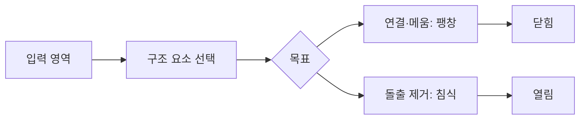

> [!abstract] 한 줄 요약
> 2D 영상 처리는 밝기·형태·좌표를 다루는 일이며, OpenCV에서는 그 결과를 ==NumPy 배열==로 직접 확인하고 조작한다.

## 밝기와 감마

명암 조절은 화면의 luminance를 밝거나 어둡게 바꾸는 일이다. 감마 조절은 이 변화를 선형이 아니라 인간 시각의 특성에 맞게 비선형으로 적용한다.

> [!note] 감마가 필요한 이유
> 강의는 사람이 어두운 영역의 변화에는 민감하고 아주 밝은 영역의 변화에는 상대적으로 둔감하다고 설명한다. 그래서 정규화한 밝기에 감마를 적용해 표시 특성을 보정한다.

```html preview h=182
<div style="font-family:system-ui,sans-serif;padding:16px;color:var(--foreground);border:1px solid var(--border);border-radius:var(--radius);background:var(--card)">
  <div style="font-weight:700;margin-bottom:8px">감마는 중간 밝기 분포를 바꾼다</div>
  <svg viewBox="0 0 700 112" width="100%" role="img" aria-label="독자 제작 감마 변화 곡선">
    <g transform="translate(50 10)" fill="none" stroke-width="3">
      <path d="M0 82H600M0 82V0" stroke="var(--border)"/>
      <path d="M0 82 C220 82 410 44 600 0" stroke="var(--chart-1)"/>
      <path d="M0 82 L600 0" stroke="var(--chart-3)" stroke-dasharray="7 5"/>
      <path d="M0 82 C65 36 210 0 600 0" stroke="var(--chart-5)"/>
    </g>
    <g font-family="system-ui,sans-serif" font-size="13" fill="currentColor"><text x="55" y="106">입력 밝기</text><text x="5" y="18">출력</text><text x="420" y="38" fill="var(--chart-1)">완만한 변화</text><text x="420" y="57" fill="var(--chart-3)">기준</text><text x="420" y="76" fill="var(--chart-5)">어두운 영역 강조</text></g>
  </svg>
</div>
```

<details>
<summary>표시 장치의 감마와 영상 보정의 관계</summary>

강의는 일반 모니터가 영상을 어둡게 출력하는 경향을 설명하고, 제작 단계에서 반대 방향의 보정을 적용하면 두 효과가 상쇄되어 자연스러운 밝기에 가까워진다고 제시한다. 핵심은 감마가 단순한 “밝기 더하기”가 아니라 곡선 형태의 변환이라는 점이다.

</details>

> [!tip] 읽는 순서
> 명암 조절은 픽셀 값의 분포를 바꾸고, 모폴로지는 이진 또는 영역 구조의 모양을 다룬다. 둘은 같은 영상 처리라도 조작 대상이 다르다.

## 구조 요소로 형태 다루기

모폴로지는 구조 요소(structuring element)를 사용해 객체 영역의 모양을 분석하고 조작한다.

<Tabs>
  <Tab label="팽창">
  작은 홈을 메우거나 끊어진 영역을 연결하는 효과로, 영역을 키운다.
  </Tab>
  <Tab label="침식">
  경계의 돌출을 깎는 효과로, 영역을 작게 만든다.
  </Tab>
  <Tab label="열림·닫힘">
  열림은 침식 뒤 팽창, 닫힘은 팽창 뒤 침식을 적용해 원래 영역 크기 관점에서 잡음을 정리한다.
  </Tab>
</Tabs>



> [!important] 연산 이름보다 목적
> ==열림==과 ==닫힘==은 두 기본 연산의 순서를 바꾼 조합이다. 따라서 “어떤 잡음이나 틈을 없애려는가”를 먼저 정한 뒤 순서를 선택해야 한다.

<details>
<summary>구조 요소가 바뀌면 결과도 바뀌는 이유</summary>

모폴로지 결과는 입력 영상만으로 정해지지 않는다. 구조 요소의 크기와 형태가 비교 기준을 만들기 때문에, 같은 영역도 어떤 구조 요소를 쓰는지에 따라 연결되거나 깎이는 정도가 달라진다.

</details>

## 동차 좌표와 기하 변환

강의는 2D 좌표에 1을 추가해 3요소 벡터로 표현하는 동차 좌표를 소개한다. 같은 비율로 스케일된 세 요소는 같은 2D 좌표를 나타낸다. 이 표현은 이동·회전·크기 변환을 행렬 연산으로 묶는 기반이 된다.

```html preview h=174
<div style="font-family:system-ui,sans-serif;padding:16px;color:var(--foreground)">
  <div style="display:flex;gap:12px;align-items:center;flex-wrap:wrap">
    <div style="padding:13px 16px;border:1px solid var(--border);border-radius:var(--radius);background:var(--card);font-weight:700">(x, y)</div>
    <div style="font-size:22px;color:var(--muted-foreground)">→</div>
    <div style="padding:13px 16px;border:1px solid var(--border);border-radius:var(--radius);background:var(--card);font-weight:700">(x, y, 1)</div>
    <div style="font-size:22px;color:var(--muted-foreground)">→</div>
    <div style="padding:13px 16px;border:1px solid var(--chart-1);border-radius:var(--radius);background:var(--card);font-weight:700">변환 행렬</div>
  </div>
  <p style="font-size:13px;color:var(--muted-foreground);margin:12px 0 0">이동·회전·크기 조정을 하나의 행렬 흐름으로 결합한다.</p>
</div>
```

> [!warning] 전방 매핑의 빈 픽셀
> 전방 변환은 변환 뒤 영상에서 값을 받지 못하는 픽셀을 만들 수 있다. 강의는 backward mapping을 이 문제를 다루는 방식으로 제시한다.

## OpenCV에서 영상 읽기

OpenCV는 컴퓨터 비전과 이미지 처리를 위한 오픈소스 라이브러리다. 강의의 실습 환경에서는 영상이 numpy.ndarray 객체이며, shape·ndim·size·dtype으로 배열 정보를 확인한다.

| 배열 관점 | 실습에서 하는 일 |
| :-- | :-- |
| 채널 | OpenCV의 픽셀 저장 순서 BGR을 확인 |
| 슬라이싱 | 채널을 분리하거나 ROI를 잘라 보기 |
| 간격 슬라이싱 | 일부 픽셀만 골라 downsampling 하기 |
| 다른 도구 연결 | Matplotlib·학습 라이브러리에 배열을 전달 |

> [!success] 실습의 연결점
> 영상이 배열이라는 사실은 처리 결과를 시각화하는 데서 끝나지 않는다. NumPy 슬라이싱으로 관심 영역을 만들고, 같은 배열을 다른 분석·학습 도구에 넘길 수 있다.

### 스스로 점검

**Q.** 기하 변환에서 변환 행렬을 미리 곱해 두는 이점은 무엇인가?

**A.** 이동 뒤 회전처럼 복합 변환을 한 행렬로 만들어, 각 점에 대해 한 번의 행렬 곱셈으로 적용할 수 있다.
