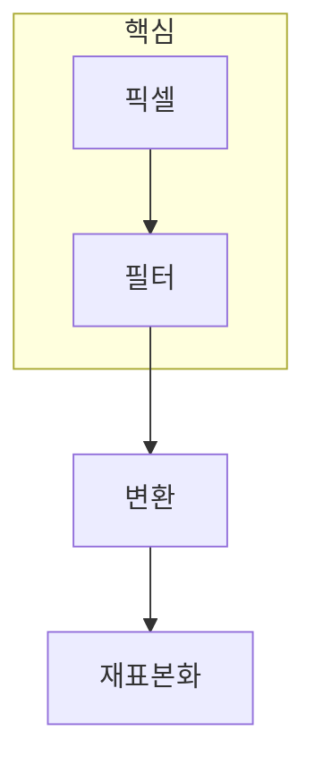

> [!abstract] 한 줄 요약
> 2D 영상 처리는 픽셀값을 바꾸는 연산과 좌표를 바꾸는 연산을 구분해야 결과를 제대로 해석할 수 있다.

## 이 노트의 지도



## 1. 값의 변화와 위치의 변화는 다른 연산이다

밝기 조정·필터링·모폴로지는 픽셀값 또는 이웃 관계에 작용한다. 반면 기하 변환은 어느 좌표의 값을 출력 격자에 둘지 정한다. ==좌표 변환== 뒤에는 빈 위치와 겹침을 처리하기 위한 보간이 따라온다.

$$
I'(x', y') = I(T^{-1}(x', y'))
$$

<details>
<summary>왜 역변환으로 샘플링할까?</summary>

출력 좌표에서 원래 영상의 어느 위치를 읽을지 정하면 모든 출력 픽셀을 채울 수 있다. 정방향 매핑만 쓰면 빈 픽셀이나 여러 값이 같은 위치에 모이는 문제가 생긴다.

</details>

> [!caution] 보간의 해석
> 보간은 새 장면 정보를 만드는 연산이 아니라, 격자가 바뀔 때 기존 샘플을 연속적으로 근사하는 선택이다.

## 2. 모폴로지는 모양을 기준으로 이웃을 읽는다

팽창·침식 같은 모폴로지 연산은 구조 요소를 기준으로 전경의 형태를 넓히거나 줄인다. 필터의 커널과 마찬가지로, 결과를 볼 때는 연산 이름보다 ==어떤 이웃을 기준으로 했는가==를 확인한다.

## 배율 제어

```html preview
<div style="font-family:system-ui,sans-serif;padding:20px;color:var(--foreground)">
  <label for="amt" style="font-size:14px;font-weight:600">출력 배율</label>
  <div id="out" style="font-size:30px;font-weight:700;color:var(--chart-1);margin:6px 0">100×</div>
  <input id="amt" type="range" min="50" max="200" step="10" value="100"
    style="width:100%;accent-color:var(--primary)" />
  <p style="font-size:13px;color:var(--muted-foreground)">배율을 바꾸면 출력 좌표를 다시 샘플링한다.</p>
  <script>
    var amt = document.getElementById('amt');
    var out = document.getElementById('out');
    amt.addEventListener('input', function () {
      out.textContent = Number(amt.value) / 100 + '×';
    });
  </script>
</div>
```

<Tabs>
  <Tab label="값">명암·필터·모폴로지로 픽셀값과 이웃 관계를 조정한다.</Tab>
  <Tab label="좌표">이동·회전·확대로 픽셀의 위치를 바꾼다.</Tab>
  <Tab label="보간">새 출력 격자에서 읽을 값을 근사한다.</Tab>
</Tabs>

## 핵심 정리

| 구분 | 바뀌는 대상 | 확인할 질문 |
| :-- | :-- | :-- |
| 필터링 | 픽셀값 | 어떤 이웃을 합성하는가 |
| 모폴로지 | 형태 | 어떤 구조 요소를 쓰는가 |
| 기하 변환 | 좌표 | 어떤 좌표계로 옮기는가 |
| 보간 | 샘플 | 빈 출력 위치를 어떻게 채우는가 |

> [!question]- 스스로 점검
> **Q.** 회전 후 영상이 거칠게 보일 때, 먼저 어떤 연산을 의심해야 하는가?
>
> **A.** 좌표 변환 자체와 그 뒤의 재표본화·보간 방식을 구분해 확인한다.

## 출처

- 공개 노트에는 원본 강의 자료, 자산 이미지, 페이지 단위 근거를 포함하지 않는다.
