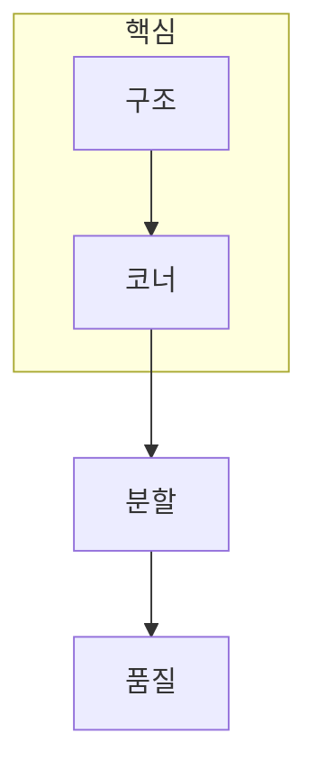

> [!abstract] 한 줄 요약
> 코너·분할·품질 평가는 모두 픽셀 하나가 아니라 ==주변 구조==를 어떻게 요약할지 결정하는 문제다.

## 이 노트의 지도



## 1. 코너는 두 방향 변화가 함께 큰 위치다

Harris는 윈도 안에서 밝기 변화가 한 방향에만 큰지, 두 방향에서 모두 큰지를 구별한다. 평탄한 영역·에지·코너를 같은 기준으로 읽지 않는 것이 핵심이다.

$$
R = det(mathbf{M}) - k,operatorname{tr}(mathbf{M})^2
$$

<details>
<summary>Harris의 k 값은 무엇을 조절할까?</summary>

k는 응답식에서 행렬식과 대각합 항의 균형을 조절한다. 추출본의 예시는 0.04를 사용하며, 이 값 하나만으로 모든 영상에 최선의 코너가 정해지는 것은 아니다.

</details>

> [!caution] 분할의 경계
> 슈퍼픽셀은 의미 객체 그 자체가 아니라, 이후 처리에 쓰기 좋게 비슷한 픽셀을 과분할한 단위다.

## 2. 화질은 픽셀 오차와 구조 보존을 함께 읽는다

PSNR은 오차 크기를 요약하지만, 사람이 중요하게 보는 경계와 구조가 유지되는지까지 충분히 말하지 못할 수 있다. SSIM은 밝기·대비·구조를 함께 비교해 이 한계를 보완한다.

$$
operatorname{PSNR}=10log_{10}rac{MAX_I^2}{operatorname{MSE}}
$$

## 비교 카드

```html preview
<div style="font-family:system-ui,sans-serif;padding:20px">
  <div id="cards" style="display:flex;gap:14px;flex-wrap:wrap"></div>
  <script>
    var stats = [
      ['Harris', '구조', '코너 반응', 'var(--chart-1)'],
      ['SLIC', '영역', '슈퍼픽셀', 'var(--chart-2)'],
      ['SSIM', '구조', '화질 비교', 'var(--chart-3)']
    ];
    document.getElementById('cards').innerHTML = stats.map(function (s) {
      return '<div style="flex:1;min-width:150px;padding:16px;background:var(--card);' +
        'color:var(--card-foreground);border:1px solid var(--border);' +
        'border-radius:var(--radius)">' +
        '<div style="font-size:13px;color:var(--muted-foreground)">' + s[0] + '</div>' +
        '<div style="font-size:26px;font-weight:700;margin-top:4px">' + s[1] + '</div>' +
        '<div style="font-size:12px;font-weight:600;margin-top:4px;color:' + s[3] + '">' +
        s[2] + '</div>' +
        '</div>';
    }).join('');
  </script>
</div>
```

<Tabs>
  <Tab label="코너">변화가 두 방향에서 큰 위치를 후보로 둔다.</Tab>
  <Tab label="분할">비슷한 픽셀을 지역 단위로 묶어 후속 계산을 단순화한다.</Tab>
  <Tab label="품질">수치 오차와 구조적 유사도를 함께 해석한다.</Tab>
</Tabs>

## 핵심 정리

| 방법 | 보는 단위 | 주의할 점 |
| :-- | :-- | :-- |
| Harris | 윈도 변화 | 임계값과 파라미터에 민감하다 |
| SLIC | 슈퍼픽셀 | 과분할은 최종 의미 분할이 아니다 |
| PSNR | 픽셀 오차 | 구조 손실을 놓칠 수 있다 |
| SSIM | 밝기·대비·구조 | 참조 영상이 필요하다 |

> [!question]- 스스로 점검
> **Q.** PSNR이 높은데도 사람이 보기에 어색할 수 있는 이유는 무엇인가?
>
> **A.** 픽셀 오차의 평균적 크기만으로 경계와 구조의 보존을 충분히 설명하지 못할 수 있기 때문이다.

## 출처

- 공개 노트에는 원본 강의 자료, 자산 이미지, 페이지 단위 근거를 포함하지 않는다.
