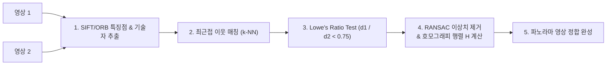

> [!abstract] 핵심 요약
> 영상 정합(Image Stitching / 파노라마)과 객체 인식의 핵심은 촬영 각도와 크기, 회전이 달라져도 동일한 지점을 신뢰할 수 있게 매칭하는 **국소 불변 특징점(Local Invariant Features)**을 찾는 것이다.
> 데이비드 로우의 **SIFT**는 DoG 스케일 공간과 128차원 그래디언트 히스토그램으로 최고 수준의 불변성을 제공하며, 매칭 시 다수 발생하는 오매칭(Outliers)은 **RANSAC**의 무작위 표본 가설-검증 루프를 통해 완벽히 걸러낸다.

---

## 1. SIFT vs ORB 특징점 알고리즘 비교

| 비교 항목 | SIFT (Scale-Invariant Feature Transform) | ORB (Oriented FAST & Rotated BRIEF) |
| :-- | :-- | :-- |
| **특징점 검출기** | DoG (Difference of Gaussians 피라미드) | **FAST 코너 + 이미지 피라미드** (초고속) |
| **기술자(Descriptor)** | $4 \times 4$ 영역 $\times$ 8방향 = **128차원 실수 벡터** | **256-bit 이진 문자열 (Binary Vector)** |
| **거리 측정 척도** | 유클리디안 거리 ($L_2$ Norm) | **해밍 거리 (Hamming Distance - XOR 연산)** |
| **연산 속도** | 다소 무거움 (실시간 임베디드 제약) | **매우 빠름 (SIFT 대비 최대 100배 고속, 실시간 SLAM)** |



---

## 2. 호모그래피(Homography) 및 RANSAC 유도

$$\mathbf{x}' \sim \mathbf{H} \mathbf{x} \iff \begin{bmatrix} x' \\ y' \\ 1 \end{bmatrix} = \begin{bmatrix} h_{11} & h_{12} & h_{13} \\ h_{21} & h_{22} & h_{23} \\ h_{31} & h_{32} & h_{33} \end{bmatrix} \begin{bmatrix} x \\ y \\ 1 \end{bmatrix} \quad (\text{자유도 8, 최소 4개 매칭 쌍 필요})$$

---

## 3. 실시간 RANSAC 이상치 제거 & 호모그래피 인라이어 추정기

```html preview
<div style="font-family:system-ui,-apple-system,sans-serif;padding:20px;background:var(--card);color:var(--card-foreground);border:1px solid var(--border);border-radius:var(--radius)">
  <div style="font-size:16px;font-weight:700;margin-bottom:14px;color:var(--primary);display:flex;align-items:center;gap:8px">
    <span>🎯 RANSAC 이상치(Outlier) 제거 및 인라이어 비율 시뮬레이터</span>
  </div>

  <div style="display:flex;gap:8px;margin-bottom:12px">
    <button id="btnRunRansac" style="padding:6px 14px;background:var(--primary);color:#fff;border:none;border-radius:var(--radius);font-weight:700;cursor:pointer">🚀 RANSAC 1회 가설 검증 반복</button>
    <button id="btnRansacReset" style="padding:6px 10px;background:var(--muted);color:var(--foreground);border:1px solid var(--border);border-radius:var(--radius);font-size:11px;cursor:pointer">초기화</button>
  </div>

  <div style="display:grid;grid-template-columns:repeat(3, 1fr);gap:10px;margin-bottom:12px">
    <div style="padding:10px;background:var(--background);border:1px solid var(--border);border-radius:var(--radius);text-align:center">
      <div style="font-size:10px;color:var(--muted-foreground)">전체 매칭 쌍 (Matches)</div>
      <div style="font-family:monospace;font-size:15px;font-weight:800">100 쌍</div>
    </div>
    <div style="padding:10px;background:var(--background);border:1px solid var(--border);border-radius:var(--radius);text-align:center">
      <div style="font-size:10px;color:var(--muted-foreground)">인라이어 수 (Inliers)</div>
      <div id="ransacInliersOut" style="font-family:monospace;font-size:15px;font-weight:800;color:var(--primary)">0 쌍</div>
    </div>
    <div style="padding:10px;background:var(--background);border:1px solid var(--border);border-radius:var(--radius);text-align:center">
      <div style="font-size:10px;color:var(--muted-foreground)">최적 호모그래피 적합도</div>
      <div id="ransacFitOut" style="font-family:monospace;font-size:15px;font-weight:800;color:var(--chart-1)">0.0 %</div>
    </div>
  </div>

  <div id="ransacLogDesc" style="padding:10px;background:var(--background);border:1px solid var(--border);border-radius:var(--radius);font-size:11px">
    버튼을 눌러 4개의 무작위 샘플로부터 호모그래피 모델을 추정하고 인라이어 수를 카운트하세요.
  </div>

  <script>
    var iter = 0;
    var maxInliers = 0;

    document.getElementById('btnRunRansac').onclick = function() {
      iter++;
      var sampledInliers = Math.floor(Math.random() * 45) + (Math.random() > 0.4 ? 40 : 10);
      if (sampledInliers > maxInliers) maxInliers = sampledInliers;

      document.getElementById('ransacInliersOut').textContent = maxInliers + " 쌍";
      document.getElementById('ransacFitOut').textContent = (maxInliers / 100 * 100).toFixed(1) + " %";
      document.getElementById('ransacLogDesc').innerHTML = "반복 <b>#" + iter + "</b>: 무작위 4쌍 선택 ➔ 이번 가설 인라이어 " + sampledInliers + "개 발견 (역대 최대 <b>" + maxInliers + "개</b> 기록 중)";
    };

    document.getElementById('btnRansacReset').onclick = function() {
      iter = 0; maxInliers = 0;
      document.getElementById('ransacInliersOut').textContent = "0 쌍";
      document.getElementById('ransacFitOut').textContent = "0.0 %";
      document.getElementById('ransacLogDesc').textContent = "초기화되었습니다.";
    };
  </script>
</div>
```
