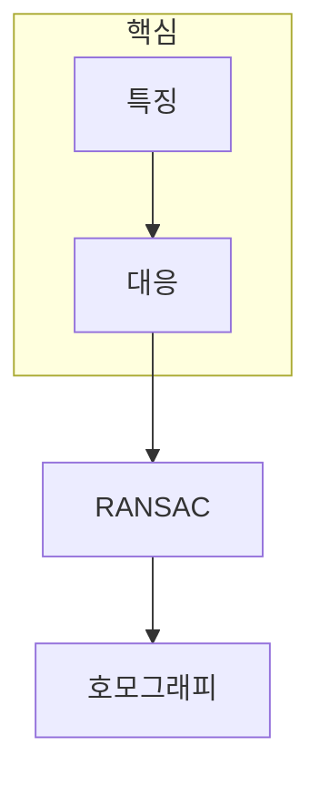

> [!abstract] 한 줄 요약
> 특징 매칭의 목표는 비슷해 보이는 점을 많이 모으는 것이 아니라, ==일관된 기하 관계==를 지지하는 대응점만 남기는 것이다.

## 이 노트의 지도



## 1. 호모그래피는 평면 위 대응을 하나의 변환으로 묶는다

두 영상이 같은 평면 장면을 볼 때, 동차 좌표의 대응은 호모그래피 행렬로 표현할 수 있다. 최소 추정에는 네 쌍의 대응점이 필요하므로, 대응점의 개수보다 배치와 정확도가 중요하다.

$$
mathbf{x}' sim mathbf{H}mathbf{x}
$$

<details>
<summary>왜 네 쌍의 대응점이 최소일까?</summary>

호모그래피는 스케일까지 포함한 자유도를 가지며, 한 점의 x·y 대응은 두 개의 제약을 준다. 따라서 일반 위치의 네 쌍이 최소 구성을 제공한다.

</details>

> [!caution] 적용 가정
> 호모그래피는 평면 장면 또는 순수 회전 같은 조건에서 유효한 모델이다. 일반적인 3D 장면의 모든 대응을 한 행렬로 설명하지는 않는다.

## 2. RANSAC은 전체를 믿기 전에 작은 가설을 반복 검증한다

RANSAC은 최소 표본으로 후보 모델을 만든 뒤, 그 모델을 지지하는 인라이어 수를 비교한다. 잘못 매칭된 점을 완전히 없애는 절차가 아니라, ==이상치에 덜 흔들리는 추정==을 만드는 절차다.

## 표본 수 제어

```html preview
<div style="font-family:system-ui,sans-serif;padding:20px;color:var(--foreground)">
  <label for="amt" style="font-size:14px;font-weight:600">가설 표본의 대응점 수</label>
  <div id="out" style="font-size:30px;font-weight:700;color:var(--chart-1);margin:6px 0">4쌍</div>
  <input id="amt" type="range" min="4" max="8" step="1" value="4"
    style="width:100%;accent-color:var(--primary)" />
  <p style="font-size:13px;color:var(--muted-foreground)">호모그래피의 최소 표본은 네 쌍이며, 후보 표본은 그보다 많이 잡을 수도 있다.</p>
  <script>
    var amt = document.getElementById('amt');
    var out = document.getElementById('out');
    amt.addEventListener('input', function () {
      out.textContent = Number(amt.value) + '쌍';
    });
  </script>
</div>
```

<Tabs>
  <Tab label="특징">재현성 있는 위치와 기술자를 찾는다.</Tab>
  <Tab label="대응">두 영상에서 같은 장면점을 후보로 연결한다.</Tab>
  <Tab label="검증">RANSAC 인라이어로 기하적 일관성을 확인한다.</Tab>
</Tabs>

## 핵심 정리

| 단계 | 산출물 | 실패 원인 |
| :-- | :-- | :-- |
| 특징 추출 | 키포인트·기술자 | 반복 무늬와 흐림 |
| 매칭 | 대응점 후보 | 유사하지만 다른 점 |
| 호모그래피 | 평면 변환 | 모델 가정 위반 |
| RANSAC | 인라이어 집합 | 표본·임계값 설정 |

> [!question]- 스스로 점검
> **Q.** 매칭 수가 많아도 호모그래피가 불안정할 수 있는 이유는 무엇인가?
>
> **A.** 대응점에 이상치가 많거나 평면 가정이 맞지 않으면 많은 점도 하나의 일관된 변환을 지지하지 못한다.

## 출처

- 공개 노트에는 원본 강의 자료, 자산 이미지, 페이지 단위 근거를 포함하지 않는다.
