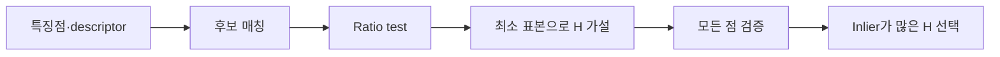

> [!abstract] 한 줄 요약
> 호모그래피는 평면 물체와 영상 평면 사이의 변환 관계를 $3×3$ 행렬로 표현하고, RANSAC은 잘못된 매칭 속에서 ==지지받는 모델==을 찾는다.

## 대응점에서 행렬로

호모그래피는 평면형 물체를 카메라로 봤을 때 원래 물체와 투영 영상 사이에 성립하는 기하 변환 관계다. 강의는 동차 좌표에서 $3×3$ 행렬 $H$로 이를 표현한다.

```html preview h=175
<div style="font-family:system-ui,sans-serif;padding:16px;color:var(--foreground);background:var(--card);border:1px solid var(--border);border-radius:var(--radius)">
  <div style="font-size:15px;font-weight:700;margin-bottom:10px">대응점은 같은 평면 위치의 두 관찰이다</div>
  <svg viewBox="0 0 720 102" width="100%" role="img" aria-label="독자 제작 호모그래피 대응점 흐름">
    <g font-family="system-ui,sans-serif" text-anchor="middle"><rect x="28" y="24" width="160" height="52" rx="10" fill="var(--card)" stroke="var(--border)"/><rect x="532" y="24" width="160" height="52" rx="10" fill="var(--card)" stroke="var(--border)"/><path d="M205 50h292" stroke="var(--chart-1)" stroke-width="4"/><path d="M497 50l-12-8v16z" fill="var(--chart-1)"/><text x="108" y="55" font-size="14" font-weight="700" fill="currentColor">관찰 A의 점</text><text x="612" y="55" font-size="14" font-weight="700" fill="currentColor">관찰 B의 점</text><text x="358" y="37" font-size="15" font-weight="700" fill="var(--chart-1)">H</text><text x="358" y="67" font-size="12" fill="var(--muted-foreground)">동차 좌표 변환</text></g>
  </svg>
</div>
```

> [!note] 최소 대응점 수
> 하나의 대응점은 두 방정식을 제공하고, 강의는 호모그래피를 결정하는 데 최소 4개의 매칭점이 필요하다고 정리한다. 네 점이 주어지면 8개 방정식으로 행렬의 스케일을 제외한 변수를 구하는 흐름이다.

<Tabs>
  <Tab label="검출·기술">
  SIFT·ORB 같은 방법으로 특징점과 descriptor를 얻는다.
  </Tab>
  <Tab label="가까운 후보">
  descriptor 거리로 후보 매칭을 만들고, 실습에서는 KNN과 ratio test를 사용해 1차로 거른다.
  </Tab>
  <Tab label="기하 검증">
  남은 대응점으로 $H$를 추정하고, RANSAC의 inlier 판정으로 일관된 매칭을 남긴다.
  </Tab>
</Tabs>



> [!important] 최소자승의 위치
> 최소자승은 오차 제곱합을 최소화해 해를 찾기 편리하지만, 큰 오차 하나가 결과에 크게 영향을 줄 수 있다. 이 취약성이 RANSAC을 함께 쓰는 이유다.

<details>
<summary>“평면형”이라는 전제는 무엇을 뜻하는가</summary>

호모그래피는 강의에서 평면형 물체와 영상 평면의 관계로 소개된다. 따라서 임의의 3D 장면 전체를 하나의 평면 변환으로 설명한다는 뜻은 아니다. 어떤 장면·대응점에 모델을 적용하는지 먼저 확인해야 한다.

</details>

## RANSAC: 다수가 지지하는 가설

RANSAC은 적은 수의 샘플로 임시 모델을 만들고, 나머지 데이터가 오차 범위 안에 들어오는지 확인해 inlier를 세는 방식이다.

> [!tip] 네 단계
> 가설 설정 → 모델 생성 → 검증 → 최적 모델 선택. 이 순서는 “가장 작은 표본”과 “가장 많은 동의”를 분리해 생각하게 해 준다.

```html preview h=183
<div style="font-family:system-ui,sans-serif;padding:16px;color:var(--foreground)">
  <div style="display:flex;gap:10px;flex-wrap:wrap">
    <div style="flex:1;min-width:125px;padding:13px;border-radius:var(--radius);border:1px solid var(--border);background:var(--card)"><b>1. 표본</b><br><span style="font-size:12px;color:var(--muted-foreground)">최소 대응점 선택</span></div>
    <div style="flex:1;min-width:125px;padding:13px;border-radius:var(--radius);border:1px solid var(--chart-3);background:var(--card)"><b>2. 모델</b><br><span style="font-size:12px;color:var(--muted-foreground)">임시 H 계산</span></div>
    <div style="flex:1;min-width:125px;padding:13px;border-radius:var(--radius);border:1px solid var(--chart-4);background:var(--card)"><b>3. 검증</b><br><span style="font-size:12px;color:var(--muted-foreground)">오차로 inlier 판정</span></div>
    <div style="flex:1;min-width:125px;padding:13px;border-radius:var(--radius);border:1px solid var(--chart-2);background:var(--card)"><b>4. 선택</b><br><span style="font-size:12px;color:var(--muted-foreground)">지지 많은 모델 채택</span></div>
  </div>
</div>
```

> [!warning] threshold는 판정 경계다
> 강의의 homography 검증은 $\lVert b_i - H a_i \rVert < t$인지를 기준으로 inlier를 판정한다. $t$는 “맞다/틀리다”를 가르는 오차 허용 범위이므로 결과의 inlier 수를 바꾼다.

<details>
<summary>RANSAC이 이상치에 강한 이유</summary>

최소자승은 모든 대응점 오차를 한꺼번에 줄이려 하므로 큰 outlier에 끌릴 수 있다. RANSAC은 작은 표본으로 가설을 여러 번 만들고, 전체 중 얼마나 많은 점이 그 가설에 동의하는지 센다. 그래서 한 번의 잘못된 대응점이 모델 전체를 바로 지배하지 않게 한다.

</details>

> [!success] 실습의 읽는 법
> SIFT로 특징을 만들고, KNN·ratio test로 후보를 줄인 뒤, RANSAC homography에서 최종 inlier만 시각화한다. 그림의 선 개수보다 “어떤 필터를 거쳐 남았는가”가 핵심이다.

## 핵심 정리

| 요소 | 역할 | 실패 시 신호 |
| :-- | :-- | :-- |
| descriptor | 지점 주변을 비교 가능한 벡터로 요약 | 잘못된 후보가 많음 |
| ratio test | 가까운 두 후보의 차이로 모호한 매칭을 줄임 | 후보가 지나치게 사라질 수 있음 |
| homography | 평면 대응을 행렬로 모델링 | 평면 전제와 맞지 않음 |
| RANSAC | inlier 지지가 큰 모델 선택 | threshold와 샘플에 민감 |

> [!question]- 스스로 점검
> **Q.** 호모그래피에 최소 4개 대응점이 필요하다는 사실과 RANSAC의 최소 표본은 어떻게 연결되는가?
> **A.** RANSAC은 한 번의 가설을 만들 때 모델이 요구하는 최소 대응점을 뽑는다. 호모그래피라면 그 최소 표본이 4쌍이다.
