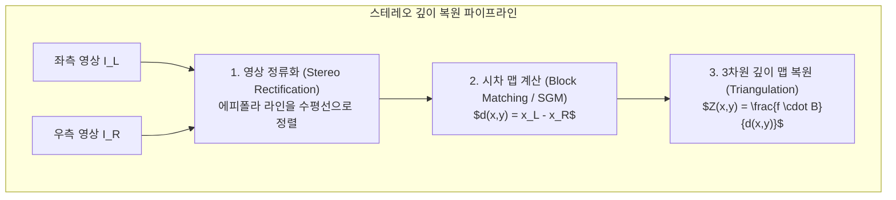

> [!abstract] 핵심 요약
> **스테레오 비전(Stereo Vision)**은 서로 다른 위치에 배치된 두 대의 카메라로부터 좌/우 영상 간의 픽셀 좌표 차이인 **시차(Disparity $d = x_L - x_R$)**를 구하여 3차원 물리적 깊이($Z$)를 복원하는 핵심 3D 비전 기술이다.
> 두 핀홀 카메라의 광학 중심과 3차원 점이 이루는 기하학적 구속 조건인 **에피폴라 기하(Epipolar Constraint $\mathbf{x}'^T \mathbf{F} \mathbf{x} = 0$)**를 통해 2D 전 영역 매칭 탐색을 1D 에피폴라 선상 탐색으로 극적으로 단순화한다.

---

## 1. 스테레오 깊이(Depth Z) 삼각측량 공식 수학적 유도

$$Z = \frac{f \cdot B}{d} = \frac{f \cdot B}{x_L - x_R}$$

- $f$: 카메라 초점 거리 (Focal Length, 픽셀 단위)
- $B$: 좌우 카메라 간의 베이스라인 거리 (Baseline, 미터 단위)
- $d = x_L - x_R$: 좌우 영상 간의 시차 (Disparity, 픽셀 단위)
- **핵심 물리 법칙**: 깊이 $Z$와 시차 $d$는 **완벽히 반비례 관계** ($d \to \infty \implies Z \to 0$, $d \to 0 \implies Z \to \infty$).



---

## 2. 기초 행렬(F) vs 본질 행렬(E) 비교

| 행렬 명칭 | 수학적 정의 | 사용 좌표계 | 카메라 캘리브레이션 필요 여부 |
| :-- | :-- | :-- | :-- |
| **본질 행렬 (Essential Matrix $\mathbf{E}$)** | $\mathbf{E} = [\mathbf{t}]_\times \mathbf{R}$ | **정규화 카메라 좌표계 ($\hat{\mathbf{x}}$)** | **필수** (내부 파라미터 $\mathbf{K}$ 필요) |
| **기초 행렬 (Fundamental Matrix $\mathbf{F}$)** | $\mathbf{F} = \mathbf{K}'^{-T} \mathbf{E} \mathbf{K}^{-1}$ | **픽셀 좌표계 ($\mathbf{x}$)** | **불필요 (Uncalibrated 영상에서 직접 8-Point 알고리즘 추정 가능)** |

---

## 3. 실시간 스테레오 시차(Disparity) ➔ 3D 깊이(Depth) 계산기

```html preview
<div style="font-family:system-ui,-apple-system,sans-serif;padding:20px;background:var(--card);color:var(--card-foreground);border:1px solid var(--border);border-radius:var(--radius)">
  <div style="font-size:16px;font-weight:700;margin-bottom:14px;color:var(--primary);display:flex;align-items:center;gap:8px">
    <span>📐 스테레오 시차(Disparity) ➔ 3D 깊이(Depth Z) 실시간 계산기</span>
  </div>

  <div style="display:grid;grid-template-columns:repeat(3, 1fr);gap:10px;margin-bottom:14px">
    <div>
      <label style="font-size:10px;color:var(--muted-foreground)">초점 거리 f (픽셀):</label>
      <input id="inStereoF" type="number" value="800" step="50" style="width:100%;padding:4px;background:var(--background);color:var(--foreground);border:1px solid var(--border);border-radius:var(--radius);font-weight:700" />
    </div>
    <div>
      <label style="font-size:10px;color:var(--muted-foreground)">베이스라인 B (미터):</label>
      <input id="inStereoB" type="number" value="0.2" step="0.05" style="width:100%;padding:4px;background:var(--background);color:var(--foreground);border:1px solid var(--border);border-radius:var(--radius);font-weight:700" />
    </div>
    <div>
      <label style="font-size:10px;color:var(--muted-foreground)">측정된 시차 d (픽셀):</label>
      <input id="inStereoD" type="number" value="32" step="2" style="width:100%;padding:4px;background:var(--background);color:var(--foreground);border:1px solid var(--border);border-radius:var(--radius);font-weight:700" />
    </div>
  </div>

  <div style="display:grid;grid-template-columns:1fr 1fr;gap:12px;margin-bottom:12px">
    <div style="padding:10px;background:var(--background);border:1px solid var(--border);border-radius:var(--radius);text-align:center">
      <div style="font-size:10px;color:var(--muted-foreground)">물체까지의 3차원 깊이 (Depth Z)</div>
      <div id="stereoDepthOut" style="font-family:monospace;font-size:16px;font-weight:800;color:var(--primary);margin-top:2px">5.00 m</div>
    </div>
    <div style="padding:10px;background:var(--background);border:1px solid var(--border);border-radius:var(--radius);text-align:center">
      <div style="font-size:10px;color:var(--muted-foreground)">깊이 분해능 감도 (dZ/dd)</div>
      <div id="stereoResOut" style="font-family:monospace;font-size:16px;font-weight:800;color:var(--chart-1);margin-top:2px">0.156 m/px</div>
    </div>
  </div>

  <div id="stereoDesc" style="padding:10px;background:var(--background);border:1px solid var(--border);border-radius:var(--radius);font-size:11px">
    공식: <code>Z = (800 px × 0.20 m) / 32 px = 5.00 m</code>. 시차가 클수록 카메라는 가까운 물체로 판정합니다.
  </div>

  <script>
    function updateStereo() {
      var f = parseFloat(document.getElementById('inStereoF').value) || 800;
      var b = parseFloat(document.getElementById('inStereoB').value) || 0.2;
      var d = parseFloat(document.getElementById('inStereoD').value) || 32;

      if (d <= 0) return;

      var z = (f * b) / d;
      var dz_dd = (f * b) / (d * d);

      document.getElementById('stereoDepthOut').textContent = z.toFixed(2) + " m";
      document.getElementById('stereoResOut').textContent = dz_dd.toFixed(3) + " m/px";
      document.getElementById('stereoDesc').innerHTML = "공식: <code>Z = (" + f + " × " + b.toFixed(2) + ") / " + d + " = <b>" + z.toFixed(2) + " m</b></code> (시차가 작을수록 원거리)";
    }

    ['inStereoF', 'inStereoB', 'inStereoD'].forEach(function(id) {
      document.getElementById(id).addEventListener('input', updateStereo);
    });
    updateStereo();
  </script>
</div>
```
