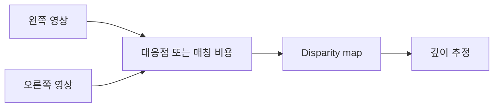

> [!abstract] 한 줄 요약
> 스테레오 비전은 두 카메라의 위치 차이에서 생기는 disparity를 이용해 깊이를 추정하며, 깊이 지도는 대응·비용·정규화의 선택에 따라 달라진다.

## 핀홀 모델과 깊이 모호성

핀홀 카메라 모델에서는 물체에서 나온 빛이 카메라 중심을 지나 영상 평면에 상을 만든다. 강의는 주축을 카메라 중심에서 영상 평면에 수직으로 내린 선, 주점을 그 선이 영상 평면과 만나는 점으로 정의한다.

> [!note] 내부 파라미터
> 초점거리와 주점은 영상 좌표를 계산하는 카메라 내부 파라미터다. 수평 화각도 영상 폭과 초점거리의 관계로 계산할 수 있다.

```html preview h=186
<div style="font-family:system-ui,sans-serif;padding:16px;color:var(--foreground);background:var(--card);border:1px solid var(--border);border-radius:var(--radius)">
  <div style="font-size:15px;font-weight:700;margin-bottom:10px">한 영상 좌표에는 같은 광선 위의 여러 3D 점이 겹칠 수 있다</div>
  <svg viewBox="0 0 720 112" width="100%" role="img" aria-label="독자 제작 핀홀 투영과 깊이 모호성 도식">
    <g transform="translate(35 8)" font-family="system-ui,sans-serif"><path d="M95 54 L520 12 M95 54 L520 96" stroke="var(--muted-foreground)" stroke-width="2"/><circle cx="95" cy="54" r="8" fill="var(--chart-1)"/><line x1="530" y1="5" x2="530" y2="103" stroke="var(--border)" stroke-width="5"/><circle cx="300" cy="34" r="8" fill="var(--chart-3)"/><circle cx="430" cy="21" r="8" fill="var(--chart-5)"/><circle cx="530" cy="12" r="7" fill="var(--chart-2)"/><text x="70" y="78" font-size="12" fill="currentColor">중심</text><text x="267" y="25" font-size="12" fill="var(--chart-3)">가까운 점</text><text x="400" y="14" font-size="12" fill="var(--chart-5)">먼 점</text><text x="545" y="18" font-size="12" fill="var(--chart-2)">같은 투영</text></g>
  </svg>
</div>
```

> [!warning] 단일 시점의 한계
> 3D 점 $(X,Y,Z)$를 같은 비율로 스케일해도 투영 좌표의 비율은 바뀌지 않는다. 강의가 말하는 depth ambiguity는 한 장의 영상만으로 절대 깊이를 확정하기 어려운 이유다.

<details>
<summary>가상 영상 평면을 쓰는 이유</summary>

실제 핀홀 뒤의 영상 평면에서는 상하좌우가 뒤집힌다. 가상 영상 평면을 앞쪽에 두면 방향은 유지하면서 같은 기하 관계를 표현할 수 있어, 계산과 해석이 쉬워진다.

</details>

## 두 시점의 차이를 깊이로 바꾸기

스테레오 비전은 두 카메라가 사람의 두 눈처럼 장면을 볼 때 생기는 위치 차이, 즉 disparity로 거리·깊이를 추정한다.



<Tabs>
  <Tab label="Baseline">
  두 카메라 중심 사이 거리다. 강의의 기본 관계는 baseline이 0이 아니라는 가정에서 시작한다.
  </Tab>
  <Tab label="Disparity">
  두 시점에서 같은 점이 놓인 위치의 차이다. 정렬된 스테레오에서는 대응점이 같은 높이에 있다고 본다.
  </Tab>
  <Tab label="Depth">
  초점거리·baseline·disparity의 비례 관계로 추정한다. disparity가 깊이와 단순히 같은 값은 아니다.
  </Tab>
</Tabs>

```html preview h=253px w=535px
<div style="font-family:system-ui,sans-serif;padding:16px;color:var(--foreground)">
  <div style="font-weight:700;margin-bottom:10px">스테레오가 추가하는 정보</div>
  <div style="display:flex;gap:10px;flex-wrap:wrap">
    <div style="flex:1;min-width:150px;padding:14px;border:1px solid var(--border);border-radius:var(--radius);background:var(--card)"><b>두 시점</b><br><span style="font-size:13px;color:var(--muted-foreground)">서로 다른 관찰 위치</span></div>
    <div style="flex:1;min-width:150px;padding:14px;border:1px solid var(--chart-3);border-radius:var(--radius);background:var(--card)"><b>시차</b><br><span style="font-size:13px;color:var(--muted-foreground)">대응 위치의 차이</span></div>
    <div style="flex:1;min-width:150px;padding:14px;border:1px solid var(--chart-2);border-radius:var(--radius);background:var(--card)"><b>깊이</b><br><span style="font-size:13px;color:var(--muted-foreground)">기하 관계로 환산</span></div>
  </div>
</div>
```

> [!important] disparity map
> disparity를 픽셀 단위로 펼친 것이 disparity map이다. 강의는 이를 깊이 지도라고도 부르지만, 실제 깊이 단위로 바꾸려면 카메라 파라미터와 기하 관계가 필요하다.

<details>
<summary>특징점 매칭만으로 모든 픽셀의 깊이를 얻기 어려운 이유</summary>

SIFT·ORB처럼 특징을 찾는 방법은 눈에 띄는 지점에는 강하지만, 특징이 아닌 대부분의 픽셀에 대해 disparity를 정하기 어렵다. 조밀한 깊이 지도를 만들려면 픽셀·블록 또는 비용 볼륨을 다루는 방법이 필요하다.

</details>

## 매칭 비용을 최소화하는 여러 방식

> [!tip] 블록 매칭
> 픽셀 주변의 작은 윈도우 단위로 좌우 영상 유사도를 비교한다. 강의는 SAD·SSD·NCC를 비용 예로 든다.

| 방법 | 핵심 관점 | 강의가 강조한 특징 |
| :-- | :-- | :-- |
| 블록 매칭 | 국소 윈도우 유사도 | 단순하고 빠른 출발점 |
| 전역 매칭 | 전체 에너지 최소화 | data term과 smoothness term의 균형 |
| 세미전역 매칭 | 여러 방향 경로 비용 | 속도와 정확도 사이의 균형 |
| 딥러닝 | 특징맵·cost volume | 비용 집계와 disparity 추정까지 학습 흐름 |

> [!success] 전역 매칭의 두 항
> data term은 좌우 대응 픽셀의 유사도를, smoothness term은 이웃 disparity가 지나치게 달라지지 않도록 하는 제약을 나타낸다. 좋은 지도는 둘 중 하나만 최소화하는 것이 아니라 trade-off를 조정한다.

<details>
<summary>세미전역 매칭이 “세미”인 이유</summary>

강의의 SGM은 블록 매칭의 속도와 전역 매칭의 정확도 사이에서 균형을 잡는다. 한 줄만 최적화할 때 생길 수 있는 줄무늬를 줄이기 위해 여러 방향에서 경로 비용을 계산하고 합친다.

</details>

> [!question]- 스스로 점검
> **Q.** smoothness term만 최소화하면 왜 충분하지 않은가?
> **A.** 모든 disparity가 같은 지도라면 매끄러움 비용은 작아질 수 있지만, 좌우 영상의 실제 대응을 설명하지 못한다. 그래서 data term과 함께 본다.
