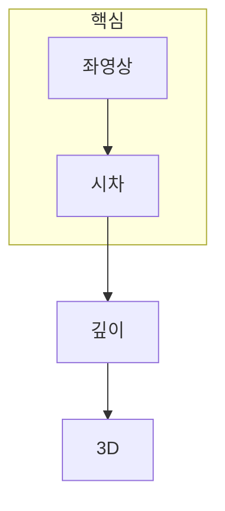

> [!abstract] 한 줄 요약
> 스테레오 비전은 같은 장면점의 ==양안 시차==를 깊이로 바꾸지만, 대응이 불확실한 곳에서는 깊이도 불확실해진다.

## 이 노트의 지도



## 1. 시차가 깊이를 연결한다

정렬된 두 카메라에서 같은 장면점은 좌·우 영상의 서로 다른 가로 위치에 나타난다. 초점거리 f와 베이스라인 B가 정해졌을 때 깊이 Z는 시차 d에 반비례한다.

$$
Z = rac{fB}{d}
$$

<details>
<summary>시차가 작을 때 왜 깊이 추정이 민감할까?</summary>

시차가 작은 먼 거리에서는 한 픽셀 안팎의 오차가 깊이에 크게 증폭될 수 있다. 따라서 멀리 있는 영역의 깊이맵은 숫자만 보지 말고 신뢰 구간과 경계 품질을 함께 확인해야 한다.

</details>

> [!caution] 대응 불가능 영역
> 가림, 반복 무늬, 텍스처 부족 영역에서는 한 영상의 픽셀이 다른 영상에서 유일한 짝을 갖지 않을 수 있다.

## 2. 매칭 방법은 지역 정보와 전역 일관성의 균형이다

블록 매칭은 가까운 이웃을 비교해 빠르게 시차를 구하지만, 가림과 경계에서 약할 수 있다. 전역·세미전역 방법과 딥러닝 기반 방법도 결국 대응 비용과 공간적 일관성을 다루는 방식이 다르다.

## 시차 제어

```html preview
<div style="font-family:system-ui,sans-serif;padding:20px;color:var(--foreground)">
  <label for="amt" style="font-size:14px;font-weight:600">시차 d</label>
  <div id="out" style="font-size:30px;font-weight:700;color:var(--chart-1);margin:6px 0">16 px</div>
  <input id="amt" type="range" min="1" max="64" step="1" value="16"
    style="width:100%;accent-color:var(--primary)" />
  <p style="font-size:13px;color:var(--muted-foreground)">d가 커질수록 Z = fB/d에 따라 깊이 Z는 작아진다.</p>
  <script>
    var amt = document.getElementById('amt');
    var out = document.getElementById('out');
    amt.addEventListener('input', function () {
      out.textContent = Number(amt.value) + ' px';
    });
  </script>
</div>
```

<Tabs>
  <Tab label="기하">카메라 간 거리와 초점거리가 깊이 비례상수에 들어간다.</Tab>
  <Tab label="대응">각 픽셀의 같은 장면점을 찾아 시차를 만든다.</Tab>
  <Tab label="신뢰">가림·반복·무텍스처 영역은 별도로 해석한다.</Tab>
</Tabs>

## 핵심 정리

| 요소 | 역할 | 오류가 커지는 조건 |
| :-- | :-- | :-- |
| 시차 d | 깊이의 직접 단서 | 작을수록 깊이 오차가 민감하다 |
| 베이스라인 B | 관측 기하 | 너무 작으면 시차가 작아진다 |
| 매칭 비용 | 대응 후보 비교 | 반복 무늬와 가림 |
| 정규화 | 공간적 일관성 | 실제 경계를 흐릴 수 있다 |

> [!question]- 스스로 점검
> **Q.** 같은 시차 오차가 가까운 물체와 먼 물체에 다르게 작용하는 이유는 무엇인가?
>
> **A.** 깊이가 시차의 역수에 비례하므로, 작은 시차 영역에서는 오차가 깊이 값에 더 크게 반영될 수 있기 때문이다.

## 출처

- 공개 노트에는 원본 강의 자료, 자산 이미지, 페이지 단위 근거를 포함하지 않는다.
