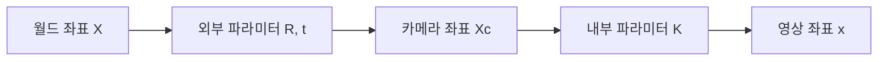

> [!abstract] 한 줄 요약
> 카메라 모델은 월드 좌표의 점을 카메라 좌표로 옮기고 영상 좌표로 투영하는 과정이며, 내부·외부 파라미터를 알아야 이 흐름을 실제 장치에 맞출 수 있다.

## 내부 파라미터: 어떻게 투영되는가

핀홀 모델에서 3D 점 $(X,Y,Z)$는 초점거리와 주점을 통해 영상 좌표로 투영된다. 강의는 이 값을 camera intrinsic matrix $K$로 묶는다.

> [!note] K 안의 값
> $f_x,f_y$는 픽셀 단위 초점거리이고, $(p_x,p_y)$는 주점이다. 강의의 단순화된 예에서는 skew를 생략하고 $f_x=f_y=f$로 표현한다.

```html preview h=178
<div style="font-family:system-ui,sans-serif;padding:16px;color:var(--foreground);background:var(--card);border:1px solid var(--border);border-radius:var(--radius)">
  <div style="font-size:15px;font-weight:700;margin-bottom:10px">내부 파라미터는 카메라 좌표를 영상 좌표로 바꾸는 기준이다</div>
  <div style="display:flex;gap:11px;align-items:center;flex-wrap:wrap">
    <div style="padding:13px 15px;border:1px solid var(--border);border-radius:var(--radius);background:var(--card)"><b>카메라 좌표</b><br><span style="font-size:12px;color:var(--muted-foreground)">(xᶜ, yᶜ, zᶜ)</span></div>
    <div style="font-size:22px;color:var(--chart-1)">K</div>
    <div style="padding:13px 15px;border:1px solid var(--chart-1);border-radius:var(--radius);background:var(--card)"><b>동차 영상 좌표</b><br><span style="font-size:12px;color:var(--muted-foreground)">(x, y, 1)</span></div>
  </div>
</div>
```

<details>
<summary>왜 z로 나누는가</summary>

투영식에는 $X/Z$, $Y/Z$가 들어간다. 동차 표현으로 행렬 곱을 먼저 적고 마지막에 정규화하면, 3D에서 2D로 가는 비율 관계를 하나의 흐름으로 정리할 수 있다.

</details>

> [!important] 같은 방향, 다른 거리
> 투영 좌표는 $X,Y,Z$의 절대 크기보다 비율에 의존한다. 그래서 한 장의 영상에서는 깊이 모호성이 생기며, 다른 시점·기하 제약이 필요한 이유가 된다.

## 외부 파라미터: 어디에서 보는가

외부 파라미터는 회전 행렬 $R$과 이동 벡터 $t$로 카메라의 방향과 위치를 나타낸다. 카메라 포즈는 이 두 값으로 정해진다.



<Tabs>
  <Tab label="월드">
  장면을 공통 기준 좌표계에서 표현한다.
  </Tab>
  <Tab label="카메라">
  회전과 이동을 적용해 카메라 중심을 원점으로 하는 좌표계로 바꾼다.
  </Tab>
  <Tab label="영상">
  K를 적용하고 동차 좌표를 정규화해 2D 영상 좌표를 얻는다.
  </Tab>
</Tabs>

> [!tip] 동차 좌표의 장점
> 3D 점 $(x,y,z)$에 1을 추가하면 회전과 이동을 하나의 행렬 곱으로 표현할 수 있다. 여러 좌표 변환도 행렬을 이어 곱해 하나의 변환으로 합칠 수 있다.

```html preview h=173
<div style="font-family:system-ui,sans-serif;padding:16px;color:var(--foreground)">
  <svg viewBox="0 0 720 104" width="100%" role="img" aria-label="독자 제작 좌표계 변환 단계">
    <g font-family="system-ui,sans-serif" text-anchor="middle"><g fill="var(--card)" stroke="var(--border)"><rect x="16" y="26" width="145" height="50" rx="10"/><rect x="288" y="26" width="145" height="50" rx="10"/><rect x="560" y="26" width="145" height="50" rx="10"/></g><g font-size="14" font-weight="700" fill="currentColor"><text x="88" y="56">월드 좌표</text><text x="360" y="56">카메라 좌표</text><text x="632" y="56">영상 좌표</text></g><path d="M175 51h99M447 51h99" stroke="var(--muted-foreground)" stroke-width="3"/><text x="225" y="37" font-size="12" fill="var(--chart-3)">R, t</text><text x="497" y="37" font-size="12" fill="var(--chart-1)">K</text></g>
  </svg>
</div>
```

<details>
<summary>카메라 행렬 P가 묶는 것</summary>

강의의 카메라 행렬은 외부 변환과 내부 투영을 결합해 월드 좌표에서 영상 좌표까지 가는 관계를 표현한다. 즉 $P$는 새로운 종류의 좌표계가 아니라, 여러 변환을 한 번에 적용하기 위한 결합 표현이다.

</details>

## 캘리브레이션과 스테레오 보정

카메라 캘리브레이션은 실제 장치의 내부·외부 파라미터를 추정하는 작업이다. 여러 카메라가 있다면 각 카메라의 $K,R,t$를 구해, 3D에서 어디에 있고 어느 방향을 보는지 모델링한다.

> [!success] 보정의 목적
> 스테레오 촬영에서는 두 영상의 기하 관계를 알아야 한다. rectification은 대응점이 같은 높이에 오도록 정렬해, 이후 disparity 탐색을 더 단순한 방향으로 제한한다.

### 보정에서 주의할 점

실제 스테레오 영상의 대응점이 처음부터 같은 높이에 있을 필요는 없다. 강의는 캘리브레이션과 기하 관계 추정 뒤 rectification으로 이를 맞추는 흐름을 제시한다.

| 항목 | 답하는 질문 | 대표 값 |
| :-- | :-- | :-- |
| 내부 파라미터 | 카메라가 어떻게 투영하는가 | $K$, 초점거리, 주점 |
| 외부 파라미터 | 카메라가 어디에 어떻게 놓였는가 | $R,t$, pose |
| 캘리브레이션 | 실제 장치의 값을 어떻게 얻는가 | 각 카메라의 파라미터 |
| 보정 | 두 영상의 탐색을 어떻게 정렬하는가 | rectified stereo pair |

### 스스로 점검

**Q.** 캘리브레이션과 rectification은 같은 작업인가?

**A.** 아니다. 캘리브레이션은 실제 카메라의 내부·외부 파라미터를 추정하는 일이고, rectification은 그 기하 관계를 사용해 스테레오 대응 탐색이 편하도록 영상을 정렬하는 단계다.
