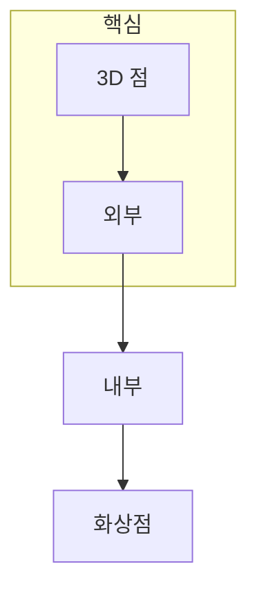

> [!abstract] 한 줄 요약
> 카메라 모델은 3D 점을 2D 화상점으로 보내는 규칙이며, ==내부·외부 파라미터==를 분리해야 보정과 복원을 해석할 수 있다.

## 이 노트의 지도



## 1. 동차 좌표는 변환을 한 행렬 곱으로 묶는다

동차 좌표를 쓰면 회전과 이동을 포함한 3D 좌표 변환을 행렬 곱으로 표현할 수 있다. 카메라의 위치·방향은 외부 파라미터 R, t로, 렌즈와 영상 센서의 기하는 내부 행렬 K로 분리한다.

$$
smathbf{x} = mathbf{K}[mathbf{R}midmathbf{t}]mathbf{X}
$$

<details>
<summary>내부와 외부를 나누는 이유</summary>

내부 파라미터는 같은 카메라의 초점거리·주점처럼 장비에 연결된 값이다. 외부 파라미터는 촬영할 때 카메라가 장면에 대해 가진 위치와 방향이다.

</details>

> [!caution] 좌표계 확인
> 행렬이 맞아도 좌표계의 원점·축 방향·단위를 섞으면 투영 결과가 달라진다. 식을 쓰기 전에 각 좌표계의 기준을 먼저 정한다.

## 2. 캘리브레이션은 관측과 모델을 맞춘다

캘리브레이션은 알려진 3D-2D 대응을 이용해 K와 왜곡 관련 파라미터를 추정하는 과정이다. 스테레오 보정은 두 카메라가 대응을 찾기 쉬운 기하 관계가 되도록 정렬하는 데 쓰인다.

## 파라미터 카드

```html preview
<div style="font-family:system-ui,sans-serif;padding:20px">
  <div id="cards" style="display:flex;gap:14px;flex-wrap:wrap"></div>
  <script>
    var stats = [
      ['K', '내부', '초점·주점', 'var(--chart-1)'],
      ['R, t', '외부', '자세와 위치', 'var(--chart-2)'],
      ['P', '투영', '3D에서 2D', 'var(--chart-3)']
    ];
    document.getElementById('cards').innerHTML = stats.map(function (s) {
      return '<div style="flex:1;min-width:150px;padding:16px;background:var(--card);' +
        'color:var(--card-foreground);border:1px solid var(--border);' +
        'border-radius:var(--radius)">' +
        '<div style="font-size:13px;color:var(--muted-foreground)">' + s[0] + '</div>' +
        '<div style="font-size:26px;font-weight:700;margin-top:4px">' + s[1] + '</div>' +
        '<div style="font-size:12px;font-weight:600;margin-top:4px;color:' + s[3] + '">' +
        s[2] + '</div>' +
        '</div>';
    }).join('');
  </script>
</div>
```

<Tabs>
  <Tab label="좌표">3D 점과 화상점을 동차 좌표로 표현한다.</Tab>
  <Tab label="파라미터">K는 내부, R·t는 외부 기하를 담당한다.</Tab>
  <Tab label="보정">관측 대응으로 모델의 미지값을 추정한다.</Tab>
</Tabs>

## 핵심 정리

| 기호 | 의미 | 확인할 질문 |
| :-- | :-- | :-- |
| K | 내부 행렬 | 렌즈·센서 기하가 무엇인가 |
| R, t | 외부 파라미터 | 카메라가 장면에 대해 어디에 있는가 |
| P | 카메라 행렬 | 어떤 3D 점이 어느 2D 점으로 가는가 |
| s | 동차 스케일 | 투영 뒤 어떻게 정규화하는가 |

> [!question]- 스스로 점검
> **Q.** 카메라를 움직이지 않고 렌즈만 바꾸면 주로 어느 파라미터가 달라지는가?
>
> **A.** 장면에 대한 카메라 자세가 아니라 초점거리·주점 같은 내부 파라미터가 달라진다.

## 출처

- 공개 노트에는 원본 강의 자료, 자산 이미지, 페이지 단위 근거를 포함하지 않는다.

---

## 원본 강의 흐름 인터랙티브

```html preview
<div style="font-family:system-ui,sans-serif;padding:20px;color:var(--foreground)">
  <label for="noteFlow734112" style="font-size:14px;font-weight:600">3D 기하와 카메라 파라미터 단계</label>
  <div id="noteFlow734112-out" style="font-size:26px;font-weight:700;color:var(--chart-1);margin:6px 0">3D 기하와 카메라 파라미터 핵심 개념</div>
  <input id="noteFlow734112" type="range" min="1" max="3" step="1" value="1" style="width:100%;accent-color:var(--primary)" />
  <p style="font-size:13px;color:var(--muted-foreground)">슬라이더를 움직이면 원본 PDF에서 정리한 이 노트의 흐름을 확인합니다.</p>
  <script>
    var noteFlow734112 = document.getElementById('noteFlow734112');
    var noteFlow734112Out = document.getElementById('noteFlow734112-out');
    var noteFlow734112Steps = ["3D 기하와 카메라 파라미터 핵심 개념","3D 기하와 카메라 파라미터 처리 절차","3D 기하와 카메라 파라미터 검증·응용"];
    noteFlow734112.addEventListener('input', function () { noteFlow734112Out.textContent = noteFlow734112Steps[Number(noteFlow734112.value) - 1]; });
  </script>
</div>
```
