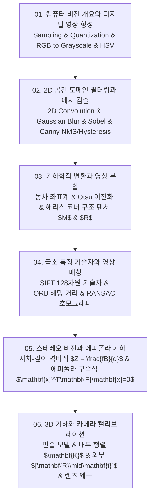

# 📚 컴퓨터 비전 (Computer Vision & 3D Geometry) 전체 강의 로드맵

디지털 영상 표본화·양자화 및 RGB/HSV 색 공간 변환, 2D 공간 컨볼루션과 가우시안 평활화, 소벨 마스크 및 캐니(Canny) 4단계 에지 검출기, 동차 좌표계 기반 아핀·원근 투영 변환 및 구조 텐서 기반 해리스 코너(Harris Corner) 검출기, DoG 및 128차원 SIFT 기술자, RANSAC 기반 강건한 호모그래피(Homography) 추정, 스테레오 비전의 시차(Disparity)-깊이 역비례 공식과 에피폴라 기하(기초 행렬 F 및 본질 행렬 E), 그리고 핀홀 카메라 캘리브레이션 투영 행렬($\mathbf{P} = \mathbf{K}[\mathbf{R} \mid \mathbf{t}]$)까지 컴퓨터 비전 전반의 수학과 알고리즘을 포괄합니다.

---

## 🗺️ 강의 목차 (Curriculum Overview)

---

## 📑 개별 정리 문서 목록

1. [01. 컴퓨터 비전 개요와 디지털 영상 형성 - 픽셀 표상, 색 공간(RGB·HSV·Grayscale)과 영상 히스토그램](file:///Users/um-yunsang/work/edu/ComputerScience/03_ai-ml-data/computer-vision/notes/01.%20%EC%BB%B4%ED%93%A8%ED%84%B0%20%EB%B9%84%EC%A0%84%20%EA%B0%9C%EC%9A%94%EC%99%80%20%EB%94%94%EC%A7%80%ED%84%B8%20%EC%98%81%EC%83%81%20%ED%98%95%EC%84%B1%20-%20%ED%94%BD%EC%85%80%20%ED%91%9C%EC%83%81,%20%EC%83%89%20%EA%B3%B5%EA%B0%84(RGB%C2%B7HSV%C2%B7Grayscale)%EA%B3%BC%20%EC%98%81%EC%83%81%20%ED%9E%88%EC%8A%A4%ED%86%A0%EA%B7%B8%EB%9E%A8.md)
   - 표본화와 양자화, $Y=0.299R+0.587G+0.114B$, 히스토그램 평활화, 실시간 RGB/HSV 변환기
2. [02. 2D 공간 도메인 필터링과 에지 검출 - 공간 컨볼루션, 가우시안 블러, 소벨(Sobel) 및 캐니(Canny) 에지 검출기](file:///Users/um-yunsang/work/edu/ComputerScience/03_ai-ml-data/computer-vision/notes/02.%202D%20%EA%B3%B5%EA%B0%84%20%EB%8F%84%EB%A9%94%EC%9D%B8%20%ED%95%84%ED%84%B0%EB%A7%81%EA%B3%BC%20%EC%97%90%EC%A7%80%20%EA%B2%80%EC%B6%9C%20-%20%EA%B3%B5%EA%B0%84%20%EC%BB%A8%EB%B3%BC%EB%A3%A8%EC%85%98,%20%EA%B0%80%EC%9A%B0%EC%8B%9C%EC%95%88%20%EB%blocks%EB%9F%AC,%20%EC%86%8C%EB%B2%A8(Sobel)%20%EB%B0%8F%20%EC%BA%90%EB%8B%88(Canny)%20%EC%97%90%EC%A7%80%20%EA%B2%80%EC%B6%9C%EA%B8%B0.md)
   - 공간 컨볼루션, 소벨 $G_x, G_y$, 캐니 4단계(NMS, Hysteresis), 실시간 그래디언트 마스크 연산기
3. [03. 기하학적 변환과 영상 분할 - 아핀·투영 변환, 오츠(Otsu) 이진화 및 해리스 코너(Harris Corner) 검출기](file:///Users/um-yunsang/work/edu/ComputerScience/03_ai-ml-data/computer-vision/notes/03.%20%EA%B8%B0%ED%95%98%ED%95%99%EC%A0%81%20%EB%B3%80%ED%99%98%EA%B3%BC%20%EC%98%81%EC%83%81%20%EB%B6%84%ED%95%A0%20-%20%EC%95%84%ED%95%80%C2%B7%ED%88%AC%EC%98%81%20%EB%B3%80%ED%99%98,%20%EC%98%A4%EC%B8%A0(Otsu)%20%EC%9D%B4%EC%A7%84%ED%99%94%20%EB%B0%8F%20%ED%95%B4%EB%A6%AC%EC%8A%A4%20%EC%BD%94%EB%84%88(Harris%20Corner)%20%EA%B2%80%EC%B6%9C%EA%B8%B0.md)
   - 동차 좌표계 변환 행렬, 오츠 클래스 간 분산, 해리스 코너 반응식 $R$, 실시간 고유값 반응성 시뮬레이터
4. [04. 국소 특징 기술자와 영상 매칭 - SIFT, ORB, RANSAC 기반 강건한 호모그래피(Homography) 추정](file:///Users/um-yunsang/work/edu/ComputerScience/03_ai-ml-data/computer-vision/notes/04.%20%EA%B5%AD%EC%86%8C%20%ED%8A%B9%EC%A7%95%20%EA%B8%B0%EC%88%A0%EC%9E%90%EC%99%80%20%EC%98%81%EC%83%81%20%EB%A7%A4%EC%B9%AD%20-%20SIFT,%20ORB,%20RANSAC%20%EA%B8%B0%EB%B0%98%20%EA%B0%95%EA%B2%AC%ED%95%9C%20%ED%98%B8%EB%AA%A8%EA%B7%B8%EB%9E%98%ED%94%BC(Homography)%20%EC%B6%94%EC%A0%95.md)
   - SIFT DoG & 128D 기술자, Lowe's Ratio Test, RANSAC 호모그래피, 대화형 RANSAC 인라이어 추정기
5. [05. 스테레오 비전(Stereo Vision)과 에피폴라 기하 - 시차(Disparity) 맵 계산, 기초 행렬(F)과 본질 행렬(E)](file:///Users/um-yunsang/work/edu/ComputerScience/03_ai-ml-data/computer-vision/notes/05.%20%EC%8A%A4%ED%85%8C%EB%A0%88%EC%98%A4%20%EB%B9%84%EC%A0%84(Stereo%20Vision)%EA%B3%BC%20%EC%97%90%ED%94%BC%ED%8F%B4%EB%9D%BC%20%EA%B8%B0%ED%95%98%20-%20%EC%8B%9C%EC%B0%A8(Disparity)%20%EB%A7%B5%20%EA%B3%84%EC%82%B0,%20%EA%B8%B0%EC%B4%88%20%ED%96%89%EB%87%AC(F)%EA%B3%BC%20%EB%B3%B8%EC%A7%88%20%ED%96%89%EB%87%AC(E).md)
   - 삼각측량 $Z = fB/d$ 공식 유도, 기초 행렬 $\mathbf{F}$ vs 본질 행렬 $\mathbf{E}$, 대화형 3D 깊이 계산기
6. [06. 3D 기하와 카메라 캘리브레이션 - 핀홀 카메라 모델, 내부·외부 파라미터 행렬(P = K[R|t])과 왜곡 보정](file:///Users/um-yunsang/work/edu/ComputerScience/03_ai-ml-data/computer-vision/notes/06.%203D%20%EA%B8%B0%ED%95%98%EC%99%80%20%EC%B9%B4%EB%A9%94%EB%9D%BC%20%EC%BA%98%EB%A6%AC%EB%B8%8C%EB%A0%88%EC%9D%B4%EC%85%98%20-%20%ED%95%80%ED%99%80%20%EC%B9%B4%EB%A9%94%EB%9D%BC%20%EB%AA%A8%EB%8D%B8,%20%EB%82%B4%EB%B6%80%C2%B7%EC%99%B8%EB%B6%80%20%ED%8C%8C%EB%9D%BC%EB%AF%B8%ED%84%B0%20%ED%96%89%EB%87%AC(P%20=%20K[R%7Ct])%EA%B3%BC%20%EC%99%9C%EA%B3%A1%20%EB%B3%B4%EC%A0%95.md)
   - 핀홀 투영 수식, 내부 파라미터 행렬 $\mathbf{K}$, 외부 행렬 $[\mathbf{R}\mid\mathbf{t}]$, 대화형 3D ➔ 2D 투영 시뮬레이터
