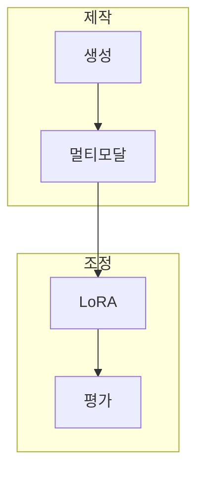

> [!abstract] 생성형 결과를 만드는 일과 모델 행동을 조정하는 일을 구분하고, 데이터·제약·평가로 반복 가능한 판단을 만드는 과정이다.

## 학습 경로



## 학습 범위

```html preview
<div style="font-family:system-ui,sans-serif;padding:20px">
  <div id="cards" style="display:flex;gap:14px;flex-wrap:wrap"></div>
  <script>
    var stats = [
      ['학습 노트', '8', '현재 재구성 범위', 'var(--chart-1)'],
      ['핵심 흐름', '4', '제작·조정·평가·탐색', 'var(--chart-2)'],
      ['수식 중심', '3', 'LoRA·평가·보상', 'var(--chart-3)']
    ];
    document.getElementById('cards').innerHTML = stats.map(function (s) {
      return '<div style="flex:1;min-width:150px;padding:16px;background:var(--card);' +
        'color:var(--card-foreground);border:1px solid var(--border);' +
        'border-radius:var(--radius)">' +
        '<div style="font-size:13px;color:var(--muted-foreground)">' + s[0] + '</div>' +
        '<div style="font-size:26px;font-weight:700;margin-top:4px">' + s[1] + '</div>' +
        '<div style="font-size:12px;font-weight:600;margin-top:4px;color:' + s[3] + '">' +
        s[2] + '</div>' +
        '</div>';
    }).join('');
  </script>
</div>
```

> [!important] 인덱스의 경계
> 이 인덱스는 공개 노트의 학습 경로만 정리한다. 원본 PDF·자산·페이지 근거는 포함하지 않는다.

## 노트 목록

| # | 노트 | 다루는 것 |
| :-- | :-- | :-- |
| 01 | [생성형 AI와 파인튜닝](<./notes/01. 생성형 AI와 파인튜닝.md>) | 프롬프트와 데이터 조정의 선택 |
| 15 | [멀티모달 생성 워크플로](<./notes/15. 멀티모달 생성 워크플로.md>) | 의도·참조·변환·검토의 반복 |
| 26 | [디자인 탐색과 제어](<./notes/26. 디자인 탐색과 제어.md>) | 제약 기반 후보 탐색과 평가 |
| 40 | [LoRA와 파라미터 효율 미세조정](<./notes/40. LoRA와 파라미터 효율 미세조정.md>) | 저랭크 업데이트와 어댑터 |
| 46 | [지시문 데이터와 대화 파인튜닝](<./notes/46. 지시문 데이터와 대화 파인튜닝.md>) | 시드·필터·대화 데이터 |
| 50 | [이미지 LoRA 학습과 적용](<./notes/50. 이미지 LoRA 학습과 적용.md>) | 데이터 범위·강도·비교 평가 |
| 62 | [제조 생성 설계와 성능 평가](<notes/60.%20%EC%A0%9C%EC%A1%B0%20%EC%83%9D%EC%84%B1%20%EC%84%A4%EA%B3%84%EC%99%80%20%EC%84%B1%EB%8A%A5%20%ED%8F%89%EA%B0%80.md>) | 다양성·새로움·공학 성능 |
| 72 | [강화학습과 생성 설계의 기초](<./notes/72. 강화학습과 생성 설계의 기초.md>) | 상태·행동·보상·검증 |

## 이 과목이 연결되는 곳

- **prerequisite** — 프롬프트·데이터·기초 모델 이해 : 조정과 평가의 입력이 된다.
- **applies-to** — 콘텐츠 제작·제품 설계·모델 운영 : 목적별 모델 행동을 검토하는 데 쓴다.

> [!question]- 학습 순서 점검
> **Q.** LoRA를 먼저 학습하기 전에 확인할 개념은 무엇인가?
>
> **A.** 생성 작업의 목표, 반복성, 데이터 대표성, 독립 평가 기준이다.
