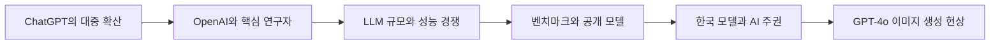

> [!abstract] 이 구간이 답하는 질문
> ChatGPT는 왜 생성형 AI를 대중적 도구로 바꾸었으며, 그 변화는 연구 조직·모델 규모·평가 경쟁·국가 전략·멀티모달 창작으로 어떻게 이어졌는가?

## 생성형 AI를 둘러싼 전체 흐름



이 강의는 알고리즘 정의부터 시작하지 않는다. 먼저 ChatGPT가 대중의 사용 습관을 바꾼 사건을 보여 주고, 그 뒤에 있는 OpenAI와 연구자, 거대언어모델의 규모 경쟁, 모델을 비교하는 평가 체계, 국가 단위의 모델 개발 경쟁을 차례로 훑는다. 마지막에는 GPT-4o를 이용한 이미지 생성 사례를 배치한다. 따라서 여기서 ==생성형 AI== 는 하나의 모델 이름이 아니라 연구 조직, 계산 자원, 평가, 제품 경험, 창작 문화가 함께 움직이는 생태계로 읽어야 한다.

## ChatGPT가 만든 대중화의 속도

ChatGPT는 OpenAI가 개발한 인공지능 챗봇으로 소개된다. 강의 자료가 가장 먼저 강조하는 것은 복잡한 구조가 아니라 확산 속도다. 2022년 11월 출시 뒤 100만 사용자를 확보하는 데 걸린 시간이 5일이었다는 수치가 제시된다. 텍스트 대화뿐 아니라 “타임스스퀘어에서 스케이트보드를 타는 곰 인형” 같은 시각적 장면도 함께 놓여 있다. 이 배치는 생성형 AI의 입구가 질문에 답하는 챗봇에서 자연어로 장면을 지시하는 창작 인터페이스로 넓어졌음을 보여 준다.

사용자가 자연어로 원하는 결과를 말하고 시스템이 새로운 텍스트나 이미지를 구성한다는 경험은 기존의 검색과 다르다. 검색은 이미 존재하는 항목을 찾는 데 초점이 있지만, 생성형 AI 사용자는 결과의 형식·대상·스타일을 요청한다. 이후 강의에서 이미지 편집과 영상 제작으로 넘어갈 수 있는 출발점이 바로 이 “말로 결과를 설계한다”는 경험이다.

<details>
<summary>확산 수치를 읽을 때 구분할 것</summary>

100만 사용자에 5일이라는 값은 출시 초기의 확산 사례다. 강의 후반에는 GPT-4o 이미지 기능과 관련해 “가입자가 시간당 100만 명 증가”했다는 기사 문구도 등장한다. 두 값은 측정 대상과 시점이 다르므로 하나의 연속 통계처럼 합치면 안 된다. 전자는 ChatGPT 출시 초기의 누적 도달 시간이고, 후자는 2025년 4월 이미지 생성 열풍을 다룬 보도 문구다.

</details>

## OpenAI의 조직과 연구 계보

강의 자료는 OpenAI를 비영리 OpenAI Incorporated와 영리 자회사 OpenAI Limited Partnership으로 구성된 미국의 AI 연구 조직으로 설명한다. 연구 목적은 친화적인 AI를 발전시키는 것으로 서술되고, 시스템은 Microsoft의 Azure 기반 슈퍼컴퓨팅 환경에서 실행된다고 적혀 있다. 2019년 Microsoft의 10억 달러 투자와 2023년 100억 달러 투자도 조직의 계산 자원과 자본 규모를 보여 주는 사례로 제시된다.

2015년 창립자 명단에는 Ilya Sutskever, Greg Brockman, Trevor Blackwell, Vicki Cheung, Andrej Karpathy, Durk Kingma, Jessica Livingston, John Schulman, Pamela Vagata, Wojciech Zaremba가 포함되고, Sam Altman과 Elon Musk가 초기 이사로 서술된다. 이어 CEO와 공동창립자 Sam Altman, 사장 Greg Brockman, 수석과학자 Ilya Sutskever, 최고기술책임자 Mira Murati, 최고운영책임자 Brad Lightcap 등 당시 인물 구성이 나온다. 이 목록은 “November 2023”이라는 시점을 포함하는 자료이므로 현재 조직도처럼 사용해서는 안 된다.

> [!warning] 조직 정보의 시점
> 임직원·이사회·투자자 목록은 2023년 11월 무렵의 자료를 반영한다. 강의 자료는 Sam Altman을 둘러싼 2023년 11월 사건과 Y Combinator의 배경을 함께 제시하지만, 추출문에는 해임 원인이나 사후 전개가 들어 있지 않다. 빈 내용을 현재 지식으로 보충하지 않는다.

Y Combinator는 2005년 시작된 미국의 기술 스타트업 액셀러레이터로, Airbnb, Coinbase, DoorDash, Dropbox, Instacart, Reddit, Stripe, Twitch 등 4,000개가 넘는 회사를 배출한 조직으로 소개된다. 2023년 1월 기준 상위 YC 기업의 합산 가치가 6,000억 달러를 넘었다는 설명도 있다. 이 맥락은 Altman의 경력과 OpenAI가 연구소이면서 동시에 거대한 제품 조직으로 성장한 배경을 이해하게 한다.

### Ilya Sutskever와 안전 문제

Ilya Sutskever는 AlexNet 연구 계보와 함께 제시된다. AlexNet은 2012년 ILSVRC 이미지 분류에서 현저히 낮은 오류율을 기록한 모델로 설명되며, 논문 저자로 Alex Krizhevsky, Ilya Sutskever, Geoffrey Hinton이 적혀 있다. 또한 Sutskever는 2014년 sequence-to-sequence 학습 논문과 연결되고, Google이 2016년 GNMT를 도입해 Seq2Seq 기반 신경망 번역으로 전환했다는 흐름이 이어진다. 바둑에서는 심층신경망과 트리 탐색을 결합한 2016년 연구가 함께 언급된다.

강의가 그를 단순한 성능 연구자로만 다루지 않는 이유는 superalignment 때문이다. Superalignment는 초지능 시스템을 감독·통제·운영하고, 고도 AI의 행동을 인간의 가치와 목표에 맞추려는 과정으로 설명된다. “미래는 더 AI 친화적이겠지만 인류에게 친화적일지는 알 수 없다”, “AGI의 신념과 욕구가 인류와 같지 않다면 재앙”이라는 경고성 문구가 배치된다. 성능 향상과 정렬 문제를 같은 연구 계보 안에서 보는 것이 이 부분의 핵심이다.

## LLM 규모와 성능 경쟁

강의는 LLM의 언어 이해, 생성, 추론, 문제 해결이 인간과 비슷하거나 일부 과제에서 인간을 넘는 수준으로 발전했다고 서술한다. 동시에 정확성, 안정성, 신뢰성은 여전히 연구 과제라고 명시한다. 즉 “성능이 높다”와 “항상 믿을 수 있다”는 같은 문장이 아니다.

자료에는 1.5B, 175B, 1.76T라는 규모 수치가 남아 있다. 그러나 텍스트 추출에서는 이 숫자가 어느 모델의 막대와 연결되는지가 사라졌다. 따라서 특정 모델의 파라미터 수로 임의 배정하지 않고, 강의가 모델 규모의 급격한 확대를 시각화했다는 범위에서만 보존한다.

<Tabs>
  <Tab label="2023 묶음">
  GPT-4는 멀티모달 지원과 향상된 추론, Claude 1~2는 헌법형 AI와 안전성·설명 가능성, PaLM 2는 코드·의료·수학 능력, LLaMA 1은 경량 공개 모델 생태계의 계기로 정리되어 있다.
  </Tab>
  <Tab label="2024 묶음">
  Gemini 1·1.5는 멀티모달과 검색, Claude 3는 긴 문맥, LLaMA 2는 상업적 사용과 코드 튜닝, GPT-4 Turbo는 128k 문맥과 비용 절감이라는 특징으로 묶여 있다.
  </Tab>
  <Tab label="2025 묶음">
  자료는 Claude 3.5 Sonnet, GPT-4o, Gemini 1.5 Flash, LLaMA 3을 2025 표 아래 배치한다. Gemini에는 최대 2M 토큰, LLaMA 3에는 8B·70B가 적혀 있다. 이는 강의 슬라이드의 분류를 기록한 것이며 실제 최초 공개 연표를 검증한 결과가 아니다.
  </Tab>
</Tabs>

> [!caution] 연표의 원문 한계
> 표의 연도 묶음과 실제 모델 공개 시점이 맞지 않을 가능성이 있다. 이 노트는 원문의 분류를 조용히 수정하지 않고, “강의 자료가 이렇게 묶었다”는 사실과 “현재 연표로 재사용하면 안 된다”는 한계를 함께 남긴다.

## 무엇으로 모델을 비교하는가

모델 경쟁은 파라미터 수만으로 결정되지 않는다. 강의는 MMLU-Pro를 더 견고하고 어려운 다과제 언어 이해 벤치마크로 제시하고, Alibaba Qwen 팀의 QwQ-32B 공개 추론 모델과 프랑스 AI 스타트업 Mistral을 함께 배치한다. 이어 Vellum의 LLM leaderboard와 LM Arena를 소개한다. Vellum 자료는 2024년 4월 이후 공개된 최신 모델을 비포화 벤치마크 중심으로 비교한다고 설명하며, 오래된 MMLU처럼 포화된 평가를 제외한다고 적는다. LM Arena는 텍스트·이미지·비전 등 여러 Arena를 나누어 모델을 비교하는 화면으로 제시된다.

평가 과제의 이름도 구체적이다. 수학 문제에는 2024 AIME와 MATH-500, 과학 추론에는 GPQA Diamond, 도구 사용에는 Gorilla leaderboard, 코드 작업에는 Aider leaderboard가 제시된다. 이 목록은 “최고 모델 하나”를 고르는 표가 아니라, 모델의 능력을 문제 유형별로 나누어 보아야 한다는 안내다.

<details>
<summary>이 구간에서 벤치마크를 해석하는 순서</summary>

1. 평가가 언어 이해, 수학, 과학 추론, 도구 사용, 코딩 중 무엇을 측정하는지 구분한다.
2. 공개 점수인지 제공업체 자체 평가인지 독립 실행 결과인지 확인한다.
3. 이미 포화된 평가인지, 최신 모델의 차이를 드러낼 만큼 어려운지 살핀다.
4. leaderboard는 시점에 따라 바뀌므로 강의 화면을 현재 순위로 인용하지 않는다.

</details>

## 한국 모델과 AI 주권 논의

국내 사례로는 LG AI Research의 EXAONE 3.5와 Upstage의 Solar Pro 2가 이름과 링크 중심으로 제시된다. 추출문에는 두 모델의 구조나 점수 설명이 없으므로 “국내 frontier 모델 사례로 등장한다”는 범위를 넘기지 않는다.

다음 흐름은 국가대표 AI foundation model 개발 사업이다. 2025년 7월 15개 컨소시엄이 제안서를 제출했다는 본문과, “2차 평가 종료, 10개 컨소시엄, 8월 초 5곳으로 압축”이라는 제목이 한 화면에 함께 있다. 목표는 글로벌 frontier model 성능의 95% 이상이며, 이를 디지털 주권과 글로벌 AI 경쟁력 확보 전략으로 해석한다.

> [!warning] 서로 다른 단계의 숫자
> 15개, 10개, 5개는 같은 시점의 경쟁자 수가 아니라 제안 제출과 평가·압축 단계를 가리키는 것으로 보인다. 그러나 추출문만으로 각 단계의 확정 일정을 재구성할 수 없으므로 숫자를 하나로 정리하거나 최종 선정 결과로 바꾸지 않는다.

## 계산 자원과 비용의 규모

강의는 1,300억원, 1.76T, A100 한 장당 20,000달러, 10,000장, 2,600억원이라는 숫자를 한 화면에 배치한다. 다만 텍스트 추출에서는 1,300억원과 1.76T가 정확히 어느 대상의 비용·규모인지 연결선이 보존되지 않았다. 따라서 숫자 간 인과관계를 새로 계산하지 않고, 대형 모델 개발이 GPU 수량과 막대한 자본을 요구한다는 문제의식만 읽는다.

```html preview
<div style="font-family:system-ui,sans-serif;padding:20px">
  <div id="cards01" style="display:flex;gap:14px;flex-wrap:wrap"></div>
  <script>
    var stats = [
      ['ChatGPT 초기 도달', '100만 사용자', '출시 뒤 5일', 'var(--chart-2)'],
      ['frontier 목표', '95% 이상', '강의 자료의 사업 목표', 'var(--chart-1)'],
      ['A100 단가 표기', '20,000달러', '강의 비용 화면', 'var(--chart-5)']
    ];
    document.getElementById('cards01').innerHTML = stats.map(function (s) {
      return '<div style="flex:1;min-width:150px;padding:16px;background:var(--card);' +
        'color:var(--card-foreground);border:1px solid var(--border);' +
        'border-radius:var(--radius)">' +
        '<div style="font-size:13px;color:var(--muted-foreground)">' + s[0] + '</div>' +
        '<div style="font-size:26px;font-weight:700;margin-top:4px">' + s[1] + '</div>' +
        '<div style="font-size:12px;font-weight:600;margin-top:4px;color:' + s[3] + '">' +
        s[2] + '</div>' +
        '</div>';
    }).join('');
  </script>
</div>
```

## GPT-4o 이미지 생성이 보여 준 것

2025년 4월 GPT-4o 사례에서는 “내 프로필 사진을 지브리 스타일로” 바꾸어 달라는 요청이 대중적 현상으로 소개된다. 관련 기사 문구에는 가입자가 시간당 100만 명 증가했고, 지브리풍 이미지 한 장을 둘러싼 열풍으로 수익이 30% 뛰었다는 표현이 있다. 이 수치는 서비스 전체의 장기 성장률이 아니라 특정 보도의 헤드라인 수치로 다루어야 한다.

마지막 두 화면은 ChatGPT 4o라는 제목과 외부 게시물 주소만 남아 있고, 이미지 안의 구체적 결과는 텍스트로 추출되지 않았다. 원본 이미지 사용이 금지된 현재 노트에서는 그 장면의 스타일이나 품질을 추측하지 않는다. 확인 가능한 결론은 GPT-4o 이미지 생성이 개인 프로필과 소셜미디어 공유 문화에 들어왔다는 강의 흐름뿐이다.

> [!info] 텍스트가 희박한 부분의 처리
> 첫 제목 화면과 계산비용 화면 일부, 마지막 이미지 사례 두 장은 텍스트만으로 시각 관계를 완전히 복원할 수 없다. 이 노트는 남아 있는 제목·수치·기사 문구만 설명하고 보이지 않는 도표나 이미지를 발명하지 않는다.

## 핵심 정리

| 축 | 강의가 제시한 내용 | 해석 원칙 |
| :-- | :-- | :-- |
| 대중화 | ChatGPT의 5일 만의 100만 사용자 도달 | 초기 확산 사례로 한정한다 |
| 조직 | OpenAI, Microsoft 투자, 핵심 연구자와 이사회 | 2023년 11월 snapshot으로 읽는다 |
| 연구 | AlexNet, Seq2Seq, superalignment | 성능과 정렬 문제를 함께 본다 |
| 모델 경쟁 | GPT·Claude·Gemini·LLaMA와 공개 모델 | 강의의 연도 묶음을 현재 연표로 오인하지 않는다 |
| 평가 | MMLU-Pro, AIME, GPQA, MATH-500, Gorilla, Aider | 능력별 평가 대상을 먼저 구분한다 |
| 국가 전략 | EXAONE, Solar Pro 2, 국가대표 foundation model | 15·10·5 단계와 95% 목표를 분리한다 |
| 멀티모달 | GPT-4o 이미지 생성 열풍 | 기사 수치와 이미지 미확인 범위를 표시한다 |

> [!question]- 스스로 점검
> **Q.** 이 구간의 1.5B, 175B, 1.76T를 특정 모델의 파라미터 수로 표에 넣어도 되는가?
>
> **A.** 안 된다. 추출문에는 수치와 막대의 대응 관계가 남아 있지 않다. 모델별 값으로 연결하려면 별도 근거가 필요하며, 현재 노트에서는 “규모 확대를 보여 주는 미매핑 수치”로만 보존한다.
