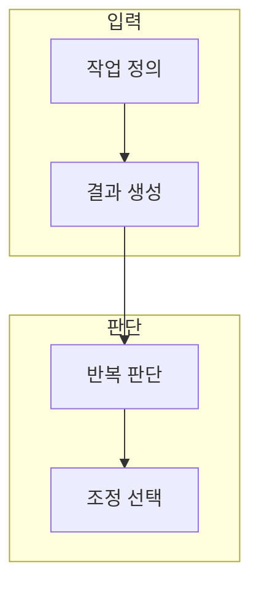

> [!abstract] 한 줄 요약
> 프롬프트로 충분한 작업과 추가 학습이 필요한 작업을 어떻게 구분하는가?

## 이 노트의 지도



## 1. 생성과 조정의 역할

생성형 AI는 입력 조건에서 새 결과를 만들고, 파인튜닝은 반복되는 목표 행동을 데이터로 조정한다. ==반복성== 는 같은 형식·판단·표현을 여러 사례에 걸쳐 안정적으로 요구하는 정도.

> [!note] 먼저 구분할 것
> 한 번의 산출물 품질을 높일 문제와, 여러 번의 응답 행동을 바꿀 문제를 섞지 않는다.

## 2. 학습 전에 필요한 증거

프롬프트 기준선, 독립 평가 사례, 실패 유형이 있어야 조정 전후를 비교할 수 있다.

<Tabs>
  <Tab label="프롬프트">작업마다 조건을 바꾸며 빠르게 탐색한다.</Tab>
  <Tab label="조정">반복되는 행동을 사례와 평가로 검증하며 바꾼다.</Tab>
</Tabs>

<details>
<summary>파인튜닝 검토 체크</summary>

- 좋은 입출력 사례와 평가 사례를 분리한다.
- 목표 형식과 실패 조건을 문장으로 적는다.
- 비용·지연·안전성도 결과 품질과 함께 비교한다.

</details>

## 데이터로 보기

```html preview
<div style="font-family:system-ui,sans-serif;padding:20px;color:var(--foreground)">
  <h3 style="margin:0 0 14px;font-size:15px;font-weight:600">조정 판단의 세 확인 축</h3>
  <div id="bars" style="display:flex;align-items:flex-end;gap:14px;height:170px"></div>
  <script>
    var data = [["반복 목표",1],["사례 분리",1],["평가 기준",1]];
    var max = Math.max.apply(null, data.map(function (d) { return d[1]; }));
    document.getElementById('bars').innerHTML = data.map(function (d, i) {
      return '<div style="flex:1;display:flex;flex-direction:column;align-items:center;' +
        'gap:6px;height:100%;justify-content:flex-end">' +
        '<span style="font-size:12px;font-weight:600">' + d[1] + '</span>' +
        '<div style="width:100%;height:' + (d[1] / max * 100) + '%;' +
        'background:var(--chart-' + (i + 1) + ');' +
        'border-radius:var(--radius) var(--radius) 0 0"></div>' +
        '<span style="font-size:12px;color:var(--muted-foreground)">' + d[0] + '</span>' +
        '</div>';
    }).join('');
  </script>
</div>
```

막대의 값 1은 성능 수치가 아니라, 조정 결정을 위해 세 축을 모두 확인해야 함을 뜻한다.

```html preview
<div style="font-family:system-ui,sans-serif;padding:20px;color:var(--foreground)">
  <label for="amt" style="font-size:14px;font-weight:600">반복 작업의 예상 횟수</label>
  <div id="out" style="font-size:30px;font-weight:700;color:var(--chart-1);margin:6px 0">작업 5</div>
  <input id="amt" type="range" min="1" max="20" step="1" value="5"
    style="width:100%;accent-color:var(--primary)" />
  <p style="font-size:13px;color:var(--muted-foreground)">값을 바꿔 반복성을 생각해 본다. 실제 채택은 데이터와 평가 준비 여부를 함께 확인한다.</p>
  <script>
    var amt = document.getElementById('amt');
    var out = document.getElementById('out');
    amt.addEventListener('input', function () {
      out.textContent = '작업 ' + Number(amt.value).toLocaleString();
    });
  </script>
</div>
```

> [!important] 해석의 경계
> 이 화면의 값은 학습 비용이나 품질을 예측하지 않는다. 목적·데이터·측정이 갖춰졌는지 점검하는 학습용 제어다.

## 핵심 정리

| 개념 | 정의 | 왜 중요한가 |
| :-- | :-- | :-- |
| 생성 | 입력에서 결과를 만드는 과정 | 초안과 탐색을 빠르게 만든다 |
| 파인튜닝 | 목표 행동을 데이터로 조정 | 반복 응답의 일관성을 검토한다 |
| 평가 | 독립 사례로 결과를 비교 | 개선과 우연을 구분한다 |

## 관련 개념

- 프롬프트 설계: 입력 조건을 명료하게 만드는 방법
- 데이터 거버넌스: 학습 사례의 사용 범위와 위험을 검토하는 방법

> [!question]- 스스로 점검
> **Q.** 반복 작업인데도 바로 파인튜닝을 시작하지 않아야 하는 경우는 언제인가?
>
> **A.** 좋은 사례와 독립 평가 기준이 없을 때다. 먼저 프롬프트 기준선과 실패 유형을 기록해야 개선 여부를 판정할 수 있다.
