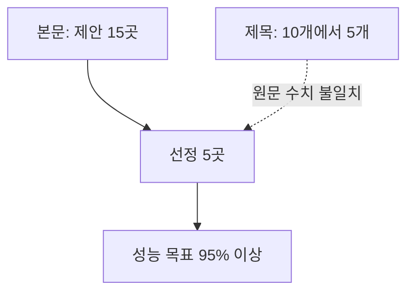

## 원본 강의 흐름 인터랙티브

```html preview
<div style="font-family:system-ui,sans-serif;padding:20px;color:var(--foreground)">
  <label for="genai01" style="font-size:14px;font-weight:600">01. 생성형 AI와 파인튜닝 단계</label>
  <div id="genai01-out" style="font-size:26px;font-weight:700;color:var(--chart-1);margin:6px 0">ChatGPT 확산</div>
  <input id="genai01" type="range" min="1" max="3" step="1" value="1" style="width:100%;accent-color:var(--primary)" />
  <p style="font-size:13px;color:var(--muted-foreground)">슬라이더를 움직이면 해당 PDF의 학습 순서를 확인합니다.</p>
  <script>
    var genai01 = document.getElementById('genai01');
    var genai01Out = document.getElementById('genai01-out');
    var genai01Steps = ["ChatGPT 확산","OpenAI·LLM 생태계","GPT-4o 이미지 생성"];
    genai01.addEventListener('input', function () {
      genai01Out.textContent = genai01Steps[Number(genai01.value) - 1];
    });
  </script>
</div>
```

> [!NOTE]
> 생성형 AI의 확산은 사용자 증가만으로 설명되지 않는다. 연구 조직, 모델 규모, 평가 방식, 국가 전략, 멀티모달 제작이 한 흐름으로 연결된다.

---

## ChatGPT가 만든 초기 확산

**핵심:** 대화형 AI와 이미지 생성 경험은 생성형 AI를 대중 서비스의 문제로 바꾸었다.

```html preview
<div style="font-family:system-ui,sans-serif;padding:20px">
  <div id="cards" style="display:flex;gap:14px;flex-wrap:wrap"></div>
  <script>
    var stats = [
      ['ChatGPT 초기 사용자', '100만 명', '출시 5일 뒤', 'var(--chart-2)'],
      ['YC 출신 기업', '4,000개 이상', '2023년 1월 기준', 'var(--chart-1)'],
      ['GPT-4o 가입 증가', '시간당 100만 명', '관련 기사 수익 30% 증가', 'var(--chart-5)']
    ];
    document.getElementById('cards').innerHTML = stats.map(function (s) {
      return '<div style="flex:1;min-width:150px;padding:16px;background:var(--card);' +
        'color:var(--card-foreground);border:1px solid var(--border);' +
        'border-radius:var(--radius)">' +
        '<div style="font-size:13px;color:var(--muted-foreground)">' + s[0] + '</div>' +
        '<div style="font-size:26px;font-weight:700;margin-top:4px">' + s[1] + '</div>' +
        '<div style="font-size:12px;font-weight:600;margin-top:4px;color:' + s[3] + '">' +
        s[2] + '</div>' +
        '</div>';
    }).join('');
  </script>
</div>
```

---

## OpenAI의 조직과 자본

**핵심:** 비영리 조직과 영리 자회사의 결합은 대규모 연구와 컴퓨팅 투자를 함께 설명하는 배경이다.

- OpenAI는 비영리 조직과 영리 합자회사를 함께 둔 연구 조직으로 소개된다.
- 연구 시스템은 Microsoft의 Azure 기반 슈퍼컴퓨팅 플랫폼에서 실행되는 것으로 설명된다.
- 창립 시점은 2015년이며, 초기 창립자·이사회·투자자 목록이 2023년 11월 시점으로 제시된다.

```html preview
<div style="font-family:system-ui,sans-serif;padding:20px;color:var(--foreground)">
  <h3 style="margin:0 0 14px;font-size:15px;font-weight:600">OpenAI LP 투자액 · 십억 달러</h3>
  <div id="bars" style="display:flex;align-items:flex-end;gap:14px;height:170px"></div>
  <script>
    var data = [['2019', 1], ['2023', 10]];
    var max = Math.max.apply(null, data.map(function (d) { return d[1]; }));
    document.getElementById('bars').innerHTML = data.map(function (d, i) {
      return '<div style="flex:1;display:flex;flex-direction:column;align-items:center;' +
        'gap:6px;height:100%;justify-content:flex-end">' +
        '<span style="font-size:12px;font-weight:600">' + d[1] + '</span>' +
        '<div style="width:100%;height:' + (d[1] / max * 100) + '%;' +
        'background:var(--chart-' + (i + 1) + ');' +
        'border-radius:var(--radius) var(--radius) 0 0"></div>' +
        '<span style="font-size:12px;color:var(--muted-foreground)">' + d[0] + '</span>' +
        '</div>';
    }).join('');
  </script>
</div>
```

---

## 인물·연구·정렬의 세 축

<Tabs>
  <Tab label="조직 인물">
    Sam Altman, Greg Brockman, Ilya Sutskever, Mira Murati, Brad Lightcap이 당시 핵심 임직원으로 열거된다. 이사회와 개인·기업 투자자도 별도 목록으로 구분된다.
  </Tab>
  <Tab label="연구 계보">
    AlexNet의 2012년 이미지 분류, 2014년 Sequence-to-Sequence, 2016년 AlphaGo가 Sutskever와 연결된 연구 계보로 배치된다.
  </Tab>
  <Tab label="AI 정렬">
    Superalignment는 고도 AI를 감독·통제·거버넌스하고 인간의 가치와 목표에 맞추려는 문제로 소개된다. 원문은 능력 향상과 인간 친화성 사이의 불확실성을 함께 강조한다.
  </Tab>
</Tabs>

<details>
<summary>조직 주변 맥락</summary>

Y Combinator는 2005년 3월 시작된 기술 스타트업 액셀러레이터로 소개된다. 2023년 1월 기준 상위 기업의 결합 가치가 6,000억 달러를 넘는다는 설명과 함께 OpenAI 경영진의 경력 배경으로 연결된다.

</details>

---

## LLM의 규모와 기능이 함께 확장되다

**핵심:** 원문은 2023년부터 2025년까지 모델군을 묶어 멀티모달, 추론, 긴 문맥, 공개 생태계의 변화를 비교한다.

| 원문 연도 묶음 | 모델군 | 제시된 변화 |
| :-- | :-- | :-- |
| 2023 | GPT-4, Claude 1~2, PaLM 2, LLaMA 1 | 멀티모달·추론, 안전성, 코드·의료·수학, 경량 공개 모델 |
| 2024 | Gemini 1·1.5, Claude 3, LLaMA 2, GPT-4 Turbo | 검색·멀티모달, 긴 문맥, 상업 사용, 128k 문맥 |
| 2025 | Claude 3.5 Sonnet, GPT-4o, Gemini 1.5 Flash, LLaMA 3 | 코드·추론, 실시간 음성·비전, 최대 2M 토큰, 8B·70B 공개 모델 |

원문은 모델 규모 표지로 1.5B, 175B, 1.76T를 함께 보여 주지만 추출문에는 각 값의 모델명이 남아 있지 않다.

---

## 평가는 하나의 점수가 아니다

| 평가 표면 | 원문에서 맡는 역할 | 해석 경계 |
| :-- | :-- | :-- |
| MMLU-Pro | 더 견고하고 어려운 다중 과제 언어 이해 평가 | 기존 MMLU와 구분 |
| Arena | 텍스트·이미지·비전 모델의 상대 비교 | 각 전용 탭에서 세부 확인 |
| AIME·MATH-500·GPQA | 수학·과학 추론 평가 사례 | 과제별 능력을 분리해 봄 |
| Gorilla·Aider | 도구 사용·코딩 평가 사례 | 일반 언어 점수와 동일시하지 않음 |

> [!IMPORTANT]
> 원문 leaderboard 설명은 포화된 과거 benchmark를 제외하고, 모델 제공자 수치와 독립 평가를 함께 본다고 명시한다. 따라서 단일 순위만으로 전체 능력을 결론내리지 않는다.

---

## 한국 AI 주권 논의의 단계



- 국내 모델과 기업 사례로 EXAONE, Upstage가 연결되지만 해당 자료 구간은 링크 중심이다.
- 국가대표 AI 파운데이션 모델 사업은 디지털 주권과 글로벌 경쟁력 확보의 전략으로 설명된다.
- 목표는 글로벌 프런티어 모델 성능의 95% 이상으로 제시된다.

---

## GPT-4o가 연 이미지 제작 방식

**핵심:** 이미지 생성은 독립된 그림 도구가 아니라 사용자의 사진과 스타일 지시를 대화 안에서 결합하는 경험으로 제시된다.

| 사례 | 추출문에서 확인되는 내용 | 공개 노트의 경계 |
| :-- | :-- | :-- |
| 프로필 변환 | 프로필 사진을 지브리풍으로 바꾸려는 요청 | 기사 제목과 설명만 반영 |
| 이미지 확산 | 가입 증가와 수익 변화가 함께 언급됨 | 수치는 앞의 독립 지표에서만 제시 |
| 후속 사례 | ChatGPT 4o 제목과 소셜미디어 주소 | 이미지 내용은 추정하지 않음 |

> [!WARNING]
> 원문에는 추출 한계와 수치 불일치가 있다. 국가 AI 사업은 제목에 `10개에서 5개`, 본문에 `15개 제안에서 5개 선정`이 함께 나타나므로 어느 한쪽으로 통합하지 않는다. 첫 표지는 제목만 남았고, 1,300억 원·1.76T·A100 20,000달러 등이 있는 자료는 관계를 설명할 텍스트가 부족하다. 두 소셜미디어 사례도 이미지 본문이 추출되지 않았다. 모델 연도표와 2023년 11월 조직 명단은 원문 시점의 분류이며 현재 상태로 확대하지 않는다.

---

## 정리

| 핵심 개념 | 의미 | 적용 또는 경계 |
| :-- | :-- | :-- |
| 대중 확산 | 대화와 이미지 생성이 빠른 사용자 유입을 만듦 | 서비스 지표와 모델 능력을 구분 |
| 조직·연구 | 자본, 컴퓨팅, 연구자가 모델 발전을 뒷받침 | 명단은 원문 시점 정보 |
| 모델 평가 | 언어·수학·코딩·비전 표면을 나눠 평가 | 단일 benchmark의 과잉 일반화 금지 |
| AI 주권 | 국내 모델과 국가 프로젝트를 연결 | 선발 단계와 목표치를 혼동하지 않음 |
| 멀티모달 | 텍스트 지시와 참조 이미지를 함께 사용 | 추출되지 않은 이미지 내용은 제외 |
