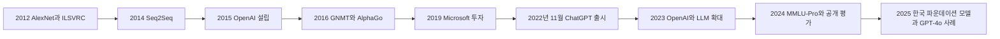
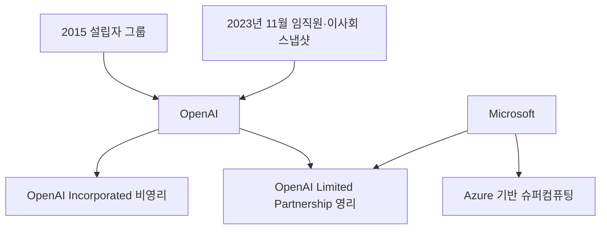

## 등장 배경은 연구 성과에서 대중 서비스로 이어진다

이 구간은 이미지 인식·번역·언어 모델 연구가 ChatGPT와 멀티모달 서비스의 대중화로 연결되는 시간축을 제시한다.

- **출발점** — 강의 제목은 멀티미디어 디자이너를 위한 생성형 AI 파인튜닝이다.
- **범위** — 연구 논문, 기업과 인물, 모델 목록, 평가 도구, 한국 정책, 이미지 생성 사례가 함께 배치된다.



## ChatGPT는 짧은 시간에 대중 접점을 만들었다

ChatGPT는 OpenAI가 개발한 AI 챗봇이며, 초기 확산 수치와 이미지 예시가 서비스의 대중성을 보여 준다.

- **출시 성과** — 2022년 11월 출시 뒤 5일 만에 사용자 100만 명을 얻었다.
- **이미지 예시** — Times Square에서 skateboard를 타는 teddy bear 사진이 함께 제시된다.
- **서비스 성격** — 대화형 텍스트 서비스 소개에서 뒤의 이미지 생성 사례로 범위가 넓어진다.

## OpenAI는 비영리 조직과 영리 자회사를 함께 둔다

자료의 조직 설명은 연구 목표, 기업 구조, Microsoft 인프라와 당시 인물 구성을 한 화면에 묶는다.

- **조직 구조** — 미국 AI 연구소 OpenAI는 비영리 OpenAI Incorporated와 영리 자회사 OpenAI Limited Partnership으로 구성된다.
- **선언된 목표** — AI 연구를 통해 친화적인 AI를 촉진하고 개발하려는 의도를 표방한다.
- **컴퓨팅 기반** — OpenAI 시스템은 Microsoft의 Azure 기반 슈퍼컴퓨팅 플랫폼에서 실행된다고 적혀 있다.
- **설립** — 2015년 Ilya Sutskever, Greg Brockman, Trevor Blackwell, Vicki Cheung, Andrej Karpathy, Durk Kingma, Jessica Livingston, John Schulman, Pamela Vagata, Wojciech Zaremba가 설립자로 열거된다.
- **초기 이사회** — Sam Altman과 Elon Musk가 초기 이사회 구성원으로 제시된다.
- **투자** — Microsoft는 OpenAI LP에 2019년 10억 달러, 2023년 100억 달러를 투자한 것으로 적혀 있다.



### 2023년 11월 인물 스냅샷

- **Sam Altman** — CEO·공동 창업자이며 전 Y Combinator 대표로 소개된다.
- **Greg Brockman** — President·공동 창업자이며 전 Stripe CTO이자 세 번째 직원으로 적혀 있다.
- **Ilya Sutskever** — Chief Scientist·공동 창업자이며 전 Google 머신러닝 전문가로 소개된다.
- **Mira Murati** — CTO이며 Leap Motion과 Tesla 경력이 제시된다.
- **Brad Lightcap** — COO이며 Y Combinator와 JPMorgan Chase 경력이 제시된다.
- **비영리 이사회** — Greg Brockman, Ilya Sutskever, Sam Altman, Adam D'Angelo, Will Hurd, Tasha McCauley, Helen Toner, Shivon Zilis가 열거된다.
- **개인 투자자** — LinkedIn 공동 창업자 Reid Hoffman, PayPal 공동 창업자 Peter Thiel, Y Combinator 창립 파트너 Jessica Livingston이 적혀 있다.
- **기업 투자자** — Microsoft, Khosla Ventures, Infosys가 열거된다.

## Y Combinator 배경은 Sam Altman과 창업 생태계를 연결한다

자료는 Sam Altman의 이전 경력을 설명한 뒤 Y Combinator의 규모와 대표 배출 기업을 별도로 소개한다.

- **출범** — 미국 기술 스타트업 액셀러레이터로 2005년 3월 시작했다.
- **배출 규모** — 4,000개가 넘는 회사를 출범시킨 것으로 적혀 있다.
- **대표 기업** — Airbnb, Coinbase, Cruise, DoorDash, Dropbox, Instacart, Quora, PagerDuty, Reddit, Stripe, Twitch가 예시다.
- **기업가치** — 상위 YC 기업의 합산 가치는 2023년 1월 기준 6,000억 달러를 넘었다.
- **운영 지역** — Boston과 Mountain View에서 시작해 2019년 San Francisco로 확장했다.
- **온라인 전환** — COVID-19 대유행 동안 프로그램 전체가 온라인으로 운영되었다.
- **평가** — Forbes는 2012년 YC를 Silicon Valley에서 가장 성공적인 액셀러레이터 중 하나로 묘사했다.
- **시점 표기** — Sam Altman 해임 관련 기사와 “November 2023” 표제가 있으나, 추출문은 사건의 상세 경위를 제공하지 않는다.

## Ilya Sutskever의 연구 계보는 시퀀스 모델과 정렬 문제를 잇는다

자료는 Ilya Sutskever를 연구자·공동 창업자·AI 안전 논의의 인물로 동시에 배치한다.

- **인물 소개** — 인공지능 분야의 세계적인 연구자로 서술된다.
- **Seq2Seq** — Ilya Sutskever, Oriol Vinyals, Quoc V. Le의 “Sequence to Sequence Learning with Neural Networks”가 NIPS 2014 연구로 제시된다.
- **GNMT** — Google은 2016년 Google Neural Machine Translation을 도입하고 Seq2Seq 기반 신경망 모델로 전환했다고 적혀 있다.
- **AlphaGo** — David Silver 등과 Ilya Sutskever가 연결된 바둑 연구가 Nature 529, 484–489, 2016으로 제시된다.
- **Superalignment** — 초지능 시스템을 감독·통제·거버넌스하고 인간의 가치·목표에 맞추어 유해하고 통제 불가능한 행동을 막는 과정으로 설명된다.
- **위험 인식** — 미래의 AI 친화성은 확실해도 인류 친화성은 알 수 없고, AGI의 신념과 욕구가 인류와 다르면 재앙이 될 수 있다는 취지의 발언이 실려 있다.
- **후속 표제** — Safe Superintelligence Inc. 링크가 함께 나오지만 조직의 구체 정보는 추출문에 없다.

```html preview
<div style="font-family:system-ui,sans-serif;padding:20px;color:var(--foreground)">
  <h3 style="margin:0 0 14px;font-size:15px;font-weight:600">자료에 표시된 논문 인용 수 스냅샷</h3>
  <div id="bars" style="display:flex;align-items:flex-end;gap:14px;height:170px"></div>
  <script>
    var data = [['AlexNet 2012', 134404], ['Seq2Seq 2014', 29579], ['AlphaGo 2016', 22407]];
    var max = Math.max.apply(null, data.map(function (d) { return d[1]; }));
    document.getElementById('bars').innerHTML = data.map(function (d, i) {
      return '<div style="flex:1;display:flex;flex-direction:column;align-items:center;' +
        'gap:6px;height:100%;justify-content:flex-end">' +
        '<span style="font-size:12px;font-weight:600">' + d[1] + '</span>' +
        '<div style="width:100%;height:' + (d[1] / max * 100) + '%;' +
        'background:var(--chart-' + (i + 1) + ');' +
        'border-radius:var(--radius) var(--radius) 0 0"></div>' +
        '<span style="font-size:12px;color:var(--muted-foreground)">' + d[0] + '</span>' +
        '</div>';
    }).join('');
  </script>
</div>
```

- **AlexNet 맥락** — Alex Krizhevsky, Ilya Sutskever, Geoffrey E. Hinton의 NIPS 2012 논문은 ILSVRC 2012 이미지 분류 우승과 현저히 낮은 오류율로 소개된다.
- **수치 경계** — 세 인용 수는 자료 작성 시점의 표시값이며 현재 인용 수로 읽지 않는다.

## LLM 규모 표시는 성능 향상과 신뢰성 과제를 함께 보여 준다

자료는 언어 이해·생성·추론·문제 해결이 인간 수준에 접근하거나 일부 과제에서 넘지만 정확성·안정성·신뢰성은 과제로 남는다고 정리한다.

- **규모 표식** — 1.5B, 175B, 1.76T가 차례로 보이지만 추출 레이아웃에는 각 값과 모델의 직접 대응이 남아 있지 않다.
- **핵심 한계** — 모델 크기 증가를 곧바로 정확성·안정성·신뢰성의 해결로 해석할 수 없다.

| 자료의 연도 묶음 | 모델 | 자료에 적힌 특징 |
| :-- | :-- | :-- |
| 2023 | GPT-4 | 멀티모달 지원, 향상된 추론 |
| 2023 | Claude 1–2 | 헌법형 AI, 안전성과 설명 가능성 강화 |
| 2023 | PaLM 2 | Gemini 이전 모델, 코드·의료·수학 능력 강화 |
| 2023 | LLaMA 1 | 경량 LLM, 오픈소스 생태계 활성화 계기 |
| 2024 | Gemini 1 / 1.5 | 멀티모달, 검색 능력 강화 |
| 2024 | Claude 3 | GPT-4급 성능, 긴 문맥 |
| 2024 | LLaMA 2 | 상업적 사용 허용, 코드 튜닝 가능 |
| 2024 | GPT-4 Turbo | 128k 문맥, 비용 절감형 |
| 2025 | Claude 3.5 Sonnet | 코드·추론, 다중 문서 처리 강화 |
| 2025 | GPT-4o | 실시간 음성·비전 통합, 멀티모달 상호작용 |
| 2025 | Gemini 1.5 Flash | 빠른 응답, 최대 2M 토큰 문맥 |
| 2025 | LLaMA 3 | 8B·70B 모델, 성능 향상과 오픈소스 지속 |

## 벤치마크는 하나의 순위보다 평가 묶음으로 읽어야 한다

공개 평가는 언어·수학·과학·코딩·에이전트 과제를 서로 다른 데이터와 리더보드로 나눈다.

<Tabs>
  <Tab label="MMLU-Pro">University of Waterloo, University of Toronto, Carnegie Mellon University 연구진의 더 견고하고 어려운 다중 과제 언어 이해 벤치마크로 제시되며 NIPS 2024 표기가 있다.</Tab>
  <Tab label="Reasoning models">Alibaba Qwen Team의 QwQ-32B는 오픈소스 추론 모델로, Mistral은 French AI startup으로 화면에 표시된다. 두 항목의 직접 비교 수치는 없다.</Tab>
  <Tab label="Public leaderboards">2024년 4월 이후 공개된 SOTA 모델을 다루며 제공자·Vellum·오픈소스 커뮤니티 평가를 사용한다. 포화되지 않은 벤치마크를 우선하고 오래된 MMLU는 제외한다고 설명한다.</Tab>
  <Tab label="LM Arena">text·image·vision 등 여러 Arena의 최신 스냅샷을 제공하고, 세부 통찰은 전용 탭에서 탐색하도록 안내한다.</Tab>
</Tabs>

- **MMLU-Pro 저자** — Yubo Wang, Xueguang Ma, Ge Zhang, Yuansheng Ni, Abhranil Chandra, Shiguang Guo, Weiming Ren, Aaran Arulraj, Xuan He, Ziyan Jiang, Tianle Li 등이 열거된다.

| 평가 이름 | 화면에서 식별되는 대상 |
| :-- | :-- |
| 2024 AIME I Problem 1 | 수학 문제 |
| GPQA Diamond | 과학 질의 평가 |
| MATH-500 | 수학 데이터셋 |
| Berkeley Gorilla leaderboard | 도구·API 관련 리더보드 |
| Aider leaderboard | 코딩 관련 리더보드 |

## 한국 모델과 국가 파운데이션 모델 사업은 별도 근거 수준을 갖는다

국산 모델 링크와 국가 사업 설명은 함께 등장하지만, 추출문이 제공하는 정보 밀도는 서로 다르다.

<Tabs>
  <Tab label="EXAONE 3.5">LG AI Research의 EXAONE 3.5 저장소와 기사 링크가 제시된다. 성능 수치나 평가 조건은 추출문에 없다.</Tab>
  <Tab label="Solar Pro 2">Upstage Solar Pro 2를 Korean·global AI frontier model로 다룬 기사와 회사 링크가 제시된다. 비교 점수는 추출문에 없다.</Tab>
</Tabs>

```html preview
<div style="font-family:system-ui,sans-serif;padding:20px">
  <div id="cards" style="display:flex;gap:14px;flex-wrap:wrap"></div>
  <script>
    var stats = [
      ['제안 컨소시엄', '15개', '2025년 7월', 'var(--chart-2)'],
      ['2차 평가 압축', '10개 → 5개', '8월 초 최종 경쟁', 'var(--chart-1)'],
      ['사업 성능 목표', '95% 이상', '글로벌 프론티어 모델 대비', 'var(--chart-5)']
    ];
    document.getElementById('cards').innerHTML = stats.map(function (s) {
      return '<div style="flex:1;min-width:150px;padding:16px;background:var(--card);' +
        'color:var(--card-foreground);border:1px solid var(--border);' +
        'border-radius:var(--radius)">' +
        '<div style="font-size:13px;color:var(--muted-foreground)">' + s[0] + '</div>' +
        '<div style="font-size:26px;font-weight:700;margin-top:4px">' + s[1] + '</div>' +
        '<div style="font-size:12px;font-weight:600;margin-top:4px;color:' + s[3] + '">' +
        s[2] + '</div>' +
        '</div>';
    }).join('');
  </script>
</div>
```

- **사업 주체** — 과학기술정보통신부가 국가대표 AI 파운데이션 모델 개발 공모를 주관한다.
- **전략 의미** — 자료는 디지털 주권 확보와 글로벌 AI 경쟁력 강화를 목표로 해석한다.
- **시점 한계** — “최종 승부 시작”은 당시 진행 단계의 기사 표현이며 완료 결과가 아니다.

## 비용 표식은 관계가 아니라 값만 확인할 수 있다

한 화면에 원화 비용, 모델 규모, 가속기 가격이 함께 있지만 추출문은 계산식이나 항목 대응을 설명하지 않는다.

| 원문 표식 | 확인 가능한 값 | 해석 제한 |
| :-- | :-- | :-- |
| 비용 표식 | 1,300억 원 | 무엇의 총비용인지 추출문에 없음 |
| 모델 규모 표식 | 1.76T, 1.76조 | 앞 구간의 규모 표기와 동일한 값 |
| 배수·비용 표식 | 10,000배 = 2,600억 원 | 산식과 환율 조건이 없음 |
| 가속기 가격 | A100 20,000달러 | 수량·구매 시점·가격 조건이 없음 |

## GPT-4o 사례는 참조 이미지에서 소셜 확산까지 이어진다

후반 사례는 이미지 생성 기능의 사용 장면을 보여 주지만, 일부 화면은 링크와 표제만 남아 있다.

- [ ] **Ghibli style 요청** — 2025년 4월 “내 프로필 사진을 지브리풍으로”라는 사례가 제시된다.
- [ ] **가입자 증가 주장** — 한국 기사 표제는 ChatGPT 가입자가 시간당 100만 명 늘었다고 보도한다.
- [ ] **수익 증가 주장** — 같은 기사 표제는 지브리 이미지 한 장으로 수익이 30% 뛰었다고 표현한다.
- [ ] **Instagram 사례** — ChatGPT 4o 표제와 계정 링크만 있어 이미지의 구체 내용은 텍스트로 확인되지 않는다.
- [ ] **Threads 사례** — ChatGPT 4o 표제와 게시물 링크만 있어 결과의 세부 특징은 확인되지 않는다.

<details>
<summary>원문 오류와 시점 한계</summary>

- “promoting and developing afriendly AI”의 “afriendly”는 띄어쓰기 추출 오류로 보인다.
- Y Combinator 설명 중 “expanded to San Francisco in 2019, and 4 was entirely online”의 4는 화면 번호가 문장에 주입된 artifact다.
- 2023년 11월 임직원·이사회 목록은 당시 스냅샷이며 현재 조직도라고 단정하지 않는다.
- 1.5B·175B·1.76T는 모델 이름과의 연결이 추출문에서 끊겼으므로 임의로 대응시키지 않는다.
- EXAONE 3.5·Solar Pro 2 화면은 링크 중심이라 성능 비교를 만들 수 없다.
- 시간당 가입자 100만 명·수익 30%는 기사 표제의 주장으로, 산정 기간과 계산 방식은 추출문에 없다.

</details>

## 학습 점검은 수치의 대상과 시점을 분리하는 데 있다

이 구간의 수치는 사용자·투자·인용·모델 규모·사업 목표·비용처럼 단위와 시점이 다르다.

- **조직 질문** — OpenAI의 비영리 조직, 영리 자회사, Microsoft 관계를 구분할 수 있는가?
- **연구 질문** — AlexNet·Seq2Seq·AlphaGo의 연도와 자료상 인용 수를 각각 식별할 수 있는가?
- **평가 질문** — 벤치마크 이름과 모델 성능 주장을 같은 것으로 취급하지 않았는가?
- **정책 질문** — 국가 사업의 진행 단계·컨소시엄 수·목표치를 완료 성과와 구분했는가?
- **사례 질문** — 링크만 있는 이미지 화면에 보이지 않는 내용을 덧붙이지 않았는가?
