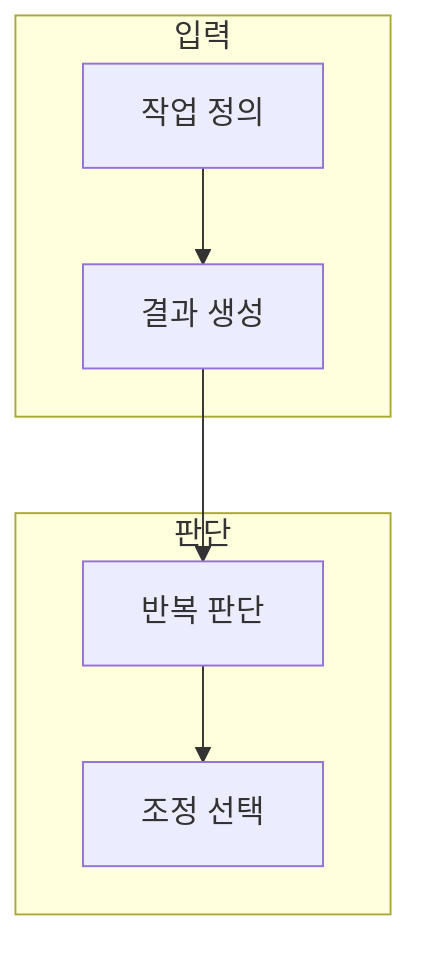

> [!abstract] 한 줄 요약
> 프롬프트와 파인튜닝의 선택은 도구 선호가 아니라 반복 목표·사례·평가 가능성의 문제다.

## 이 노트의 지도



## 1. 생성과 조정의 역할

생성형 AI는 입력 조건에서 새 결과를 만들고, 파인튜닝은 반복되는 목표 행동을 데이터로 조정한다. ==반복성== 는 같은 형식·판단·표현을 여러 사례에 걸쳐 안정적으로 요구하는 정도.

> [!note] 판단 기준
> 한 번의 결과를 고치는 문제와 여러 번의 응답 행동을 바꿀 문제를 섞지 않는다.

## 2. 학습 전에 필요한 증거

프롬프트 기준선, 독립 평가 사례, 실패 유형이 있어야 조정 전후를 비교할 수 있다.

<Tabs>
  <Tab label="프롬프트">작업마다 조건을 바꾸며 빠르게 탐색한다.</Tab>
  <Tab label="조정">반복되는 행동을 사례와 평가로 검증하며 바꾼다.</Tab>
</Tabs>

<details>
<summary>조정 검토 체크</summary>

- 좋은 입출력 사례와 평가 사례를 분리한다.
- 목표 형식과 실패 조건을 문장으로 적는다.
- 비용·지연·안전성도 함께 비교한다.

</details>

## 데이터로 보기

```html preview
<div style="font-family:system-ui,sans-serif;padding:20px">
  <div id="cards" style="display:flex;gap:14px;flex-wrap:wrap"></div>
  <script>
    var stats = [["반복 목표","1","작업 정의","var(--chart-1)"],["사례 분리","1","데이터 준비","var(--chart-2)"],["평가 기준","1","비교 가능","var(--chart-3)"]];
    document.getElementById('cards').innerHTML = stats.map(function (s) {
      return '<div style="flex:1;min-width:150px;padding:16px;background:var(--card);' +
        'color:var(--card-foreground);border:1px solid var(--border);' +
        'border-radius:var(--radius)">' +
        '<div style="font-size:13px;color:var(--muted-foreground)">' + s[0] + '</div>' +
        '<div style="font-size:26px;font-weight:700;margin-top:4px">' + s[1] + '</div>' +
        '<div style="font-size:12px;font-weight:600;margin-top:4px;color:' + s[3] + '">' +
        s[2] + '</div>' +
        '</div>';
    }).join('');
  </script>
</div>
```

**해석의 경계.** 카드의 1은 성능 수치가 아니라, 조정을 검토하기 전에 세 확인 축을 갖춘다는 표시다.

## 핵심 정리

| 개념 | 정의 | 왜 중요한가 |
| :-- | :-- | :-- |
| 생성 | 입력에서 결과를 만드는 과정 | 초안과 탐색을 빠르게 만든다 |
| 파인튜닝 | 목표 행동을 데이터로 조정 | 반복 응답을 검토한다 |
| 평가 | 독립 사례로 결과를 비교 | 개선과 우연을 구분한다 |

## 관련 개념

- 프롬프트 설계: 입력 조건을 명료하게 만드는 방법
- 데이터 거버넌스: 학습 사례의 사용 범위와 위험을 검토하는 방법

> [!question]- 스스로 점검
> **Q.** 반복 작업인데도 바로 파인튜닝을 시작하지 않아야 하는 경우는 언제인가?
>
> **A.** 좋은 사례와 독립 평가 기준이 없을 때다. 먼저 프롬프트 기준선과 실패 유형을 기록한다.
