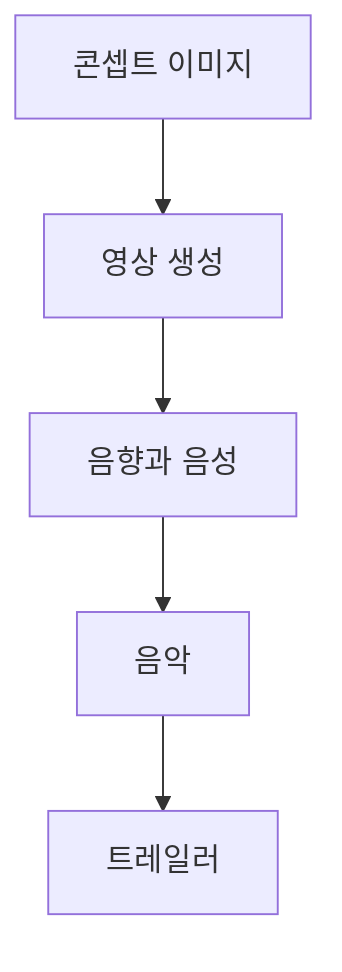

## 원본 강의 흐름 인터랙티브

```html preview
<div style="font-family:system-ui,sans-serif;padding:20px;color:var(--foreground)">
  <label for="genai15" style="font-size:14px;font-weight:600">15. 멀티모달 생성 워크플로 단계</label>
  <div id="genai15-out" style="font-size:26px;font-weight:700;color:var(--chart-1);margin:6px 0">참조 이미지 변환</div>
  <input id="genai15" type="range" min="1" max="3" step="1" value="1" style="width:100%;accent-color:var(--primary)" />
  <p style="font-size:13px;color:var(--muted-foreground)">슬라이더를 움직이면 해당 PDF의 학습 순서를 확인합니다.</p>
  <script>
    var genai15 = document.getElementById('genai15');
    var genai15Out = document.getElementById('genai15-out');
    var genai15Steps = ["참조 이미지 변환","영상 생성 모델","영화·전시 채널"];
    genai15.addEventListener('input', function () {
      genai15Out.textContent = genai15Steps[Number(genai15.value) - 1];
    });
  </script>
</div>
```

> [!NOTE]
> 멀티모달 제작의 핵심은 한 모델이 모든 일을 하는 데 있지 않다. 참조 이미지, 영상, 음성, 음악, 편집 도구를 목적에 맞게 이어 결과물을 완성한다.

---

## 참조 이미지를 지시문으로 바꾸기

**핵심:** ChatGPT 4o 사례는 텍스트 지시와 하나 이상의 참조 이미지를 결합해 인물·의상·캐릭터 표현을 바꾸는 작업을 보여 준다.

| 입력 구성 | 요청된 변환 | 유지해야 할 기준 |
| :-- | :-- | :-- |
| 인물 사진 + 의상 사진 | 첫 인물이 두 번째 사진의 옷을 입은 장면 | 인물과 의상 참조의 역할 구분 |
| 인물 사진 | 단순한 선과 귀여운 캐릭터로 표현 | 대상의 정체성과 표현 방식 분리 |
| 캐릭터 + 예시 이미지 | 같은 주인공으로 이모지 세트 생성 | 캐릭터 일관성과 세트 형식 유지 |

> [!IMPORTANT]
> 이 사례들은 결과 이미지를 공개 노트에 재현하지 않는다. 추출문에 남은 입력 관계와 지시문의 작업 구조만 학습 근거로 사용한다.

---

## 영상 생성 모델의 역할이 나뉘다

<Tabs>
  <Tab label="Runway">
    2023년 2월 Gen-1과 Gen-2를 공개한 초기 상용 text-to-video 계열로 소개된다. 최신 flagship으로 제시된 Gen-4의 공개일은 2025년 3월 31일이다.
  </Tab>
  <Tab label="Pika">
    Pika 1.0과 창업팀 소개가 함께 배치된다. 원문은 공동창업자 Demi Guo의 학력과 중국 언론에서 사용한 수식어까지 포함하지만, 모델 기능과 인물 평가는 구분해서 읽어야 한다.
  </Tab>
  <Tab label="Veo2·Pika 2.2">
    Veo2는 가상의 Sephora 광고 제작 사례와 연결된다. Pika 2.2는 Pikaframes와 최대 10초 generation을 제시한다.
  </Tab>
</Tabs>

<details>
<summary>모델 소개에서 분리해 읽을 정보</summary>

Runway 자료는 모델 세대와 공개 시점을 중심으로 읽을 수 있다. Pika 자료에는 제품 설명 외에 창업자의 출생 세대, 학력, 언론 보도가 함께 들어 있으므로 기술 능력의 근거로 혼합하지 않는다.

</details>

---

## 여러 도구를 한 편의 트레일러로 묶기

**핵심:** Silmarillion teaser 사례는 이미지, 영상, 음성, 음악이 서로 다른 도구에서 만들어진 뒤 하나의 결과물로 결합되는 구조다.



| 제작 역할 | 원문 도구 |
| :-- | :-- |
| 콘셉트 이미지 | Midjourney |
| 영상 생성 | Luma, Kling |
| 음향·보이스오버 | ElevenLabs |
| 음악 | Audiomachine |

---

## AI 영화는 역할별 파이프라인이다

**핵심:** 고려대학교 세종캠퍼스의 AI 영화 사례는 한 작품 안에서도 제작 단계를 분리하고 단계마다 도구를 선택한다.

| 단계 | 사용 예 |
| :-- | :-- |
| 대본 작성 | ChatGPT, Claude AI |
| 배경 제작 | Runway Gen-3 Alpha, Midjourney |
| 캐릭터 디자인·애니메이션 | Midjourney, ChatGPT |
| 폭발·전투 장면 | Runway, Midjourney |
| 음악·사운드 | Suno AI, ElevenLabs |
| 후반 작업 | DaVinci Resolve, Adobe |

이 작품은 제6회 창원국제민주영화제 개막작으로 선정된 사례로 소개된다.

---

## 제작 도구는 전시와 채널로 확장된다

<Tabs>
  <Tab label="AI 영화">
    대본에서 후반 작업까지 역할을 분담한 영화 제작 사례는 생성 도구가 기존 제작 공정 안에 배치되는 방식을 보여 준다.
  </Tab>
  <Tab label="AI 전시">
    Korean AI Artist 전시 관련 자료는 Midjourney로 이미지를 만들고 Luma로 영상을 생성한 뒤 CapCut으로 편집한 조합을 제시한다. 동일한 설명이 두 자료에 반복된다.
  </Tab>
  <Tab label="창작 채널">
    AI Catverse는 고양이를 중심으로 상상적 디지털 아트를 전개하는 creator channel 사례로 소개된다.
  </Tab>
</Tabs>

---

## 작업을 설계할 때 먼저 정할 것

| 결정 | 질문 | 원문 사례에서의 선택 |
| :-- | :-- | :-- |
| 참조 방식 | 인물·의상·스타일 중 무엇을 고정하는가 | 복수 이미지 또는 캐릭터 예시 |
| 시간 표현 | 정지 이미지인가, 연속 영상인가 | Runway·Pika·Veo2 |
| 음향 구성 | 음성·효과음·음악을 어떻게 나누는가 | ElevenLabs·Audiomachine·Suno AI |
| 후반 작업 | 생성 결과를 무엇으로 조립하는가 | DaVinci Resolve·Adobe·CapCut |
| 공개 맥락 | 영화·전시·창작 채널 중 어디에 놓이는가 | 영화제·전시·소셜 채널 |

> [!WARNING]
> 원본의 일부는 추출 근거가 제한적이다. 한 자료는 공유 드라이브 주소만 남았고, 전시 관련 두 자료는 같은 설명이 중복된다. Sora 자료도 서비스 주소 외에는 본문이 추출되지 않았다. 따라서 해당 영상과 이미지의 내용, 품질, 기능을 추가로 추정하지 않는다. Pika 창업팀 설명에 등장하는 PicLab 표기도 원문 형태를 임의로 고치지 않는다.

---

## 정리

| 핵심 개념 | 의미 | 적용 또는 경계 |
| :-- | :-- | :-- |
| 참조 변환 | 여러 입력의 역할을 정해 원하는 표현으로 변환 | 보이지 않는 결과를 추정하지 않음 |
| 영상 모델 | 모델마다 세대·길이·제작 사례가 다름 | 마케팅 설명과 기능 근거를 구분 |
| 교차 도구 제작 | 이미지·영상·음향·음악을 단계별로 연결 | 역할이 겹칠 때 책임을 명시 |
| AI 영화 | 기존 영화 공정에 생성 도구를 배치 | 후반 작업까지 포함해 설계 |
| 창작 유통 | 영화제·전시·소셜 채널로 결과물을 확장 | 중복·링크 전용 자료는 제한적으로 사용 |
