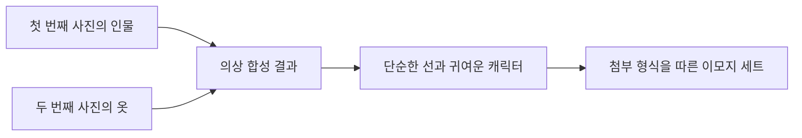

## 참조 이미지는 인물·의상·화풍·표정을 나누어 지시한다

ChatGPT 4o 사례는 여러 입력 이미지에서 유지할 요소와 바꿀 요소를 자연어로 지정하는 방식을 보여 준다.

- [ ] **인물 유지** — 첫 번째 사진 속 남자를 대상 인물로 지정한다.
- [ ] **의상 전이** — 두 번째 사진의 옷을 첫 번째 인물에게 입히도록 요청한다.
- [ ] **표현 단순화** — 같은 인물을 simple lines와 cute characters로 그리도록 지시한다.
- [ ] **세트 확장** — 첨부 이미지 형식을 따라 앞의 캐릭터를 주인공으로 emoji 세트를 만든다.
- [ ] **출연 맥락** — 사례 영상 표제에는 세종사이버대 김덕진 교수와 유메타랩 서승완 대표가 적혀 있다.



## 영상 생성 도구는 출시 시점과 기능 단위가 다르다

Runway·Pika·Google Veo2는 모두 영상 제작에 쓰이지만, 자료가 제공하는 설명의 깊이와 시점은 서로 다르다.

- **비교 축** — Runway는 공개 이력, Pika는 인물·기능·길이, Veo2는 광고 사례가 중심이다.

<Tabs>
  <Tab label="Runway">2023년 2월 Gen-1을 공개했고 Gen-2는 초기 상용 text-to-video 모델 가운데 하나로 설명된다. 최신 flagship Gen-4는 2025년 3월 31일 공개되었다.</Tab>
  <Tab label="Pika 1.0">PIKA LABS의 초기 모델로 소개된다. 공동 창업자 Demi Guo는 1995년 이후 출생 세대, 중국 Hangzhou 출신·미국 국적, Zhejiang Province 최초 Harvard 사전 입학 학생, CCTV의 “genius girl”로 서술된다.</Tab>
  <Tab label="Pika 2.2">사진과 영상을 변환하며 Pikaframes와 최대 10초 길이 생성을 제공한다고 적혀 있다.</Tab>
  <Tab label="Google Veo2">가상의 Sephora 신제품군 “PURE EDGE” spec ad가 Google Veo2 시험 사례로 제시된다.</Tab>
</Tabs>

```html preview
<div style="font-family:system-ui,sans-serif;padding:20px">
  <div id="cards" style="display:flex;gap:14px;flex-wrap:wrap"></div>
  <script>
    var stats = [
      ['Runway Gen-1', '2023년 2월', '자료의 공개 시점', 'var(--chart-2)'],
      ['Runway Gen-4', '2025년 3월 31일', 'flagship 공개', 'var(--chart-1)'],
      ['Pika 2.2', '최대 10초', 'Pikaframes 생성 길이', 'var(--chart-5)']
    ];
    document.getElementById('cards').innerHTML = stats.map(function (s) {
      return '<div style="flex:1;min-width:150px;padding:16px;background:var(--card);' +
        'color:var(--card-foreground);border:1px solid var(--border);' +
        'border-radius:var(--radius)">' +
        '<div style="font-size:13px;color:var(--muted-foreground)">' + s[0] + '</div>' +
        '<div style="font-size:26px;font-weight:700;margin-top:4px">' + s[1] + '</div>' +
        '<div style="font-size:12px;font-weight:600;margin-top:4px;color:' + s[3] + '">' +
        s[2] + '</div>' +
        '</div>';
    }).join('');
  </script>
</div>
```

## 한 편의 영상은 생성 도구와 후반 도구를 조합한다

Silmarillion teaser 사례는 장면·움직임·음성·음악을 서로 다른 서비스에 배분한 제작 조합을 명시한다.

- [ ] **이미지·콘셉트** — Midjourney가 사용된다.
- [ ] **영상 생성** — Luma와 Kling이 사용된다.
- [ ] **효과음·보이스오버** — Eleven Labs가 담당한다.
- [ ] **음악** — Audiomachine이 사용된다.
- [ ] **산출물** — 제작자가 여러 도구를 결합해 AI-generated Silmarillion teaser trailer를 구성했다고 설명한다.

## AI 영화 제작은 작업 단계별 도구 배치로 드러난다

고려대학교 세종캠퍼스의 작품 사례는 대본부터 후반작업까지 도구가 어떻게 분업되는지 보여 준다.

- **작품** — AI 영화 “Gulliver's Travels to Yuldo”가 제6회 Changwon International Democratic Film Festival 개막작으로 선정되었다.
- **제작 단위** — 대본, 배경, 캐릭터, 폭발·전투, 음악·음향, 후반작업이 별도 단계로 적혀 있다.
- **근거 범위** — 선정 사실과 도구 목록은 있으나 상영 길이·제작 인원·생성 횟수는 없다.


| 제작 단계 | 자료에 적힌 도구 | 확인 가능한 역할 |
| :-- | :-- | :-- |
| Script writing | ChatGPT, Claude AI | 대본 작성 |
| Background Creation | Runway Gen-3 Alpha, MidJourney | 배경 생성 |
| Character design and animation | MidJourney, ChatGPT | 캐릭터 설계·애니메이션 |
| Explosion and battle scenes | Runway, Mid.Journey | 폭발·전투 장면 |
| Music and sound | Suno Al, Eleven Labs | 음악·음향 |
| Post-production | DaVinci Resolve, Adobe | 후반작업 |

## 전시·소셜 사례는 도구 조합보다 창작 맥락을 넓힌다

후반 사례는 영화 외에도 전시형 작업, 캐릭터 채널, OpenAI 영상 모델로 범위를 확장한다.

- **사례 묶음** — Heterotopia, Park Eunji, AI Catverse, Sora가 서로 다른 근거 밀도로 제시된다.

<Tabs>
  <Tab label="Heterotopia">Instagram 계정 사례는 이미지 생성 Midjourney, 영상 생성 Luma, 편집 CapCut의 조합을 두 화면에서 동일하게 반복한다.</Tab>
  <Tab label="Park Eunji">서울벤처대학원대학교 AI문화경영연구소 소장·주임교수로 표기된다. 프랑스 AI 정상회의 Korean AI Artist 展 총괄 큐레이터와 FAHIS in GangNam 예술총감독 경력도 적혀 있다.</Tab>
  <Tab label="AI Catverse">“AI Imaginational Super Art of Super Cats”를 내세운 digital creator 채널로 소개된다. 구체 제작 절차나 수치는 없다.</Tab>
  <Tab label="Sora">OpenAI Sora 링크만 남아 있어 모델 기능·버전·성능은 이 구간의 텍스트로 설명할 수 없다.</Tab>
</Tabs>

- [ ] **중복 확인** — Heterotopia 도구 조합과 인물 소개는 연속한 두 화면에 같은 문구로 나온다.
- [ ] **링크 전용 화면** — 두 개의 Google Drive 화면 가운데 하나는 링크 외의 설명이 없다.
- [ ] **채널 정체성** — AI Catverse는 고양이를 중심으로 한 상상적 AI 예술 채널임을 표제에서 확인할 수 있다.
- [ ] **모델 후속 경로** — Sora는 후속 탐색 대상으로만 제시된다.

<details>
<summary>원문 표기 오류와 sparse source 한계</summary>

- PIKA LABS 설명은 founding team을 “behind PicLab”이라고 적는다. PicLab은 원문 표기를 보존한 것으로, 다른 이름으로 조용히 교정하지 않는다.
- 영화 제작 목록의 “Mid.Journey”는 같은 자료의 “MidJourney”와 표기가 다르다.
- 음악 도구 “Suno Al”은 마지막 문자가 대문자 I가 아니라 소문자 l처럼 추출된 원문 artifact다.
- Google Drive 링크만 있는 화면은 파일 내용이 추출되지 않아 작품명·절차·성과를 보충할 수 없다.
- Heterotopia의 연속 두 화면은 같은 텍스트를 반복하므로 서로 다른 두 프로젝트로 세지 않는다.
- AI Catverse와 Sora 화면은 링크·표제 중심이라 내부 모델 구조나 제작 성과를 추론하지 않는다.

</details>

## 도구 선택은 입력·출력·후반 단계를 먼저 구분한다

이 구간의 사례는 한 모델의 우열보다 제작 단계마다 다른 도구를 조합하는 실무 구조를 보여 준다.

- **참조 변환** — 인물·의상·화풍·이모지 형식을 입력 요소로 분리한다.
- **영상 생성** — Runway·Pika·Veo2·Luma·Kling을 각 사례의 명시된 범위에서만 사용한다.
- **음향 생성** — Eleven Labs, Suno Al, Audiomachine을 효과음·보이스오버·음악 역할로 구분한다.
- **후반작업** — DaVinci Resolve, Adobe, CapCut은 생성 뒤 편집 단계에 놓인다.
- **검증 질문** — 링크만 있는 사례에 기능·품질·길이 정보를 덧붙이지 않았는지 확인한다.
