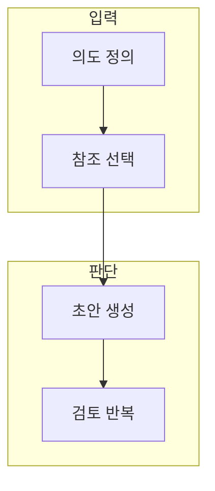

> [!abstract] 한 줄 요약
> 매체를 바꿔도 제작 의도와 검토 기준을 어떻게 유지하는가?

## 이 노트의 지도



## 1. 입력의 세 역할

텍스트는 의도를, 참조는 유지할 속성을, 생성 조건은 변환 범위를 정한다. ==참조== 는 복제할 대상이 아니라 유지·변형·배제할 속성을 고르는 기준.

> [!note] 먼저 구분할 것
> 참조 이미지나 문구를 그대로 재현하는 목표와 새 결과를 만드는 목표를 먼저 구분한다.

## 2. 이미지에서 영상으로

정지 이미지에서 구도·대상·스타일을 먼저 고정한 뒤 시간 변화와 움직임을 추가하면 수정 원인을 찾기 쉽다.

<details>
<summary>검토 로그의 최소 형식</summary>

- 의도 한 줄
- 참조에서 유지할 속성
- 이번 반복에서 바꾼 변수
- 채택·거절 사유

</details>

## 데이터로 보기

```html preview
<div style="font-family:system-ui,sans-serif;padding:20px;color:var(--foreground)">
  <h3 style="margin:0 0 14px;font-size:15px;font-weight:600">매체별 검토 초점</h3>
  <div id="bars" style="display:flex;align-items:flex-end;gap:14px;height:170px"></div>
  <script>
    var data = [["텍스트",1],["이미지",1],["영상",1]];
    var max = Math.max.apply(null, data.map(function (d) { return d[1]; }));
    document.getElementById('bars').innerHTML = data.map(function (d, i) {
      return '<div style="flex:1;display:flex;flex-direction:column;align-items:center;' +
        'gap:6px;height:100%;justify-content:flex-end">' +
        '<span style="font-size:12px;font-weight:600">' + d[1] + '</span>' +
        '<div style="width:100%;height:' + (d[1] / max * 100) + '%;' +
        'background:var(--chart-' + (i + 1) + ');' +
        'border-radius:var(--radius) var(--radius) 0 0"></div>' +
        '<span style="font-size:12px;color:var(--muted-foreground)">' + d[0] + '</span>' +
        '</div>';
    }).join('');
  </script>
</div>
```

세 막대는 품질 수치가 아니라, 매체마다 의도·구성·시간적 연속성을 각각 점검해야 함을 나타낸다.

```html preview
<div style="font-family:system-ui,sans-serif;padding:20px;color:var(--foreground)">
  <label for="amt" style="font-size:14px;font-weight:600">이번 반복에서 바꿀 변수 수</label>
  <div id="out" style="font-size:30px;font-weight:700;color:var(--chart-1);margin:6px 0">변수 1</div>
  <input id="amt" type="range" min="1" max="5" step="1" value="1"
    style="width:100%;accent-color:var(--primary)" />
  <p style="font-size:13px;color:var(--muted-foreground)">한 번에 바꾸는 변수를 줄이면 결과 변화의 원인을 더 잘 비교할 수 있다.</p>
  <script>
    var amt = document.getElementById('amt');
    var out = document.getElementById('out');
    amt.addEventListener('input', function () {
      out.textContent = '변수 ' + Number(amt.value).toLocaleString();
    });
  </script>
</div>
```

> [!important] 해석의 경계
> 변수 수는 정답이 아니다. 작업의 위험과 검토 가능성에 맞춰 반복 단위를 정한다.

## 핵심 정리

| 개념 | 정의 | 왜 중요한가 |
| :-- | :-- | :-- |
| 의도 | 만들 결과와 제약 | 평가 기준의 출발점 |
| 참조 | 유지·변형할 속성 | 매체 전환의 일관성 |
| 검토 | 채택·거절 사유 | 다음 반복의 근거 |

## 관련 개념

- 프롬프트: 의도와 금지 조건을 문장으로 고정하는 방법
- 콘텐츠 검수: 매체별 오류와 권리 위험을 확인하는 방법

> [!question]- 스스로 점검
> **Q.** 정지 이미지를 먼저 검토하고 영상으로 넘어가는 이유는 무엇인가?
>
> **A.** 시간 변화까지 동시에 고치면 원인을 찾기 어렵기 때문이다. 구성과 대상의 기준선을 만든 뒤 움직임을 추가한다.
