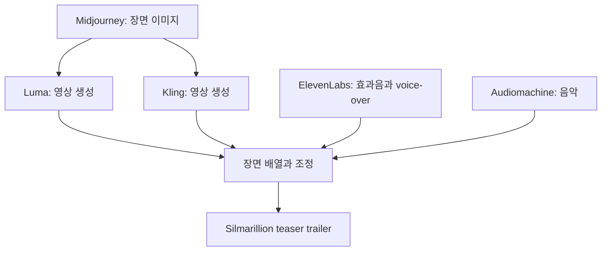

> [!abstract] 이 구간이 답하는 질문
> 한 번의 생성 요청은 어떻게 참조 이미지 변환, 영상 합성, 음성·음악 제작, 편집을 거쳐 하나의 멀티미디어 결과물이 되는가?

## 참조에서 완성본까지


이 구간은 모델 구조를 설명하기보다 실제 제작 예를 연속해서 보여 준다. 출발점은 ChatGPT 4o에 두 장의 사진과 자연어 지시를 주는 간단한 변환이다. 이후 Runway, Pika, Google Veo2 같은 영상 생성 도구가 등장하고, Midjourney·Luma·Kling·ElevenLabs·Audiomachine을 엮은 예고편, 여러 생성 도구와 편집 도구를 조합한 AI 영화로 규모가 커진다. 끝에서는 독립 창작자의 Instagram 작업, 고양이 중심의 AI Catverse, Sora로 이어진다.

핵심은 ==멀티모달 제작== 을 “한 모델이 전부 수행한다”는 뜻으로 오해하지 않는 것이다. 강의의 사례에서는 이미지, 영상, 음성, 음악, 편집이 서로 다른 도구에 맡겨진다. 제작자는 각 단계의 산출물을 다음 단계의 입력으로 전달하고, 전체 스타일과 서사를 유지하는 조정자 역할을 한다.

## ChatGPT 4o의 참조 이미지 변환

첫 사례는 두 사진을 결합하는 요청이다. 첫 번째 사진 속 남성이 두 번째 사진의 옷을 입은 모습으로 만들어 달라는 지시가 나온다. 이 요청에는 인물 정체성을 유지할 대상, 옮겨 올 의상, 최종 장면이라는 세 요소가 있다. 이어 같은 인물을 단순한 선과 귀여운 캐릭터로 그려 달라는 요청이 배치된다. 다음 사례에서는 앞서 만든 캐릭터를 주인공으로 삼아 첨부 예시와 같은 emoji 묶음을 그려 달라고 한다.

이 흐름은 생성 작업에서 참조가 한 종류가 아님을 보여 준다. 인물 사진은 유지해야 할 주체를 제공하고, 의상 사진은 바꿀 속성을 제공하며, emoji 예시는 결과의 구성 형식을 제공한다. 자연어 지시는 이 참조 사이의 관계를 지정한다. “무엇을 남기고 무엇을 바꿀지”를 분리해 말하는 것이 단순히 스타일 이름 하나를 입력하는 것보다 구체적인 제작 지시가 된다.

<Tabs>
  <Tab label="인물과 의상">
  첫 사진의 남성을 주체로 유지하고 두 번째 사진의 의상을 적용한다. 두 입력이 같은 역할을 하는 것이 아니라 주체와 변경 속성으로 나뉜다.
  </Tab>
  <Tab label="캐릭터 단순화">
  같은 인물을 단순한 선과 귀여운 character로 다시 표현한다. 이 단계에서는 사실적 외형보다 알아볼 수 있는 특징과 표현 양식이 중요해진다.
  </Tab>
  <Tab label="emoji 세트">
  앞 단계의 캐릭터를 주인공으로 유지하면서 첨부 예시가 보여 주는 세트 형식을 따른다. 하나의 결과가 다음 요청의 참조 자산이 되는 과정이다.
  </Tab>
</Tabs>

> [!important] 참조의 역할을 먼저 적는다
> “사진처럼 만들어 줘”라고 뭉뚱그리지 말고 주체, 옮길 속성, 표현 양식, 세트 구성을 나누어야 한다. 이 원칙은 강의의 세 요청을 비교해 얻을 수 있는 제작 절차이며, 모델 내부 기능에 대한 추가 가정은 아니다.

## 텍스트에서 영상으로: Runway와 Pika

Runway는 2023년 2월 Gen-1을 공개했고, Gen-2는 초기의 상용 text-to-video 모델 가운데 하나로 소개된다. 2025년 3월 31일에는 최신 flagship model인 Gen-4가 공개되었다고 적혀 있다. 강의가 이 연속을 배치한 이유는 텍스트·이미지 생성이 짧은 시간 안에 영상 생성 제품으로 확장되었음을 보여 주기 위해서다.

Pika Labs에서는 Pika 1.0이 함께 등장한다. 공동창업자 Demi Guo는 1995년 이후 출생한 중국 항저우 출신으로 소개되며, 미국 국적, Harvard University 사전 입학, 중국 CCTV의 보도로 “genius girl”이라는 별칭을 얻었다는 인물 설명이 붙어 있다. 이 내용은 제품 성능과 직접 관계가 있는 검증 지표가 아니라 창업팀을 소개하는 강의 자료의 인물 서사다.

<details>
<summary>Runway 공개 흐름에서 확정할 수 있는 것</summary>

- Gen-1은 2023년 2월 공개로 적혀 있다.
- Gen-2는 초기 상용 text-to-video 모델 가운데 하나로 설명된다.
- Gen-4는 2025년 3월 31일 공개된 최신 flagship model로 적혀 있다.
- 추출문에는 해상도, 길이, 가격, benchmark가 없으므로 세대별 품질 향상을 수치화하지 않는다.

</details>

## 광고 실험과 장면 연결: Veo2와 Pika 2.2

Google Veo2 사례는 Sephora의 가상 신규 시리즈 “PURE EDGE”를 위한 spec advertisement다. 실제 제품 출시 광고가 아니라 Veo2 테스트의 일부로 만든 상상 속 광고라는 점이 중요하다. 생성형 영상은 존재하는 캠페인을 자동화하는 데만 쓰이는 것이 아니라, 아직 없는 제품이나 브랜드 장면을 빠르게 시각화하는 concept test로도 쓰인다.

Pika 2.2는 사진과 영상을 변환하는 기능, Pikaframes, 최대 10초 generation을 소개한다. 한 장면을 만드는 text-to-video와 달리 Pikaframes라는 이름은 여러 시각 상태 사이를 이어 주는 제작 사용법을 암시하지만, 추출문에는 내부 원리나 frame 수가 없다. 따라서 이 노트에서는 “사진·영상 변환, Pikaframes, 최대 10초”라는 명시된 범위만 설명한다.

```html preview
<div style="font-family:system-ui,sans-serif;padding:20px">
  <div id="cards15" style="display:flex;gap:14px;flex-wrap:wrap"></div>
  <script>
    var stats = [
      ['Runway Gen-1', '2023년 2월', '강의 자료의 공개 시점', 'var(--chart-1)'],
      ['Runway Gen-4', '2025년 3월 31일', '강의 자료의 공개 시점', 'var(--chart-2)'],
      ['Pika 2.2 generation', '최대 10초', '강의 자료의 길이 표기', 'var(--chart-3)']
    ];
    document.getElementById('cards15').innerHTML = stats.map(function (s) {
      return '<div style="flex:1;min-width:170px;padding:16px;background:var(--card);' +
        'color:var(--card-foreground);border:1px solid var(--border);' +
        'border-radius:var(--radius)">' +
        '<div style="font-size:13px;color:var(--muted-foreground)">' + s[0] + '</div>' +
        '<div style="font-size:23px;font-weight:700;margin-top:4px">' + s[1] + '</div>' +
        '<div style="font-size:12px;font-weight:600;margin-top:4px;color:' + s[3] + '">' +
        s[2] + '</div></div>';
    }).join('');
  </script>
</div>
```

> [!caution] 제품 비교의 한계
> 이 구간은 각 제품의 공개 사례를 보여 주지만 동일한 prompt, 길이, 해상도, 비용으로 비교한 시험은 제공하지 않는다. Runway, Pika, Veo2의 이름이 나란히 있다고 해서 품질 순위를 만들면 안 된다.

## 여러 도구를 연결한 Silmarillion 예고편

“The Silmarillion - Teaser Trailer”는 한 제작자가 여러 AI 도구를 연결한 사례다. Midjourney로 이미지를 만들고, Luma와 Kling을 이용해 영상으로 전개한다. 효과음과 voice-over는 ElevenLabs, 음악은 Audiomachine을 사용한다. 완성된 예고편은 하나의 모델 출력이라기보다 역할이 다른 산출물을 조합한 제작 결과다.



이 사례에서 제작자가 관리해야 하는 일은 네 가지다. 첫째, 여러 이미지에서 등장인물과 미술 스타일이 이어져야 한다. 둘째, 정지 이미지가 움직일 때 장면의 의도와 구도가 무너지지 않아야 한다. 셋째, 음성과 효과음이 화면의 사건과 맞아야 한다. 넷째, 음악이 전체 trailer의 속도와 감정을 묶어야 한다. 강의 자료는 구체적 설정값을 주지 않지만, 도구 배치만으로도 멀티도구 제작의 조정 지점을 분명히 보여 준다.

<details>
<summary>예고편 사례를 작업 순서로 바꾸기</summary>

1. Midjourney에서 이야기의 핵심 장면을 정지 이미지로 만든다.
2. 각 장면을 Luma 또는 Kling의 영상 입력으로 사용한다.
3. ElevenLabs로 voice-over와 효과음을 준비한다.
4. Audiomachine 음악을 전체 정서와 길이에 맞춘다.
5. 영상·음성·음악을 시간 순서로 배열해 하나의 teaser로 완성한다.

강의 자료가 말하지 않은 편집 프로그램, prompt, seed, 해상도는 이 절차에 추가하지 않는다.

</details>

## AI 영화 제작: Gulliver's Travels to Yuldo

Korea University Sejong Campus의 AI 영화 “Gulliver's Travels to Yuldo”는 제6회 Changwon International Democratic Film Festival의 개막작으로 선정된 사례다. 이 영화는 제작 단계를 도구 역할별로 더 구체적으로 나눈다.

| 제작 단계 | 강의에 적힌 도구 | 맡은 역할 |
| :-- | :-- | :-- |
| Script writing | ChatGPT, Claude AI 등 | 이야기와 대본 작성 |
| Background creation | Runway Gen-3 Alpha, Midjourney 등 | 배경 장면 제작 |
| Character design and animation | Midjourney, ChatGPT 등 | 캐릭터 설계와 움직임 |
| Explosion and battle scenes | Runway, Midjourney 등 | 복합 action 장면 |
| Music and sound | Suno AI, ElevenLabs 등 | 음악·음향 제작 |
| Post-production | DaVinci Resolve, Adobe 등 | 생성 산출물 편집과 마무리 |

표가 보여 주는 것은 생성 단계만으로 영화가 완성되지 않는다는 사실이다. 대본이 장면 요구사항을 만들고, 배경과 캐릭터가 시각 자산을 구성하며, action 장면은 별도 생성과 검토를 요구한다. Suno AI와 ElevenLabs가 소리를 채우고, DaVinci Resolve와 Adobe 도구가 서로 다른 산출물을 한 시간축 안에 배치한다. ==후반 편집== 은 생성형 AI 바깥의 부가 작업이 아니라 멀티모달 결과를 작품으로 묶는 핵심 단계다.

> [!tip] 영화 사례에서 배울 수 있는 역할 분리
> 한 도구에 모든 기능을 요구하기보다 script, background, character, action, sound, post-production의 책임을 먼저 나누면 어느 단계의 결과가 부족한지 찾기 쉬워진다.

## 독립 창작자와 소셜미디어 제작

두 개의 연속 사례는 같은 제작 정보를 반복한다. Instagram 계정 “heterotopia_of_ingong”의 작업에서 이미지 생성은 Midjourney, 영상 생성은 Luma, 편집은 CapCut이 맡는다. 연결된 profile text에는 서울벤처대학원대학교 박은지, AI문화경영연구소 소장·주임교수, 프랑스 AI 정상회의 Korean AI Artist 전시 총괄 curator, FAHIS in GangNam 예술총감독이라는 역할이 적혀 있다.

두 화면의 drive 주소는 서로 다르지만 추출된 설명 문장은 같다. 따라서 서로 다른 작품의 장면이나 줄거리를 추측하지 않고, 동일한 Midjourney→Luma→CapCut 제작 조합을 두 사례가 공유한다는 사실만 기록한다. 이 조합은 대형 영화 사례보다 간결하다. 한 사람이 이미지를 만들고 움직임을 부여한 뒤 모바일·desktop 편집 도구에서 배포용 영상으로 다듬는 독립 제작 경로다.

### AI Catverse와 Sora로 넓어지는 형식

AI Catverse는 “AI Imaginational Super Art of Super Cats”를 내세우는 digital creator 계정으로 소개된다. 고양이라는 반복 주제를 중심에 둔 채 AI 생성 이미지를 계정 정체성으로 만든 사례다. 여기서는 특정 영화 한 편이 아니라 지속적으로 같은 세계관의 콘텐츠를 발행하는 channel 운영이 강조된다.

마지막에는 OpenAI Sora 주소만 제시된다. 추출문에 모델 설명, 영상 길이, 사용 절차가 없으므로 Sora의 기능을 다른 지식으로 채우지 않는다. 앞선 Runway·Pika·Veo2·Luma·Kling 사례 뒤에 Sora가 놓인다는 강의의 전환만 확인할 수 있다.

> [!info] 텍스트가 없는 영상 화면
> 중간의 한 화면은 drive 주소 외에 설명이 없고, 마지막 Sora 화면도 제품 주소만 남아 있다. 원본 영상이나 이미지를 열지 않는 조건에서는 장면 내용·품질·제작법을 확인할 수 없다. 이 빈틈은 누락이 아니라 근거 한계로 표시한다.

## 사례별로 남겨야 할 제작 질문

| 사례 | 고유한 제작 질문 | 확인 가능한 답 |
| :-- | :-- | :-- |
| ChatGPT 4o 참조 변환 | 무엇을 유지하고 무엇을 바꿀 것인가? | 인물, 의상, 선화 style, emoji 형식을 역할별로 분리한다 |
| Veo2 spec ad | 실제 제품이 없어도 concept 영상을 만들 수 있는가? | 가상의 Sephora “PURE EDGE” 광고가 test 사례로 제시된다 |
| Pika 2.2 | 짧은 변환의 범위는 어디까지인가? | 사진·영상 변환, Pikaframes, 최대 10초가 명시된다 |
| Silmarillion trailer | 여러 모델 산출물을 어떻게 묶는가? | 이미지·영상·voice-over·효과음·음악을 역할별 도구로 연결한다 |
| Gulliver's Travels to Yuldo | 작품 규모가 커지면 어떤 단계가 필요한가? | script부터 post-production까지 여섯 역할이 분리된다 |
| 독립 creator | 작은 제작팀은 어떤 경로를 쓰는가? | Midjourney→Luma→CapCut 조합이 반복된다 |
| AI Catverse | 단발 결과를 channel 정체성으로 만들 수 있는가? | 고양이 중심의 지속적 digital creator 사례가 제시된다 |

> [!question]- 스스로 점검
> **Q.** Silmarillion trailer와 Gulliver's Travels to Yuldo의 제작 과정을 같은 도구 목록으로 합치면 안 되는 이유는 무엇인가?
>
> **A.** 두 사례의 책임 분리가 다르기 때문이다. 전자는 Midjourney·Luma·Kling·ElevenLabs·Audiomachine으로 한 teaser를 만드는 사례이고, 후자는 script, background, character, action, sound, post-production을 나누고 ChatGPT·Claude·Runway Gen-3 Alpha·Suno AI·DaVinci Resolve·Adobe까지 명시한 영화 제작 사례다.
