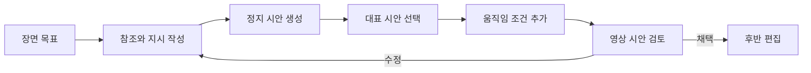

> [!abstract] 한 줄 요약
> 멀티모달 생성은 도구를 나열하는 일이 아니라, **참조 입력과 생성 결과를 반복해서 연결하는 제작 과정**이다.

강의는 대화형 이미지 편집, 텍스트·이미지 기반 영상 생성, 그리고 AI 제작 사례를 함께 제시한다. 이들을 한 작업으로 보면 핵심은 매체 변환이 아니라, 처음의 의도를 다음 단계에서도 잃지 않게 관리하는 일이다.

```html preview h=180
<div style="font-family:system-ui,sans-serif;padding:16px;color:var(--foreground);background:var(--card);border:1px solid var(--border);border-radius:var(--radius)">
  <div style="font-weight:700;margin-bottom:10px">의도가 매체를 건너갈 때 필요한 연결</div>
  <svg viewBox="0 0 720 112" width="100%" role="img" aria-label="텍스트, 참조 이미지, 영상 시안, 편집본을 잇는 독자 제작 작업 흐름">
    <g font-family="system-ui,sans-serif" text-anchor="middle"><g fill="var(--card)" stroke="var(--border)"><rect x="16" y="32" width="128" height="48" rx="12"/><rect x="202" y="32" width="128" height="48" rx="12"/><rect x="388" y="32" width="128" height="48" rx="12"/><rect x="574" y="32" width="128" height="48" rx="12"/></g><g fill="currentColor" font-size="13" font-weight="700"><text x="80" y="53">의도 문장</text><text x="266" y="53">참조 입력</text><text x="452" y="53">생성 시안</text><text x="638" y="53">편집본</text></g><g fill="var(--muted-foreground)" font-size="10"><text x="80" y="69">장면·감정·제약</text><text x="266" y="69">이미지·스케치</text><text x="452" y="69">이미지·클립</text><text x="638" y="69">선택·보정·연결</text></g><path d="M150 56h44M336 56h44M522 56h44" stroke="var(--chart-1)" stroke-width="3"/><path d="M194 56l-9-6v12zM380 56l-9-6v12zM566 56l-9-6v12z" fill="var(--chart-1)"/></g>
  </svg>
</div>
```

## 입력은 세 역할을 가진다

| 입력 종류 | 하는 일 | 예시 질문 |
| :-- | :-- | :-- |
| 텍스트 지시 | 장면과 행동을 언어로 지정 | 누가 무엇을 어떤 분위기로 하는가 |
| 참조 이미지 | 인물·의상·구도·스타일을 고정 | 무엇을 유지해야 하는가 |
| 시간 조건 | 영상에서 움직임과 변화 순서를 지정 | 처음과 끝 사이에 무엇이 바뀌는가 |
| 편집 지시 | 생성물 중 채택·수정할 부분을 지정 | 무엇을 남기고 무엇을 버릴 것인가 |

> [!important] 참조는 복사가 아니다
> 참조 이미지를 넣는 목적은 결과물의 정체성을 관리하는 데 있다. 인물·의상·색감·화면 비율 중 무엇을 고정하고 무엇을 새로 생성할지 먼저 구분해야 한다.

## 이미지에서 영상까지

<Tabs>
  <Tab label="이미지 생성">
    한 장의 구도·색·소재를 탐색하는 데 적합하다. 같은 의도를 여러 시안으로 넓혀 보며 방향을 고른다.
  </Tab>
  <Tab label="이미지 편집">
    기존 인물이나 의상을 유지한 채 일부 속성을 바꾸는 데 적합하다. 변경 범위가 작을수록 검토 기준도 선명해진다.
  </Tab>
  <Tab label="영상 생성">
    시작 프레임, 움직임, 장면 전환이 모두 필요하다. 정지 이미지의 품질이 좋아도 시간적 일관성은 별도로 검토해야 한다.
  </Tab>
</Tabs>



## 검토 기준을 나누는 법

```html preview h=155
<div style="font-family:system-ui,sans-serif;padding:16px;color:var(--foreground)">
  <div style="display:grid;grid-template-columns:repeat(3,minmax(150px,1fr));gap:10px">
    <div style="padding:14px;border-left:4px solid var(--chart-1);background:var(--card);border-radius:var(--radius)"><b>의미</b><br><span style="font-size:13px;color:var(--muted-foreground)">요청한 장면이 읽히는가</span></div>
    <div style="padding:14px;border-left:4px solid var(--chart-4);background:var(--card);border-radius:var(--radius)"><b>일관성</b><br><span style="font-size:13px;color:var(--muted-foreground)">인물·의상·공간이 유지되는가</span></div>
    <div style="padding:14px;border-left:4px solid var(--chart-2);background:var(--card);border-radius:var(--radius)"><b>사용성</b><br><span style="font-size:13px;color:var(--muted-foreground)">편집·납품에 쓸 수 있는가</span></div>
  </div>
</div>
```

한 기준으로만 결과를 고르면 문제가 숨는다. “멋있다”는 판단과 “의도한 인물과 의상이 유지되었다”는 판단, “연속 장면으로 쓸 수 있다”는 판단은 서로 다르다.

<details>
<summary>작업 지시를 장면 명세로 만드는 체크리스트</summary>

- 주체: 화면에 누구 또는 무엇이 있는가
- 환경: 공간·시간·조명·시점은 무엇인가
- 행동: 정지 또는 시간에 따른 변화는 무엇인가
- 유지 요소: 바꾸지 않아야 할 인물·의상·색·로고는 무엇인가
- 금지 요소: 등장하면 안 되는 대상·문구·스타일은 무엇인가
- 검토: 첫 생성 뒤 어떤 기준으로 수정 요청을 할 것인가

</details>

> [!tip] 정지 시안을 먼저 고르는 이유
> 영상 단계에서 정체성·구도·색감까지 동시에 고치려 하면 원인을 분리하기 어렵다. 먼저 대표 이미지를 고르면 움직임과 시간적 일관성에 집중할 수 있다.

## 핵심 정리

| 단계 | 산출물 | 다음 단계에 넘길 것 |
| :-- | :-- | :-- |
| 의도 정의 | 장면 명세 | 유지·변경·금지 조건 |
| 이미지 탐색 | 후보 시안 | 선택 근거와 대표 참조 |
| 영상화 | 시간 변화가 있는 시안 | 흔들림·왜곡·연속성 검토 |
| 편집 | 최종 시퀀스 | 채택한 구성과 수정 이력 |

> [!question]- 스스로 점검
> 이미지 생성 결과가 마음에 든다고 해서 바로 영상화하면 왜 위험한가?
>
> **답:** 이미지의 장점이 장면 전환·움직임에서도 유지된다는 보장이 없다. 대표 시안의 어떤 요소를 고정하고 시간 변화에서 무엇을 검토할지 분리해야 한다.
