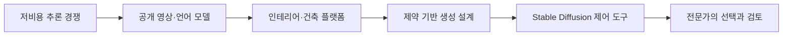
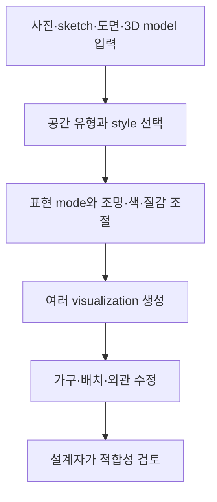

> [!abstract] 이 구간이 답하는 질문
> 생성형 AI의 비용 하락과 공개 모델 경쟁은 디자인 도구의 입력·탐색·제어 방식을 어떻게 바꾸며, 사람의 전문 판단은 어디에 남는가?

## 비용 변화에서 디자인 작업 환경까지



이 구간은 서로 멀어 보이는 두 흐름을 연결한다. 앞부분에서는 DeepSeek, Tencent Hunyuan, Moonshot Kimi K2를 통해 모델 개발과 추론의 비용·공개 경쟁을 본다. 중간에서는 방 사진, sketch, 도면, 3D model, text prompt를 입력받아 설계 시안을 만드는 서비스들을 비교한다. 뒤에서는 generative design을 “제약 아래에서 자동으로 대안을 탐색하는 계산 설계”로 정의하고, ControlNet·AUTOMATIC1111·ComfyUI가 Stable Diffusion 작업을 어떻게 제어 가능한 workflow로 바꾸는지 보여 준다.

따라서 ==디자인 탐색== 은 예쁜 이미지를 한 번 생성하는 행위로 끝나지 않는다. 입력 자료를 선택하고, style과 표현 강도를 지정하고, 여러 후보를 생성하며, 수정·검토 가능한 workflow를 만드는 과정이다. 비용 하락은 후보를 더 많이 시도할 여지를 만들지만, 어떤 후보가 효율적이고 제작 가능하며 목적에 맞는지는 여전히 설계자의 판단이 필요하다.

## DeepSeek가 흔든 비용 곡선

DeepSeek는 중국 저장성 항저우에 본사를 둔 AI startup으로 소개된다. 정식 명칭은 Hangzhou DeepSeek Artificial Intelligence Basic Technology Research Co., Ltd.이며 2023년 7월 17일 설립되었다. 중국 hedge fund High-Flyer가 주요 투자자이자 소유자로 적혀 있다.

창업자이자 CEO인 Liang Wenfeng은 1985년생이다. Zhejiang University에서 2007년 electronic information engineering 학사, 2010년 information and communication engineering 석사를 받았다는 경력이 함께 나온다. 강의가 인물의 학력과 투자 배경까지 배치한 것은 DeepSeek를 단일 model release가 아니라 자본·연구 인력·지역 산업이 결합된 startup 사례로 보여 주기 위해서다.

2025년 1월 27일 미국 주식시장과 기술주가 크게 하락했고, Nvidia가 18% 떨어져 시가총액 5,890억 달러를 잃었다는 문구가 있다. 이 사건을 다룬 “Taking Stock of the DeepSeek Shock”의 날짜는 2025년 2월 5일이다. 강의 자료가 제시한 직접 비교에서는 DeepSeek R1의 blended inference cost가 100만 token당 0.65달러, OpenAI o1은 26.25달러다. R1이 훨씬 낮은 가격에 “comparable quality”를 유지한다는 평가도 함께 적혀 있다.

```html preview
<div style="font-family:system-ui,sans-serif;padding:20px;color:var(--foreground)">
  <h3 style="margin:0 0 14px;font-size:15px;font-weight:600">강의 자료의 100만 token당 blended cost</h3>
  <div id="bars26cost" style="display:flex;align-items:flex-end;gap:14px;height:170px"></div>
  <script>
    var data = [['DeepSeek R1', 0.65], ['OpenAI o1', 26.25]];
    var max = Math.max.apply(null, data.map(function (d) { return d[1]; }));
    document.getElementById('bars26cost').innerHTML = data.map(function (d, i) {
      return '<div style="flex:1;display:flex;flex-direction:column;align-items:center;' +
        'gap:6px;height:100%;justify-content:flex-end">' +
        '<span style="font-size:12px;font-weight:600">' + d[1] + '</span>' +
        '<div style="width:100%;height:' + (d[1] / max * 100) + '%;' +
        'background:var(--chart-' + (i + 1) + ');' +
        'border-radius:var(--radius) var(--radius) 0 0"></div>' +
        '<span style="font-size:12px;color:var(--muted-foreground)">' + d[0] + '</span>' +
        '</div>';
    }).join('');
  </script>
</div>
```

> [!warning] 가격과 품질 주장의 범위
> 0.65달러와 26.25달러는 강의 자료가 인용한 blended cost다. “comparable quality”도 해당 자료의 평가 문구이지, 이 강의 구간에서 독립 benchmark를 재실행한 결과가 아니다. 비용 차이를 근거로 모든 작업에서 품질이 같다고 일반화하지 않는다.

<details>
<summary>DeepSeek 사례에서 분리해서 읽을 네 층위</summary>

1. 회사 층위: 항저우 기반 startup, 2023년 설립, High-Flyer의 투자·소유.
2. 인물 층위: Liang Wenfeng의 공학 교육 배경과 CEO 역할.
3. 시장 층위: 2025년 1월 27일 Nvidia 18% 하락과 5,890억 달러 가치 감소.
4. 서비스 층위: R1과 o1의 100만 token당 blended cost 비교.

이 네 층위를 한 문장에 섞으면 “낮은 API 가격이 주가 하락의 유일한 원인”처럼 과도한 인과관계를 만들 수 있다. 강의는 충격의 맥락을 나란히 보여 줄 뿐 인과 모형을 제공하지 않는다.

</details>

## 중국 생성 모델 경쟁: Hunyuan과 Kimi K2

Tencent의 HunyuanVideo는 text-to-video 기반의 130억 parameter 대규모 공개 video generation foundation model로 소개된다. 함께 언급된 논문 제목은 “A Systematic Framework For Large Video Generative Models”이다. 품질 면에서 Runway Gen-3와 Luma 1.6 같은 비공개 모델보다 자주 우수하다는 문구가 있지만, 비교 조건과 점수는 추출문에 없다. HunyuanWorld-1도 함께 제시되고 “Aug. 2025”라는 시점이 붙어 있으나, 기능 설명은 남아 있지 않다.

Moonshot AI의 Kimi K2는 2025년 7월 사례다. 중국 AI unicorn인 Moonshot이 공개했으며, 일부 기능이 OpenAI ChatGPT, Google Gemini, 중국 DeepSeek보다 낫다는 평가와 함께 “AI 산업을 흔들 또 하나의 DeepSeek moment”라는 표현이 나온다. 이 역시 benchmark 표가 아니라 기사식 평가이므로 기능별 우열로 확대해서는 안 된다.

창업자이자 CEO인 Yang Zhilin은 당시 31세로 소개된다. Tsinghua University computer science를 졸업하고 Carnegie Mellon University에서 박사학위를 받았으며, 미국 Meta AI team과 Google Brain에서 일한 경력이 적혀 있다. DeepSeek의 Liang Wenfeng과 Kimi의 Yang Zhilin을 연달아 배치한 것은 중국 모델 경쟁을 회사 이름만이 아니라 창업자의 공학 교육과 글로벌 연구 경력으로 설명하는 방식이다.

> [!caution] 공개 모델 설명과 홍보 문구
> “기존 비공개 모델보다 우수”, “ChatGPT·Gemini·DeepSeek를 능가”, “또 다른 DeepSeek moment”는 모두 강의가 인용한 source claim이다. 동일 입력으로 재현한 비교가 없으므로 이 노트의 결론으로 바꾸지 않는다.

## 방 사진에서 설계안으로: 인테리어 플랫폼

디자인 플랫폼들은 서로 다른 브랜드를 내세우지만 입력과 출력의 기본 구조는 유사하다. 사용자가 방 사진, sketch, 평면도, 3D model, text prompt 가운데 가능한 자료를 제공하면 AI가 photorealistic visualization이나 대안 style을 만든다. 차이는 지원 입력, style 수, 조정 mode, 편집 기능, 대상 사용자에 있다.

<Tabs>
  <Tab label="Paintit.ai와 ReRoom">
  Paintit.ai는 공간 사진이나 도면에서 photorealistic 3D visualization을 만들고, interior뿐 아니라 exterior와 landscape도 지원한다. Sketch-to-Render, 가구 배치·조명·색상 변경, Virtual Staging이 명시된다. ReRoom은 사진·sketch·3D model을 JPG, PNG, render image 등의 형태로 받아 몇 초 안에 결과를 만들며 20개가 넘는 style, 조명·색 구성·질감·시간대, Precise·Balance·Creative mode를 제공한다.
  </Tab>
  <Tab label="mnml.ai와 Luw.ai">
  mnml.ai는 건축가와 interior designer를 대상으로 사진, sketch, 2D 도면, 3D model, text prompt를 받는다. Exterior AI, Interior AI, Landscape AI, Virtual Staging, Sketch-to-Image, Masterplan AI, Style Transfer, Concept Statement Generator, Canvas 기반 Edit & Modify, Render Enhancer, Video AI 등 12개가 넘는 도구와 40개가 넘는 style이 적혀 있다. 2020년 이집트 Cairo에서 설립된 것으로 소개된다. Luw.ai는 사진·sketch·3D model screenshot으로 수 초 안에 interior·exterior render를 만들고, 전문가·부동산 종사자·DIY 사용자까지 대상으로 삼으며 개인 취향을 학습하는 AI persona 기능을 내세운다.
  </Tab>
  <Tab label="Canva와 InstantInterior">
  Canva는 social media graphic, presentation, poster, document, video template을 제공하는 호주의 online graphic design platform이다. 2012년 설립, 무료·Pro·Enterprise 구독, 2021년 월간 활성 사용자 6,000만 명이 적혀 있다. InstantInterior AI는 사진과 원하는 style 설명을 받아 몇 분 안에 photorealistic design과 가구·소품 추천을 제공한다. 인용된 2025년 무료 앱 review에서는 editor 추천 1위, 무료 고해상도 design 5개, watermark 없음, style·가구 추천을 특징으로 제시한다.
  </Tab>
</Tabs>

### 플랫폼을 사용할 때의 공통 절차



첫째, 입력이 현재 공간을 얼마나 정확히 표현하는지 확인한다. 사진은 현실의 재료와 조명을 담지만 치수가 약하고, 도면·3D model은 구조가 분명하지만 최종 분위기를 바로 보여 주지 않을 수 있다. 강의 자료는 이 장단점을 직접 수치화하지 않지만 여러 입력 형식을 병렬로 제시한다.

둘째, style과 mode를 구분한다. ReRoom의 20개가 넘는 style은 미니멀·모던·보헤미안·스칸디나비아 같은 표현 방향이고, Precise·Balance·Creative는 원본을 얼마나 강하게 유지하거나 변형할지를 고르는 mode다. 셋째, 생성 뒤 가구, 조명, 색상, 질감, 시간대를 수정한다. 넷째, photorealistic하다는 이유만으로 설계가 시공 가능하다고 판단하지 않고 전문가가 결과를 검토한다.

```html preview
<div style="font-family:system-ui,sans-serif;padding:20px">
  <div id="cards26tools" style="display:flex;gap:14px;flex-wrap:wrap"></div>
  <script>
    var stats = [
      ['ReRoom style', '20개 이상', '강의 자료의 선택지', 'var(--chart-2)'],
      ['mnml.ai 도구', '12개 이상', '강의 자료의 기능 수', 'var(--chart-1)'],
      ['Canva MAU', '6,000만 명', '2021년 강의 수치', 'var(--chart-5)']
    ];
    document.getElementById('cards26tools').innerHTML = stats.map(function (s) {
      return '<div style="flex:1;min-width:150px;padding:16px;background:var(--card);' +
        'color:var(--card-foreground);border:1px solid var(--border);' +
        'border-radius:var(--radius)">' +
        '<div style="font-size:13px;color:var(--muted-foreground)">' + s[0] + '</div>' +
        '<div style="font-size:26px;font-weight:700;margin-top:4px">' + s[1] + '</div>' +
        '<div style="font-size:12px;font-weight:600;margin-top:4px;color:' + s[3] + '">' +
        s[2] + '</div>' +
        '</div>';
    }).join('');
  </script>
</div>
```

> [!info] 인터뷰 화면의 한계
> “디자이너가 생성형 AI를 쓰는 이유, 좋은 디자인에 집중할 수 있게”라는 interview 제목은 남아 있지만 본문은 추출되지 않았다. 따라서 반복 작업을 줄여 창의성에 집중한다는 뒤의 generative design 논의와 제목 수준에서만 연결하고, interview 발언을 만들어 넣지 않는다.

## 생성 설계는 무엇을 자동화하는가

Building Designers Association of Australia는 building design과 thermal performance profession을 advocacy, education, professional excellence로 높이는 조직으로 소개된다. 사명은 cutting-edge education, proactive advocacy, design excellence를 통해 회원에게 힘과 영감을 주는 것이다. 이 맥락 뒤에 generative design 정의가 배치된다. 도구가 설계자를 없애는 것이 아니라 전문 직능이 새로운 계산 도구를 다루도록 교육과 기준을 마련해야 한다는 흐름이다.

Shea 등은 2005년 generative design system을 현재의 computing·manufacturing capability를 활용해 공간적으로 새롭고, 효율적이며, 제작 가능한 설계를 만드는 새로운 design process로 설명한다. Jang 등은 2021년 designer가 정의한 constraint 아래에서 design exploration을 자동 수행하는 computational design method라고 정의한다.

두 정의를 합치면 세 조건이 드러난다.

1. 결과는 기존 답을 복사하지 않는 ==새로운 후보== 여야 한다.
2. 새롭기만 한 것이 아니라 효율적이고 buildable해야 한다.
3. 탐색의 자유도는 designer가 정한 constraint 안에 있어야 한다.

전통적 제품 설계는 긴 과정과 여러 iteration을 반복해 왔다. 강의는 software 발전으로 반복 작업을 줄이고 비용을 낮추며 process를 빠르게 만들 수 있다고 설명한다. Design template과 user-defined feature를 활용하면 설계자는 반복 구현보다 innovation과 new product design에 더 많은 시간을 쓸 수 있다는 주장이다.

> [!caution] 레이아웃 추출 artifact
> 제품 설계 문장에는 `the35`와 `help of 35`가, 다음 물리 제품 사례에는 `illustrative36`이 남아 있다. 이는 슬라이드 번호 35와 36이 본문에 끼어든 추출 artifact로 보이며, 단어·설계 수·성능 수치로 해석하지 않는다.

<details>
<summary>생성 설계와 단순 이미지 생성의 차이</summary>

단순 이미지 생성의 성공 기준은 원하는 분위기나 시각 품질에 가까울 수 있다. Generative design에서는 후보가 constraint를 만족하는지, 효율적인지, 실제 manufacturing capability로 만들 수 있는지를 함께 보아야 한다. 인테리어 visualization이 설계 의사소통을 돕더라도 치수·구조·열성능·제조성을 자동으로 보증하지는 않는다.

</details>

## 물리 제품 설계와 전문가 판단

강의는 generative AI가 물리 제품 design life cycle을 크게 줄이고 innovation을 촉진할 수 있지만 “magic wand”는 아니라고 강조한다. 잠재적 함정을 줄이려면 design expert의 지식과 재량이 필요하다.

예시는 IoT 기능을 갖춘 현대적 welding helmet의 high-fidelity concept image다. Industrial designer가 text-to-image software에 prompt를 반복해서 입력하며 초기 설계를 다듬고, 현대 sports car styling에서 영감을 받은 미래적 aesthetic으로 발전시킨다. 자료는 이 이미지가 article을 위해 만든 illustrative example임을 명시한다. 따라서 실제 제조·안전 검증을 마친 helmet으로 읽으면 안 된다.

> [!important] 반복 prompting의 역할
> 이 사례에서 prompt 반복은 최종 제품을 인증하는 절차가 아니라 concept image의 방향을 다듬는 절차다. 설계자는 aesthetic을 탐색한 뒤 구조, 재료, 안전, 생산성 검토를 별도로 수행해야 한다.

## Stable Diffusion을 제어 가능한 workflow로 만들기

ControlNet은 AUTOMATIC1111 Stable Diffusion WebUI를 위한 extension으로 소개된다. 원래 Stable Diffusion model에 ControlNet과 다른 injection-based control을 추가해 이미지를 생성한다. 추가는 on-the-fly로 이루어지고 model merging은 필요하지 않다고 적혀 있다. 즉 base model 파일을 매번 합치는 대신 실행 workflow 안에서 제어 조건을 주입하는 방식으로 설명된다.

AUTOMATIC1111은 Gradio library로 구현된 Stable Diffusion web interface다. 추출문에는 이 한 문장만 남아 있어 설치법이나 기능 목록을 더하지 않는다.

ComfyUI는 open-source node-based program이다. text prompt에서 이미지를 만들며 Stable Diffusion 같은 무료 diffusion model을 base로 사용하고, ControlNet과 LCM Low-rank adaptation 같은 도구를 각각 node로 표현한다. Graph·node·flowchart interface를 통해 복잡한 Stable Diffusion workflow를 설계·실행하고, code를 직접 작성하지 않고도 실험할 수 있는 것이 특징이다.

| 도구 | 강의에서 확인되는 역할 | 확인되지 않은 것 |
| :-- | :-- | :-- |
| ControlNet extension | 실행 중 제어 조건을 주입하며 merging이 필요 없음 | 구체적 control 종류와 설정값 |
| AUTOMATIC1111 | Gradio 기반 Stable Diffusion web UI | 설치·화면별 사용 절차 |
| ComfyUI | model과 control을 node graph로 연결 | 추출문 뒤가 잘려 있어 전체 기능 목록 없음 |

ComfyUI 설명의 마지막 문장은 “사용자는 코드를 작성할 필요 없이 Stable Diffusion 작업 흐름을 실험하고”에서 끊긴다. 문장을 임의로 완성하지 않는다. 확인 가능한 핵심은 node graph가 model, prompt, control, adaptation을 명시적인 연결 관계로 바꾸어 준다는 점이다.

> [!warning] GUI가 검증을 대신하지 않는다
> Node가 연결되어 실행된다는 사실은 디자인 결과가 constraint, 제조성, 안전성을 만족한다는 뜻이 아니다. GUI는 생성 절차를 보이게 만들고 반복하기 쉽게 할 뿐, 전문가의 평가 책임을 제거하지 않는다.

## 핵심 정리

| 흐름 | 대표 사례 | 이 구간의 결론 |
| :-- | :-- | :-- |
| 비용 하락 | DeepSeek R1과 OpenAI o1 가격 비교 | 저비용 추론이 시장·도구 경쟁을 바꾼다 |
| 공개 모델 | HunyuanVideo·HunyuanWorld·Kimi K2 | 규모와 공개성 주장은 비교 조건과 함께 읽어야 한다 |
| 디자인 SaaS | Paintit, ReRoom, mnml.ai, Luw.ai, Canva, InstantInterior | 입력 형식·style·mode·편집 기능이 플랫폼을 구분한다 |
| 생성 설계 | Shea, Jang의 정의 | 새로움·효율·제작 가능성·constraint를 함께 다룬다 |
| 물리 제품 | IoT welding helmet concept | 반복 prompting은 concept 탐색이며 제조 검증은 별도다 |
| 제어 workflow | ControlNet, AUTOMATIC1111, ComfyUI | 생성 과정을 주입 조건과 node graph로 명시화한다 |

> [!question]- 스스로 점검
> **Q.** ReRoom에서 Creative mode로 photorealistic 결과가 나왔다는 사실만으로 generative design이 성공했다고 말할 수 있는가?
>
> **A.** 없다. 그 결과는 style과 표현 강도를 적용한 visualization이다. Generative design의 정의에 따르면 designer가 정한 constraint, 효율성, buildability까지 검토해야 하며, 물리 제품 사례에서도 전문가의 지식과 재량이 필요하다고 명시한다.
