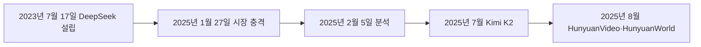
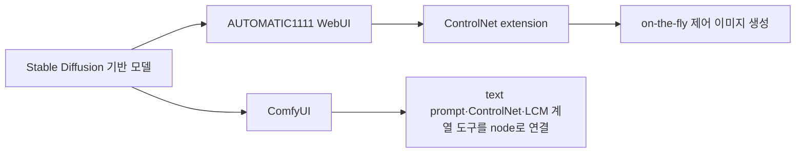

## DeepSeek 충격은 추론 비용과 시장 반응을 함께 드러냈다

자료는 DeepSeek의 기업 배경, R1 가격, Nvidia 시가총액 하락을 하나의 비용 곡선 변화로 제시한다.

- **기업명** — 정식 명칭은 Hangzhou DeepSeek Artificial Intelligence Basic Technology Research Co., Ltd.로 적혀 있다.
- **본사** — 중국 Zhejiang Province의 Hangzhou에 본사를 둔 AI startup이다.
- **설립** — Liang Wenfeng이 2023년 7월 17일 설립했다.
- **소유·투자** — 중국 hedge fund High-Flyer가 주 투자자이자 소유자로 소개된다.
- **시장 반응** — 2025년 1월 27일 미국 주식시장과 기술주가 큰 폭으로 하락했고 Nvidia는 18% 떨어져 시가총액 5,890억 달러를 잃었다고 적혀 있다.
- **분석 시점** — “Taking Stock of the DeepSeek Shock”의 날짜는 2025년 2월 5일이다.
- **품질 주장** — R1은 OpenAI o1과 비교 가능한 품질을 유지하면서 경쟁력 있는 추론 가격을 제공한다고 서술된다.

```html preview
<div style="font-family:system-ui,sans-serif;padding:20px;color:var(--foreground)">
  <h3 style="margin:0 0 14px;font-size:15px;font-weight:600">1백만 토큰당 blended inference cost, USD</h3>
  <div id="bars" style="display:flex;align-items:flex-end;gap:14px;height:170px"></div>
  <script>
    var data = [['DeepSeek R1', 0.65], ['OpenAI o1', 26.25]];
    var max = Math.max.apply(null, data.map(function (d) { return d[1]; }));
    document.getElementById('bars').innerHTML = data.map(function (d, i) {
      return '<div style="flex:1;display:flex;flex-direction:column;align-items:center;' +
        'gap:6px;height:100%;justify-content:flex-end">' +
        '<span style="font-size:12px;font-weight:600">' + d[1] + '</span>' +
        '<div style="width:100%;height:' + (d[1] / max * 100) + '%;' +
        'background:var(--chart-' + (i + 1) + ');' +
        'border-radius:var(--radius) var(--radius) 0 0"></div>' +
        '<span style="font-size:12px;color:var(--muted-foreground)">' + d[0] + '</span>' +
        '</div>';
    }).join('');
  </script>
</div>
```

### Liang Wenfeng

- **출생** — 1985년생으로 적혀 있다.
- **역할** — DeepSeek chief executive다.
- **학부** — Zhejiang University에서 2007년 electronic information engineering 공학사를 받았다.
- **대학원** — 같은 대학에서 2010년 information and communication engineering 공학석사를 받았다.

## 중국 생성 모델은 영상·월드·언어 모델로 확장된다

DeepSeek 이후의 화면은 Tencent HunyuanVideo·HunyuanWorld와 Moonshot AI Kimi K2를 연속해서 소개한다.



- **HunyuanVideo** — text-to-video 기반 130억 parameter의 대규모 오픈소스 영상 생성 foundation model로 소개된다.
- **논문 표제** — “A Systematic Framework For Large Video Generative Models”와 함께 공개되었다고 적혀 있다.
- **비교 주장** — 품질 면에서 Runway Gen-3와 Luma 1.6 같은 closed model을 자주 능가한다고 서술된다.
- **HunyuanWorld** — HunyuanVideo와 함께 2025년 8월 표제에 놓이지만 구체 기능은 추출문에 없다.
- **Kimi K2** — 중국 AI unicorn Moonshot이 2025년 7월 공개한 모델로 소개된다.
- **성능 주장** — 일부 기능이 OpenAI ChatGPT, Google Gemini, DeepSeek를 능가한다는 보도 표현이 실려 있다.
- **산업 반응** — 또 다른 “DeepSeek moment”가 올 수 있다는 관측이 인용된다.

### Yang Zhilin

- **역할·나이** — Moonshot 창업자 겸 CEO이며 31세로 적혀 있다.
- **학력** — Tsinghua University computer science를 졸업하고 Carnegie Mellon University에서 박사학위를 받았다.
- **경력** — 미국 Meta AI team과 Google Brain에서 일한 것으로 소개된다.
- **장소 표기** — 사진 설명에는 Beijing이 적혀 있다.

## 인테리어 플랫폼은 입력 형식과 편집 범위에서 갈린다

여섯 플랫폼은 공간 입력, 생성 속도, 스타일 수, 편집·추천·사용자 범위를 서로 다르게 강조한다.

<Tabs>
  <Tab label="Paintit.ai">공간 사진이나 도면에서 빠르게 photorealistic 3D 시각화를 만들며 실내·외관·조경을 지원한다. Sketch-to-Render, 가구·조명·색상 편집, Virtual Staging이 명시된다.</Tab>
  <Tab label="ReRoom AI">사진·스케치·3D 모델과 JPG·PNG·render image를 입력받아 몇 초 안에 시각화한다. 20가지 이상 스타일과 Precise·Balance·Creative 모드를 제공한다.</Tab>
  <Tab label="mnml.ai">건축가·인테리어 디자이너 대상이며 사진·스케치·2D 도면·3D 모델·text prompt를 받는다. 12개 이상 도구와 40개 이상 스타일을 지원한다.</Tab>
  <Tab label="Luw.ai">사진·스케치·3D 모델 screenshot으로 실내·외부 공간을 몇 초 안에 렌더링한다. 전문가·부동산 종사자·DIY 사용자를 아우르고 맞춤형 AI persona를 제공한다.</Tab>
  <Tab label="Canva">호주의 template 기반 온라인 graphic design 플랫폼이다. 개인 무료·Pro·Enterprise를 제공하며 social media graphic, presentation, poster, document, video를 다룬다.</Tab>
  <Tab label="InstantInterior">사진과 style 설명으로 몇 분 안에 photorealistic interior와 furniture·accessory 추천을 만든다. 2025년 무료 앱 리뷰에서 editor 추천 1위로 소개된다.</Tab>
</Tabs>

```html preview
<div style="font-family:system-ui,sans-serif;padding:20px">
  <div id="cards" style="display:flex;gap:14px;flex-wrap:wrap"></div>
  <script>
    var stats = [
      ['ReRoom AI 스타일', '20가지 이상', '조합 가능', 'var(--chart-2)'],
      ['mnml.ai 도구', '12개 이상', '공간·편집·영상 기능', 'var(--chart-1)'],
      ['mnml.ai 스타일', '40개 이상', '자료의 지원 규모', 'var(--chart-5)']
    ];
    document.getElementById('cards').innerHTML = stats.map(function (s) {
      return '<div style="flex:1;min-width:150px;padding:16px;background:var(--card);' +
        'color:var(--card-foreground);border:1px solid var(--border);' +
        'border-radius:var(--radius)">' +
        '<div style="font-size:13px;color:var(--muted-foreground)">' + s[0] + '</div>' +
        '<div style="font-size:26px;font-weight:700;margin-top:4px">' + s[1] + '</div>' +
        '<div style="font-size:12px;font-weight:600;margin-top:4px;color:' + s[3] + '">' +
        s[2] + '</div>' +
        '</div>';
    }).join('');
  </script>
</div>
```

| 플랫폼 | 입력 | 출력·제어 | 원문 고유 정보 |
| :-- | :-- | :-- | :-- |
| Paintit.ai | 공간 사진, 도면 | 3D render, 외관·조경, staging | 정밀 render와 상호작용 편집 |
| ReRoom AI | 사진, sketch, 3D model | 조명·색·texture·시간대 | 세 가지 표현 강도 mode |
| mnml.ai | 사진, sketch, 2D·3D, text | exterior·interior·landscape·video 등 | Cairo, Egypt에서 2020년 설립 |
| Luw.ai | 사진, sketch, 3D screenshot | 실내·외부 render, redesign | 사용자 취향을 학습하는 AI persona |
| Canva | template와 콘텐츠 입력 | graphic·presentation·poster·document·video | 2012년 설립, 2021년 월 활성 6천만 명 |
| InstantInterior | 사진과 style 설명 | interior와 가구·소품 추천 | 무료 고해상도 5개, watermark 없음 |

- **mnml.ai 명시 도구** — Exterior AI, Interior AI, Landscape AI, Virtual Staging, Sketch-to-Image, Masterplan AI가 열거된다.
- **mnml.ai 추가 표기** — Style Transfer, Concept Statement Generator, Edit & Modify (Canvas), Render Enhancer, Video AI가 이어진다.
- **Canva 가치 표명** — 사람들에게 힘을 주고 정직·개방·건설적 태도를 중시한다고 설명한다.
- **InstantInterior 무료 조건** — style과 furniture 추천도 무료 이용에 포함된다고 적혀 있다.
- **인터뷰 표제** — “디자이너가 생성형 AI를 쓰는 이유, 좋은 디자인에 집중할 수 있게”라는 링크 제목만 남아 있다.

## 생성 설계는 제약 안에서 탐색을 자동화한다

두 정의는 새로운 공간 해법과 설계자 제약을 동시에 강조하며, BDAA의 교육·전문성 맥락이 이를 둘러싼다.

| 출처 표기 | 생성 설계의 초점 |
| :-- | :-- |
| Shea 등, 2005 | 현재의 컴퓨팅·제조 역량을 활용해 공간적으로 새롭고 효율적이며 제작 가능한 설계를 만드는 새 과정 |
| Jang 등, 2021 | 설계자가 정한 제약 아래 설계 탐색을 자동 수행하는 계산 설계 방법 |

- **BDAA 대상** — building design과 thermal performance 전문직을 향상하는 조직으로 소개된다.
- **실행 축** — advocacy, education, professional excellence를 통합한다.
- **미션** — cutting-edge education, proactive advocacy, design excellence로 회원에게 역량과 영감을 주는 것을 목표로 한다.
- **기존 과정** — 전통적 설계는 긴 과정과 여러 iteration을 요구한다고 서술된다.
- **소프트웨어 효과** — 과정 단순화·속도 향상·비용 최소화가 가능하다고 주장한다.
- **디자이너 역할** — design best practice를 익히고 template로 반복 작업을 줄이며 사용자 정의 기능을 적절한 도구로 구현한다.
- **시간 재배분** — 반복 작업보다 혁신과 새로운 제품 설계에 더 많은 시간을 쓰는 방향이 제시된다.

## 생성형 AI는 물리 제품 설계의 가속 수단이지 자동 정답이 아니다

자료는 수명주기 단축과 혁신 가능성을 인정하면서도 전문가 지식과 재량이 잠재 위험을 줄이는 데 필요하다고 명시한다.

- [ ] **제품 사례** — Internet of Things 기능을 갖춘 현대식 welding helmet의 high-fidelity concept image다.
- [ ] **생성 방식** — generative AI text-to-image software를 사용했다.
- [ ] **정제 절차** — industrial designer가 iterative prompting으로 초기 설계를 발전시켰다.
- [ ] **미학 방향** — modern sports car styling에서 영감을 받은 futuristic aesthetic을 적용했다.
- [ ] **증거 한계** — 이미지는 실제 제품 검증 결과가 아니라 해당 기사용 illustrative concept이다.
- [ ] **전문가 조건** — 설계 지식과 판단이 잠재적 함정을 완화하는 데 필요하다.

## Stable Diffusion 제어는 WebUI·확장·노드 흐름으로 구성된다

AUTOMATIC1111, ControlNet extension, ComfyUI는 각각 기본 인터페이스·즉시 주입 제어·노드 기반 workflow를 맡는다.



- **AUTOMATIC1111** — Gradio library로 구현된 Stable Diffusion web interface다.
- **ControlNet extension** — AUTOMATIC1111 WebUI에 ControlNet과 다른 injection-based Stable Diffusion controls를 추가한다.
- **적용 방식** — 원래 Stable Diffusion 모델에 on-the-fly로 더하며 merging은 필요하지 않다.
- **ComfyUI 성격** — 오픈소스 node-based program이자 강력하고 modular한 GUI·backend로 설명된다.
- **기반과 도구** — Stable Diffusion 같은 free diffusion model을 base로 사용하고 ControlNet과 LCM Low-rank adaptation 표기의 도구를 결합한다.
- **표현 단위** — 각 도구는 graph·node·flowchart 인터페이스의 node로 나타난다.
- **사용 방식** — 코드를 쓰지 않고 복잡한 Stable Diffusion workflow를 설계·실행하고 실험할 수 있다고 적혀 있다.

<details>
<summary>원문 오류·추출 artifact·주장 한계</summary>

- 생성 설계 설명의 “with the35”와 “help of 35”는 화면 번호 35가 문장에 주입된 추출 artifact다.
- 제품 설계 사례의 “Images are illustrative36”에서 36도 화면 번호가 단어 뒤에 붙은 artifact다.
- BDAA 문장의 “a33 steadfast commitment”에는 화면 번호 33이 관사 뒤에 주입되어 있다.
- 인터뷰 링크 화면에는 32가 두 번 표시되며 본문 설명은 링크 제목 외에 없다.
- ComfyUI 마지막 한국어 문장은 “workflow를 실험하고”에서 끊겨 이후 내용이 추출되지 않았다.
- “LCM Low-rank adaptation”은 원문에 연결된 표현을 보존한 것으로, LCM과 LoRA의 정확한 관계를 이 구간만으로 다시 정의하지 않는다.
- HunyuanVideo의 우위, Kimi K2의 일부 성능 우위, InstantInterior의 editor 추천 1위는 자료가 전달한 주장이다. 공통 조건의 독립 비교 수치는 없다.

</details>

## 학습 점검은 숫자·기능·주장의 근거 수준을 구분한다

비용과 플랫폼 수치는 명시값으로 보존하고, 성능 우위와 기사 평가는 검증 완료 사실로 확대하지 않는다.

- **비용** — R1과 o1의 토큰당 가격 단위가 같은지 확인한다.
- **시장** — Nvidia 하락률과 시가총액 손실을 모델 성능 점수로 섞지 않는다.
- **플랫폼** — 입력 형식, 편집 범위, 스타일·도구 수를 각 서비스별로 구분한다.
- **생성 설계** — 자동 탐색과 설계자 제약·전문가 판단을 함께 기억한다.
- **제어 스택** — WebUI, extension, node workflow의 역할을 같은 구성요소로 합치지 않는다.
