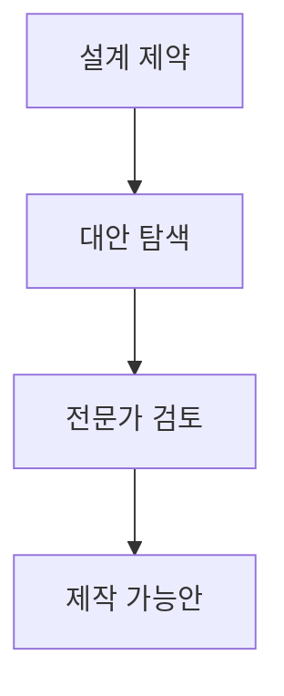

> [!NOTE]
> 생성형 디자인의 경쟁력은 모델 가격만으로 정해지지 않는다. 비용, 모델 생태계, 입력 인터페이스, 설계 제약, 전문가의 판단을 하나의 탐색 과정으로 묶어야 한다.

---

## DeepSeek가 흔든 비용 곡선

**핵심:** DeepSeek 사례는 비슷한 품질을 주장하는 추론 서비스 사이에 큰 가격 차이가 생길 수 있음을 보여 준다.

- DeepSeek는 중국 항저우에 본사를 둔 AI 스타트업으로 소개되며 설립일은 2023년 7월 17일이다.
- 창업자 Liang Wenfeng은 전자정보공학과 정보통신공학을 공부했고 High-Flyer가 주요 투자자이자 소유자로 제시된다.

```html preview
<div style="font-family:system-ui,sans-serif;padding:20px;color:var(--foreground)">
  <h3 style="margin:0 0 14px;font-size:15px;font-weight:600">100만 토큰당 추론 비용 · 달러</h3>
  <div id="bars" style="display:flex;align-items:flex-end;gap:14px;height:170px"></div>
  <script>
    var data = [['DeepSeek R1', 0.65], ['OpenAI o1', 26.25]];
    var max = Math.max.apply(null, data.map(function (d) { return d[1]; }));
    document.getElementById('bars').innerHTML = data.map(function (d, i) {
      return '<div style="flex:1;display:flex;flex-direction:column;align-items:center;' +
        'gap:6px;height:100%;justify-content:flex-end">' +
        '<span style="font-size:12px;font-weight:600">' + d[1] + '</span>' +
        '<div style="width:100%;height:' + (d[1] / max * 100) + '%;' +
        'background:var(--chart-' + (i + 1) + ');' +
        'border-radius:var(--radius) var(--radius) 0 0"></div>' +
        '<span style="font-size:12px;color:var(--muted-foreground)">' + d[0] + '</span>' +
        '</div>';
    }).join('');
  </script>
</div>
```

---

## 비용 변화가 시장 충격으로 번지다

```html preview
<div style="font-family:system-ui,sans-serif;padding:20px">
  <div id="cards" style="display:flex;gap:14px;flex-wrap:wrap"></div>
  <script>
    var stats = [
      ['Nvidia 주가', '18% 하락', '1월 27일 시장 충격', 'var(--chart-2)'],
      ['시가총액 감소', '5,890억 달러', '원문이 제시한 손실 규모', 'var(--chart-1)']
    ];
    document.getElementById('cards').innerHTML = stats.map(function (s) {
      return '<div style="flex:1;min-width:150px;padding:16px;background:var(--card);' +
        'color:var(--card-foreground);border:1px solid var(--border);' +
        'border-radius:var(--radius)">' +
        '<div style="font-size:13px;color:var(--muted-foreground)">' + s[0] + '</div>' +
        '<div style="font-size:26px;font-weight:700;margin-top:4px">' + s[1] + '</div>' +
        '<div style="font-size:12px;font-weight:600;margin-top:4px;color:' + s[3] + '">' +
        s[2] + '</div>' +
        '</div>';
    }).join('');
  </script>
</div>
```

> [!IMPORTANT]
> 비용 비교는 원문이 말하는 blended inference cost와 comparable quality 주장에 한정한다. 주가와 시가총액 수치는 같은 시장 사건을 설명하지만 모델 품질의 직접 측정값은 아니다.

---

## 중국 생성 모델의 범위가 넓어지다

| 모델 | 중심 기능 | 원문이 강조한 위치 |
| :-- | :-- | :-- |
| DeepSeek R1 | 저비용 AI 추론 | 비용 곡선과 시장 충격 |
| HunyuanVideo·HunyuanWorld | text-to-video와 world generation | 공개 대형 영상 모델 |
| Kimi K2 | 언어 모델의 기능 경쟁 | 2025년 7월의 또 다른 산업 충격 가능성 |

```html preview
<div style="font-family:system-ui,sans-serif;padding:20px">
  <div id="cards" style="display:flex;gap:14px;flex-wrap:wrap"></div>
  <script>
    var stats = [
      ['HunyuanVideo', '13B', 'foundation model parameters', 'var(--chart-2)'],
      ['ReRoom 스타일', '20개 이상', '공간 디자인 선택지', 'var(--chart-1)'],
      ['mnml.ai 도구', '12개 이상', '건축·인테리어 기능', 'var(--chart-5)'],
      ['mnml.ai 스타일', '40개 이상', '원문 지원 범위', 'var(--chart-3)']
    ];
    document.getElementById('cards').innerHTML = stats.map(function (s) {
      return '<div style="flex:1;min-width:150px;padding:16px;background:var(--card);' +
        'color:var(--card-foreground);border:1px solid var(--border);' +
        'border-radius:var(--radius)">' +
        '<div style="font-size:13px;color:var(--muted-foreground)">' + s[0] + '</div>' +
        '<div style="font-size:26px;font-weight:700;margin-top:4px">' + s[1] + '</div>' +
        '<div style="font-size:12px;font-weight:600;margin-top:4px;color:' + s[3] + '">' +
        s[2] + '</div>' +
        '</div>';
    }).join('');
  </script>
</div>
```

<details>
<summary>모델 소개의 해석 범위</summary>

HunyuanVideo는 공개 대형 영상 생성 모델로 소개되며 원문은 Runway Gen-3와 Luma 1.6보다 품질이 좋다는 설명을 싣고 있다. Kimi K2도 일부 기능이 경쟁 모델을 앞선다는 기사 서술과 창업자 Yang Zhilin의 학력·경력을 함께 제시한다. 이 문서에서는 해당 문구를 독립 benchmark 결과로 확대하지 않는다.

</details>

---

## 인테리어 플랫폼은 입력과 제어 방식으로 구분한다

<Tabs>
  <Tab label="Paintit·ReRoom">
    Paintit은 공간 사진이나 도면에서 실내·외 3D 시각화를 만들고 가구, 조명, 색상을 편집한다. ReRoom은 사진·스케치·3D 모델을 받아 조명, 색상, 질감, 시간대와 Precise·Balance·Creative 모드를 조절한다.
  </Tab>
  <Tab label="mnml.ai·Luw.ai">
    mnml.ai는 사진, 스케치, 2D 도면, 3D 모델, 텍스트 prompt를 건축 시각화로 연결한다. Luw.ai는 공간 입력을 빠르게 렌더링하고 사용자의 취향과 스타일에 맞춘 AI persona를 설명한다.
  </Tab>
  <Tab label="Canva·InstantInterior">
    Canva는 template 기반 디자인 SaaS로 2021년 월 활성 사용자 6천만 명이 제시된다. InstantInterior는 사진과 스타일 설명으로 실내 디자인과 가구 추천을 만들며 무료 이용에서 고해상도 디자인 5개와 watermark 없음이 소개된다.
  </Tab>
</Tabs>

| 입력 | 생성 결과 | 후속 제어 |
| :-- | :-- | :-- |
| 공간 사진 | 포토리얼한 인테리어·외부 공간 | 조명·색상·질감 |
| 스케치·도면 | 3D 렌더와 concept image | 스타일·표현 강도 |
| 3D 모델 | 재설계된 공간 시각화 | 가구 배치·시간대 |
| 텍스트 prompt | 건축·제품 concept | canvas 편집·enhancement |

---

## 생성 설계는 제약 아래의 탐색이다

**핵심:** 원문 정의들은 생성 설계를 새롭기만 한 형상이 아니라 효율성, 제작 가능성, 설계자 제약을 함께 만족시키는 탐색으로 본다.

| 정의의 초점 | 포함되는 조건 |
| :-- | :-- |
| Shea 등의 정의 | 공간적 새로움, 효율성, 제작 가능성, 현재 계산·제조 능력 |
| Jang 등의 정의 | 설계자가 정한 제약 아래에서 자동으로 설계 대안을 탐색 |
| 제품 디자인 사례 | 반복 작업과 비용을 줄이고 혁신에 더 많은 시간을 배분 |
| 물리 제품 사례 | 생성 속도와 창의성의 이점, 전문가 지식과 재량의 필요 |



---

## Stable Diffusion의 제어 인터페이스

| 인터페이스 | 원문에서의 역할 | 작업 방식 |
| :-- | :-- | :-- |
| AUTOMATIC1111 WebUI | Stable Diffusion용 Gradio 웹 인터페이스 | 모델과 확장을 한 화면에서 조작 |
| ControlNet extension | 원본 모델에 injection 방식 제어를 추가 | 병합 없이 실행 중 적용 |
| ComfyUI | node·graph·flowchart 기반 GUI와 backend | prompt와 ControlNet·LCM LoRA 등을 node로 연결 |

**핵심:** 생성 설계의 제약은 prompt만으로 표현되지 않는다. 자세·구조·모듈 연결 같은 제어를 인터페이스 수준에서 구성할 수 있다.

> [!WARNING]
> 원본에는 추출 한계가 있다. 디자이너 인터뷰 자료와 AUTOMATIC1111 소개 자료는 본문이 거의 남지 않았다. BDAA 설명과 생성 설계 기사에는 페이지 번호가 문장 중간에 섞였고, ComfyUI 설명은 마지막 문장이 중단된다. 따라서 잘린 문장을 복원하거나 화면 기능을 추가로 추정하지 않는다.

---

## 정리

| 핵심 개념 | 의미 | 적용 또는 경계 |
| :-- | :-- | :-- |
| 비용 곡선 | 같은 단위의 추론 가격 차이가 시장 기대를 바꿈 | 품질 주장을 별도 검증값으로 보지 않음 |
| 모델 생태계 | 언어·영상·world generation이 병렬로 확장 | 기사식 우위 표현을 benchmark로 확대하지 않음 |
| 디자인 플랫폼 | 입력 형식과 조절 가능한 속성으로 구분 | 기능 수와 결과 품질은 다른 기준 |
| 생성 설계 | 제약 안에서 새롭고 제작 가능한 대안을 탐색 | 전문가 판단을 제거하지 않음 |
| 제어 인터페이스 | 모델 위에 조건과 workflow를 구성 | 추출되지 않은 UI 동작은 제외 |
