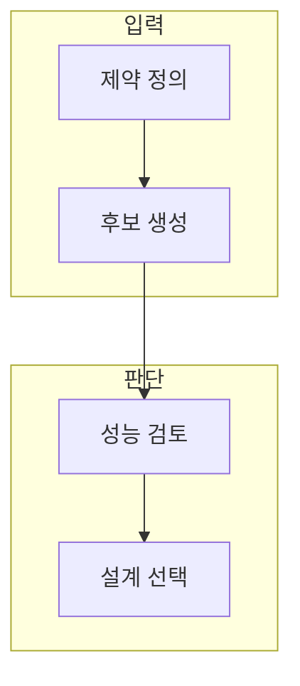

> [!abstract] 한 줄 요약
> 생성 결과의 새로움은 제약·성능·사용 조건과 함께 검토될 때 설계 후보가 된다.

## 이 노트의 지도



## 1. 디자인 입력을 해석하는 방법

형상·성능·표현 제약은 결과를 줄이는 장벽이 아니라 비교 가능한 후보 공간을 만드는 기준이다. ==제어 조건== 는 변화시킬 요소와 고정할 요소를 분리한 설계 규칙.

> [!note] 판단 기준
> 시각적 선호와 제조 가능성·안전성·비용을 같은 판단으로 합치지 않는다.

## 2. 노드 기반 워크플로

입력·변환·출력 단위를 나누면 결과 변화가 어느 연결에서 생겼는지 되짚을 수 있다.

<details>
<summary>후보 비교 규칙</summary>

- 같은 제약 조건에서 후보를 만든다.
- 한 반복에 바꾼 제어 변수를 기록한다.
- 시각적 선호와 공학 성능을 분리한다.

</details>

## 데이터로 보기

```html preview
<div style="font-family:system-ui,sans-serif;padding:20px;color:var(--foreground)">
  <label for="amt" style="font-size:14px;font-weight:600">이번 탐색에서 고정할 제약 수</label>
  <div id="out" style="font-size:30px;font-weight:700;color:var(--chart-1);margin:6px 0">제약 3</div>
  <input id="amt" type="range" min="1" max="6" step="1" value="3"
    style="width:100%;accent-color:var(--primary)" />
  <p style="font-size:13px;color:var(--muted-foreground)">값을 바꿔 고정·변경 조건을 구분한다. 실제 후보 품질은 별도 검증으로 판단한다.</p>
  <script>
    var amt = document.getElementById('amt');
    var out = document.getElementById('out');
    amt.addEventListener('input', function () {
      out.textContent = '제약 ' + Number(amt.value).toLocaleString();
    });
  </script>
</div>
```

> [!important] 해석의 경계
> 제약의 개수만으로 후보 품질은 판단할 수 없다. 각 제약의 우선순위와 충족 여부를 별도로 확인한다.

## 핵심 정리

| 개념 | 정의 | 왜 중요한가 |
| :-- | :-- | :-- |
| 제약 | 허용·금지 조건 | 탐색 범위를 설명한다 |
| 후보 | 제약 아래 생성된 대안 | 비교 가능한 선택지 |
| 검토 | 성능과 사용성을 확인 | 그럴듯함과 타당성을 구분 |

## 관련 개념

- 다목적 최적화: 여러 기준 사이의 우선순위를 설명하는 방법
- 설계 검증: 해석·시험으로 제약 충족을 확인하는 방법

> [!question]- 스스로 점검
> **Q.** 제약을 명시하면 생성 설계의 가능성이 줄어드는가?
>
> **A.** 무작위 후보의 수는 줄 수 있지만, 실제로 비교·제조·사용할 수 있는 후보 공간은 선명해진다.
