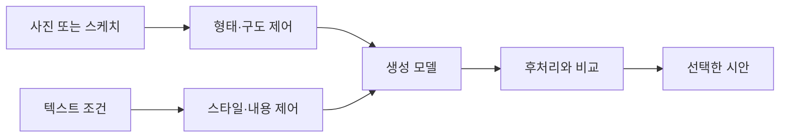

> [!abstract] 한 줄 요약
> 디자인 생성에서 중요한 것은 시안을 많이 뽑는 능력이 아니라, **제약을 지키면서 탐색 공간을 넓히는 능력**이다.

강의는 공간 사진·스케치·도면을 바탕으로 하는 시각화 도구, 생성적 설계의 정의, 그리고 ControlNet·노드 기반 워크플로를 함께 다룬다. 이들은 모두 “원하는 방향으로 생성 결과를 제어한다”는 한 문제로 연결된다.

```html preview h=180
<div style="font-family:system-ui,sans-serif;padding:16px;color:var(--foreground);background:var(--card);border:1px solid var(--border);border-radius:var(--radius)">
  <div style="font-weight:700;margin-bottom:9px">제약이 있는 디자인 탐색</div>
  <svg viewBox="0 0 720 116" width="100%" role="img" aria-label="디자인 제약, 생성 후보, 평가, 선택을 순환시키는 독자 제작 도식">
    <g font-family="system-ui,sans-serif" text-anchor="middle"><rect x="18" y="34" width="140" height="50" rx="12" fill="var(--card)" stroke="var(--chart-5)"/><text x="88" y="56" font-size="14" font-weight="700" fill="currentColor">제약 설정</text><text x="88" y="72" font-size="10" fill="var(--muted-foreground)">공간·예산·브랜드</text><rect x="206" y="34" width="140" height="50" rx="12" fill="var(--card)" stroke="var(--chart-1)"/><text x="276" y="56" font-size="14" font-weight="700" fill="currentColor">후보 생성</text><text x="276" y="72" font-size="10" fill="var(--muted-foreground)">다양한 시안</text><rect x="394" y="34" width="140" height="50" rx="12" fill="var(--card)" stroke="var(--chart-4)"/><text x="464" y="56" font-size="14" font-weight="700" fill="currentColor">평가</text><text x="464" y="72" font-size="10" fill="var(--muted-foreground)">적합성·새로움</text><rect x="582" y="34" width="120" height="50" rx="12" fill="var(--chart-2)"/><text x="642" y="63" font-size="14" font-weight="700" fill="white">선택·수정</text><path d="M164 59h34M352 59h34M540 59h34" stroke="var(--muted-foreground)" stroke-width="3"/><path d="M198 59l-8-6v12zM386 59l-8-6v12zM574 59l-8-6v12z" fill="var(--muted-foreground)"/></g>
  </svg>
</div>
```

## 디자인 입력을 해석하는 방법

| 입력 | 생성 모델에 주는 정보 | 놓치기 쉬운 점 |
| :-- | :-- | :-- |
| 공간 사진 | 기존 구조·조명·시점의 단서 | 실제 치수와 시공 가능성은 별도 검토가 필요 |
| 스케치·도면 | 배치와 형태의 출발점 | 선의 의미가 항상 정확히 보존되지는 않음 |
| 텍스트 조건 | 스타일·재료·분위기 | 모호한 형용사는 서로 다른 결과를 만들 수 있음 |
| 참조 이미지 | 고정할 시각 언어 | 그대로 복제할 근거가 되지는 않음 |

> [!note] 생성적 설계의 핵심
> 생성적 설계는 디자이너가 정한 제약 아래에서 설계 대안을 탐색하는 계산적 방법이다. 따라서 모델이 후보를 내더라도 제약을 정하고 선택하는 책임은 사람에게 남는다.

## 제어 수준에 따른 작업

<Tabs>
  <Tab label="느슨한 탐색">
    텍스트 중심으로 넓은 스타일과 분위기를 찾는다. 초기 아이디어 발산에는 좋지만, 구조·구도·인물의 일관성은 낮을 수 있다.
  </Tab>
  <Tab label="참조 기반 생성">
    사진·스케치·기존 결과를 넣어 유지할 형태를 늘린다. 무엇을 고정할지 명확히 쓸수록 수정 원인을 찾기 쉽다.
  </Tab>
  <Tab label="구조화된 워크플로">
    입력·모델·제어 모듈·후처리를 노드로 나누어 연결한다. 재현과 비교가 필요한 작업에 유리하다.
  </Tab>
</Tabs>



## 노드 기반 워크플로의 장점

```html preview h=165
<div style="font-family:system-ui,sans-serif;padding:16px;color:var(--foreground)">
  <div style="display:flex;gap:8px;align-items:center;flex-wrap:wrap">
    <span style="padding:9px 12px;border-radius:var(--radius);background:var(--card);border:1px solid var(--border)">입력 노드</span>
    <span style="font-size:20px;color:var(--muted-foreground)">→</span>
    <span style="padding:9px 12px;border-radius:var(--radius);background:var(--card);border:1px solid var(--chart-1)">제어 노드</span>
    <span style="font-size:20px;color:var(--muted-foreground)">→</span>
    <span style="padding:9px 12px;border-radius:var(--radius);background:var(--card);border:1px solid var(--chart-4)">생성 노드</span>
    <span style="font-size:20px;color:var(--muted-foreground)">→</span>
    <span style="padding:9px 12px;border-radius:var(--radius);background:var(--card);border:1px solid var(--chart-2)">평가 노드</span>
  </div>
  <p style="font-size:13px;color:var(--muted-foreground);margin:12px 0 0">단계를 분리하면 무엇을 바꿨을 때 결과가 달라졌는지 비교할 수 있다.</p>
</div>
```

## 평가 기준의 두 축

| 축 | 질문 | 생성 결과의 해석 |
| :-- | :-- | :-- |
| 적합성 | 제약·용도·요청을 충족하는가 | 보기 좋은 시안이라도 조건을 어기면 채택하지 않음 |
| 다양성 | 같은 답을 반복하지 않고 다른 가능성을 보이는가 | 다양성만 높고 제약을 무시하면 탐색 가치가 낮음 |

<details>
<summary>공간·제품 시안 검토표</summary>

- 기존 구조와 충돌하는 요소가 있는가
- 요구한 스타일·재료·조명 조건이 읽히는가
- 서로 다른 후보가 실제로 다른 설계 선택을 제안하는가
- 다음 단계에서 다시 만들 수 있도록 입력과 설정을 남겼는가
- 사람의 안전·사용성·실현 가능성 검토가 필요한 부분은 무엇인가

</details>

> [!warning] 시각적 설득력과 설계 타당성은 다르다
> 포토리얼한 결과는 아이디어를 전달하는 데 도움이 되지만, 구조·치수·공법을 검증한 결과는 아니다. 생성 모델의 장점은 대안 탐색이지 전문 검토의 대체가 아니다.

## 핵심 정리

| 개념 | 역할 |
| :-- | :-- |
| 생성적 설계 | 제약 아래에서 다양한 대안을 탐색 |
| 제어 조건 | 구조·구도·스타일 중 유지할 속성을 명시 |
| 노드 워크플로 | 단계를 분리해 재현성과 비교 가능성을 높임 |
| 평가 | 적합성과 다양성을 함께 판단 |
| 사람의 판단 | 제약 정의·선택·실현 가능성 검토를 맡음 |

> [!question]- 스스로 점검
> 같은 프롬프트에서 결과가 달라졌을 때, 노드 기반 작업이 원인 분석에 유리한 이유는 무엇인가?
>
> **답:** 입력·제어·생성·후처리 단계를 분리해 두면 한 번에 하나의 조건을 바꿔 비교할 수 있기 때문이다.
