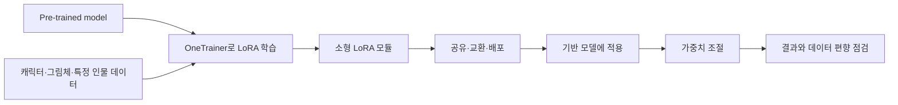

## LoRA 계열은 목적별 조정 단위를 다룬다

이 구간은 LoRA를 적은 비용의 fine-tuning을 가능하게 한 대표 PEFT 기법으로 소개한다.

- **LoRA** — Low-Rank Adaptation의 약자이며, 거대 pre-trained model을 목적에 맞게 조금씩 조정한다.
- **PEFT 맥락** — 강의는 목적별 fine-tuning의 필요성과 함께 AI 엔지니어·연구자의 필수 기법으로 제시한다.
- **자료 범위** — LoHa와 LoKr는 LoRA를 개선하는 대표 방법으로 열거되지만 세부 원리는 설명되지 않는다.

<Tabs>
  <Tab label="LoRA">핵심 아이디어와 Stable Diffusion 사례가 함께 설명된 방법이다.</Tab>
  <Tab label="LoHa">대표 PEFT 방법으로 이름만 제시되며 구조 설명은 없다.</Tab>
  <Tab label="LoKr">대표 PEFT 방법으로 이름만 제시되며 구조 설명은 없다.</Tab>
</Tabs>

## 학습·배포 lifecycle은 작은 모듈을 중심으로 이어진다

OneTrainer에서 목적별 모듈을 만들고, 공유한 뒤 기반 모델에 적용해 결과를 확인한다.



- **OneTrainer** — Stable Diffusion training 요구를 한곳에서 다루는 one-stop solution으로 소개된다.
- **학습 대상** — 개별 LoRA로 캐릭터 스타일, 그림체, 특정 인물 재현을 학습할 수 있다.
- **합성** — “LoRA 합성”으로 여러 스타일을 동시에 적용하는 사례가 제시된다.

```html preview
<div style="font-family:system-ui,sans-serif;padding:20px">
  <div id="cards" style="display:flex;gap:14px;flex-wrap:wrap"></div>
  <script>
    var stats = [
      ['배포 단위', '수 MB', '소형 LoRA 모듈', 'var(--chart-2)'],
      ['테스트 기반', '2종', 'AnyLoRA·NED', 'var(--chart-1)'],
      ['기본 가중치', ':1', 'auto1111 안내', 'var(--chart-5)']
    ];
    document.getElementById('cards').innerHTML = stats.map(function (s) {
      return '<div style="flex:1;min-width:150px;padding:16px;background:var(--card);' +
        'color:var(--card-foreground);border:1px solid var(--border);' +
        'border-radius:var(--radius)">' +
        '<div style="font-size:13px;color:var(--muted-foreground)">' + s[0] + '</div>' +
        '<div style="font-size:26px;font-weight:700;margin-top:4px">' + s[1] + '</div>' +
        '<div style="font-size:12px;font-weight:600;margin-top:4px;color:' + s[3] + '">' +
        s[2] + '</div>' +
        '</div>';
    }).join('');
  </script>
</div>
```

<details>
<summary>auto1111에 LoRA를 적용하는 네 단계</summary>

1. **WebUI 갱신** — git pull을 사용하거나 다시 내려받아 WebUI를 갱신한다.
2. **파일 복사** — LoRA 파일을 stable-diffusion-webui/models/lora에 복사한다.
3. **모듈 선택** — WebUI에서 사용할 LoRA를 선택한다.
4. **가중치 변경** — 모델 안내에 맞춰 가중치를 조절한다.

</details>

## Gear Fifth Luffy는 유연성과 데이터 편향을 함께 보여 준다

이 사례는 trigger의 적용 범위, 가중치 효과, 작은 dataset의 부수적 스타일 학습을 구분한다.

| 관찰 | source 사실 | 판단 경계 |
| :-- | :-- | :-- |
| 적용 대상 | Luffy와 다른 캐릭터에 Gear Fifth 적용 가능 | 한 캐릭터에만 묶인 개념으로 보지 않음 |
| 속성 변경 | 머리 색과 의상을 바꿀 수 있음 | trigger가 모든 속성을 고정하지 않음 |
| 가중치 | 낮추면 drawing effect가 줄어듦 | 표현 강도의 변화로 읽음 |
| dataset | 크기가 작아 cartoon style을 일부 학습함 | 의도한 개념과 부수적 편향을 분리 |
| 조합 | Wano style LoRA와 함께 사용함 | 복수 LoRA 사용 사례로만 읽음 |

> [!warning] 작은 dataset의 과적합 경계
> 제작자는 trigger가 지나치게 고정되지 않았다고 설명하지만 cartoon style도 함께 습득했다고 적는다. 속성 변경 가능성과 데이터 편향은 별도 관찰이다.

- **소개** — Gear Fifth Luffy의 스타일을 반영한 LoRA다.
- **지원 안내** — 모델 제작 비용을 언급하며 Patreon 또는 coffee 후원을 요청한다.
- **스포일러** — One Piece chapter 1044 내용을 다룬다고 명시한다.

## SDXL과 스타일 자료는 존재와 연결 관계까지만 확인된다

후반 세 화면은 모델·dataset 이름과 저장소 연결을 보여 주지만 학습 조건이나 성능값은 제공하지 않는다.

- **SDXL** — chinh102/onepiece-finalsdxl이 “SDXL LoRA DreamBooth”로 제시된다.
- **Yarn style** — Norod78/Yarn-art-style dataset과 derekl35/yarn-qlora-flux가 함께 나온다.
- **Paper Cutout** — Norod78/PaperCutoutStyle dataset과 Flux 1 Dev LoRA 모델이 함께 나온다.

> [!warning] Sparse 화면의 한계
> 저장소 제목만으로 SDXL·DreamBooth 설정, Yarn·Paper Cutout의 데이터 수, 품질 순위를 추가할 수 없다.

## 점검 질문

- **Q.** Gear Fifth 사례에서 속성 변경이 가능하다는 사실만으로 과적합이 없다고 결론 내릴 수 있는가?
- **A.** 없다. 작은 dataset에서 cartoon style이 함께 학습됐으므로 유연성과 부수적 편향을 따로 확인해야 한다.
