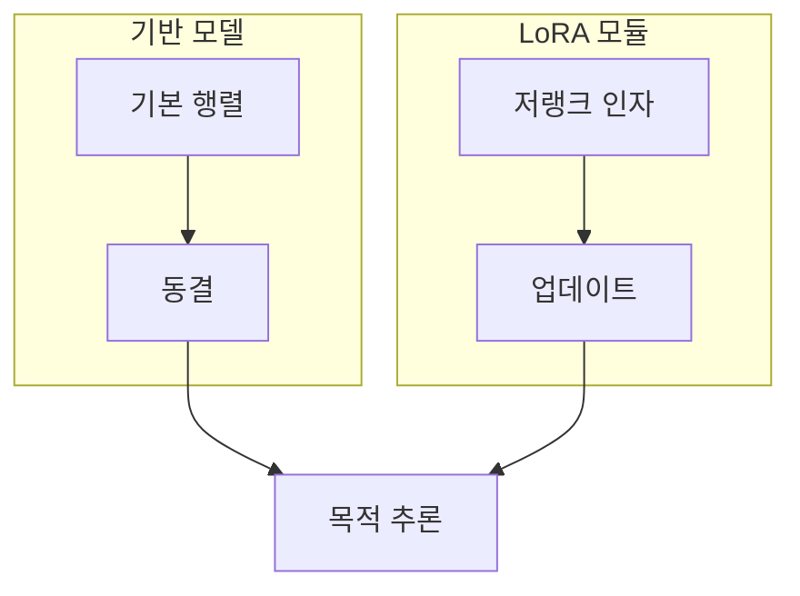

> [!abstract] 학습 질문
> 큰 모델의 성능을 목적에 맞게 바꾸려면 왜 모든 가중치를 다시 학습하지 않고도 되는가?

LoRA는 기반 가중치를 고정한 채 작은 저랭크 업데이트만 학습한다. 따라서 비용 절감은 단순한 저장 공간 문제가 아니라 **무엇을 바꾸고 무엇을 보존할지**를 정하는 설계 선택이다.

## 변화의 위치



기본 행렬은 여러 작업이 공유하는 능력을 유지하고, 업데이트 모듈은 특정 작업·스타일·도메인에 필요한 차이를 담는다. 이 분리는 여러 어댑터를 비교하거나 되돌릴 때도 유리하다.

## 저랭크라는 말의 수학

기본 행렬 $W$를 직접 바꾸는 대신, 작은 두 행렬의 곱으로 변화량을 표현한다.

$$
\Delta W = BA, \qquad
W^{\prime} = W + \alpha BA
$$

$$
W \in \mathbb{R}^{d \times k}, \quad
B \in \mathbb{R}^{d \times r}, \quad
A \in \mathbb{R}^{r \times k}, \quad
r \ll \min(d,k)
$$

여기서 $r$은 업데이트가 표현할 수 있는 방향의 수다. $r$을 작게 두면 학습 변수는 줄지만, 목표 변화가 복잡할 때는 필요한 차이를 놓칠 수 있다.

```html preview h=210
<div style="font-family:system-ui,sans-serif;padding:14px;color:var(--foreground)">
  <svg viewBox="0 0 720 180" width="100%" role="img" aria-label="기본 가중치 행렬을 두 개의 저랭크 행렬로 분해해 업데이트하는 기하 도표" style="display:block;max-width:100%;height:auto">
    <rect x="24" y="35" width="150" height="105" rx="12" style="fill:var(--card);stroke:var(--chart-1);stroke-width:2"/>
    <text x="99" y="82" text-anchor="middle" style="fill:var(--foreground);font-size:18px;font-weight:700">ΔW</text>
    <text x="99" y="108" text-anchor="middle" style="fill:var(--muted-foreground);font-size:13px">d × k</text>
    <path d="M195 88 H250" style="stroke:var(--muted-foreground);stroke-width:2;fill:none"/>
    <path d="M245 82 L257 88 L245 94" style="stroke:var(--muted-foreground);stroke-width:2;fill:none"/>
    <rect x="275" y="42" width="90" height="92" rx="12" style="fill:var(--card);stroke:var(--chart-2);stroke-width:2"/>
    <text x="320" y="82" text-anchor="middle" style="fill:var(--foreground);font-size:18px;font-weight:700">B</text>
    <text x="320" y="108" text-anchor="middle" style="fill:var(--muted-foreground);font-size:13px">d × r</text>
    <text x="392" y="95" text-anchor="middle" style="fill:var(--muted-foreground);font-size:28px">×</text>
    <rect x="420" y="66" width="120" height="45" rx="12" style="fill:var(--card);stroke:var(--chart-3);stroke-width:2"/>
    <text x="480" y="91" text-anchor="middle" style="fill:var(--foreground);font-size:18px;font-weight:700">A</text>
    <text x="480" y="133" text-anchor="middle" style="fill:var(--muted-foreground);font-size:13px">r × k</text>
    <path d="M565 88 H620" style="stroke:var(--muted-foreground);stroke-width:2;fill:none"/>
    <path d="M615 82 L627 88 L615 94" style="stroke:var(--muted-foreground);stroke-width:2;fill:none"/>
    <text x="662" y="82" text-anchor="middle" style="fill:var(--foreground);font-size:17px;font-weight:700">r 작게</text>
    <text x="662" y="108" text-anchor="middle" style="fill:var(--muted-foreground);font-size:13px">학습 범위 축소</text>
  </svg>
</div>
```

## 순위를 바꾸며 비교하기

아래 모델은 $d=k=4096$인 하나의 투영 행렬을 가정한다. 슬라이더는 순위 $r$에 따라 LoRA가 학습하는 변수 비율을 다시 계산한다. 이는 실제 모델 전체의 메모리 측정값이 아니라, 같은 행렬에서의 구조적 비교다.

```html preview h=300
<div style="font-family:system-ui,sans-serif;padding:16px;color:var(--foreground);border:1px solid var(--border);border-radius:var(--radius);background:var(--card)">
  <div style="display:flex;justify-content:space-between;gap:12px;align-items:baseline;flex-wrap:wrap">
    <strong>LoRA 순위 실험</strong>
    <span id="rankLabel" style="color:var(--muted-foreground)">r = 8</span>
  </div>
  <label for="rank" style="display:block;margin:14px 0 6px;font-size:13px">업데이트 순위 r</label>
  <input id="rank" type="range" min="1" max="256" value="8" step="1" style="width:100%;accent-color:var(--primary)">
  <div style="display:grid;grid-template-columns:repeat(2,minmax(0,1fr));gap:10px;margin:16px 0">
    <div style="padding:10px;border:1px solid var(--border);border-radius:var(--radius)">
      <div style="font-size:12px;color:var(--muted-foreground)">전체 파인튜닝</div>
      <strong id="fullCount">16,777,216</strong>
    </div>
    <div style="padding:10px;border:1px solid var(--border);border-radius:var(--radius)">
      <div style="font-size:12px;color:var(--muted-foreground)">LoRA 학습 변수</div>
      <strong id="loraCount">65,536</strong>
    </div>
  </div>
  <div style="display:grid;gap:9px">
    <div>
      <div style="display:flex;justify-content:space-between;font-size:12px"><span>전체</span><span>100%</span></div>
      <div style="height:16px;border-radius:var(--radius);background:var(--muted)"><div style="height:100%;width:100%;border-radius:var(--radius);background:var(--chart-1)"></div></div>
    </div>
    <div>
      <div style="display:flex;justify-content:space-between;font-size:12px"><span>LoRA</span><span id="ratio">0.39%</span></div>
      <div style="height:16px;border-radius:var(--radius);background:var(--muted)"><div id="loraBar" style="height:100%;width:0.39%;min-width:3px;border-radius:var(--radius);background:var(--chart-2)"></div></div>
    </div>
  </div>
  <p id="interpretation" style="margin:14px 0 0;font-size:13px;color:var(--muted-foreground)"></p>
  <script>
    (function () {
      var rank = document.getElementById('rank');
      var d = 4096, k = 4096;
      function commas(n) { return n.toLocaleString('ko-KR'); }
      function update() {
        var r = Number(rank.value);
        var full = d * k;
        var lora = r * (d + k);
        var ratio = lora / full * 100;
        document.getElementById('rankLabel').textContent = 'r = ' + r;
        document.getElementById('fullCount').textContent = commas(full);
        document.getElementById('loraCount').textContent = commas(lora);
        document.getElementById('ratio').textContent = ratio.toFixed(2) + '%';
        document.getElementById('loraBar').style.width = Math.max(ratio, 0.3) + '%';
        document.getElementById('interpretation').textContent =
          'r=' + r + '에서는 이 행렬 하나의 업데이트가 전체 변수의 ' +
          ratio.toFixed(2) + '%이다. 순위를 높일수록 표현 여지는 커지지만 학습 범위도 함께 커진다.';
      }
      rank.addEventListener('input', update);
      update();
    }());
  </script>
</div>
```

> [!important] 비교의 경계
> 위 계산은 한 투영 행렬의 변수 수를 비교한다. 실제 학습 비용은 적용 레이어 수, 정밀도, 배치, 옵티마이저 상태, 분산 전략까지 포함해 따로 측정해야 한다.

## 설정을 결정하는 질문

1. 어떤 능력은 기반 모델에 남기고, 어떤 변화만 어댑터에 맡길 것인가?
2. 목표의 복잡도에 비해 $r$이 너무 작은가, 아니면 불필요하게 큰가?
3. 어떤 레이어에 업데이트를 넣었을 때 목표 품질과 부작용의 균형이 맞는가?
4. 어댑터를 끈 결과와 켠 결과를 같은 평가 기준으로 비교했는가?

<details>
<summary>배포 전에 확인할 항목</summary>

- 기반 모델과 어댑터의 버전·구조 호환성
- 목표 데이터가 학습하려는 스타일·대상·지시를 실제로 대표하는지
- 병합 배포와 분리 어댑터 배포 중 되돌리기·교체에 유리한 방식
- 품질 지표뿐 아니라 실패 사례와 편향 변화까지 포함한 비교 기록

</details>

> [!question]- 스스로 점검
> LoRA의 학습 변수가 작아도 데이터 검토와 평가를 생략할 수 없는 이유는 무엇인가?
>
> **답:** LoRA는 바꾸는 변수의 범위를 줄일 뿐, 데이터가 어떤 행동과 성향을 가르치는지는 바꾸지 않는다. 작은 모듈도 부정확하거나 편향된 데이터를 그대로 반영할 수 있다.
