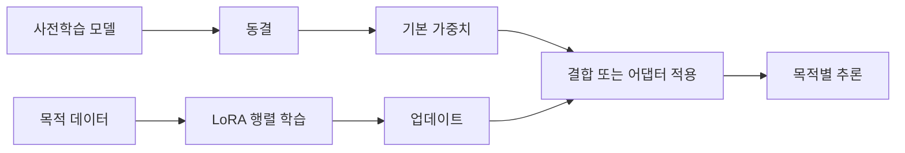

> [!abstract] 한 줄 요약
> LoRA는 기존 큰 가중치를 통째로 바꾸지 않고, 작은 **저랭크 업데이트**만 학습해 목적별 변형을 만드는 방법이다.

강의는 LoRA를 대형 사전학습 모델의 비용을 낮추는 대표적인 파라미터 효율 미세조정 기법으로 소개한다. 핵심은 모델을 새로 만들거나 전체를 다시 학습하는 대신, 필요한 변화만 별도 행렬로 표현하는 데 있다.

```html preview h=180
<div style="font-family:system-ui,sans-serif;padding:16px;color:var(--foreground);background:var(--card);border:1px solid var(--border);border-radius:var(--radius)">
  <div style="font-weight:700;margin-bottom:9px">동결된 기본 모델 위에 작은 업데이트를 더한다</div>
  <svg viewBox="0 0 720 116" width="100%" role="img" aria-label="기본 가중치와 작은 LoRA 업데이트가 합쳐지는 독자 제작 도식">
    <g font-family="system-ui,sans-serif" text-anchor="middle"><rect x="40" y="34" width="165" height="52" rx="12" fill="var(--card)" stroke="var(--border)"/><text x="122" y="57" font-size="14" font-weight="700" fill="currentColor">기본 가중치 W</text><text x="122" y="75" font-size="10" fill="var(--muted-foreground)">동결 · 공유</text><text x="259" y="67" font-size="28" font-weight="700" fill="var(--muted-foreground)">+</text><rect x="314" y="34" width="165" height="52" rx="12" fill="var(--card)" stroke="var(--chart-4)"/><text x="396" y="57" font-size="14" font-weight="700" fill="currentColor">업데이트 BA</text><text x="396" y="75" font-size="10" fill="var(--muted-foreground)">학습 · 소형 모듈</text><text x="531" y="67" font-size="28" font-weight="700" fill="var(--muted-foreground)">→</text><rect x="587" y="34" width="100" height="52" rx="12" fill="var(--chart-2)"/><text x="637" y="57" font-size="13" font-weight="700" fill="white">W′</text><text x="637" y="75" font-size="10" fill="white">목적형 모델</text></g>
  </svg>
</div>
```

## 저랭크 업데이트

기본 가중치 $W$를 그대로 두고 작은 행렬 $A$, $B$만 학습하는 표현은 다음과 같다.

$$
W' = W + Delta W,qquad Delta W = BA
$$

여기서 $W$가 큰 $d  imes k$ 행렬이라면, $B$와 $A$는 낮은 순위 $r$을 이용해 업데이트를 표현한다. $r$이 충분히 작으면 전체 $d  imes k$를 다시 학습하는 것보다 학습할 파라미터 수가 줄어든다.

| 대상 | 전체 파인튜닝 | LoRA |
| :-- | :-- | :-- |
| 기본 가중치 | 보통 학습 대상 | 동결 |
| 새로 학습하는 값 | 모델의 많은 또는 모든 가중치 | 저랭크 업데이트 행렬 |
| 저장·공유 단위 | 큰 모델 사본 | 작은 어댑터 모듈 |
| 목적별 변형 | 모델 복제 비용이 큼 | 같은 기반 모델에 여러 모듈 가능 |

> [!important] “작다”는 “무조건 좋다”가 아니다
> 업데이트 순위와 적용 위치가 너무 작거나 부적절하면 필요한 변화를 담지 못한다. LoRA는 비용을 줄이는 선택이지, 데이터 품질·목표 정의·평가를 생략하는 방법이 아니다.

## 학습과 추론의 분리

<Tabs>
  <Tab label="학습 중">
    기본 모델 가중치는 고정하고 LoRA 행렬만 업데이트한다. 그래서 메모리와 최적화 대상이 작아진다.
  </Tab>
  <Tab label="추론 중">
    기본 가중치와 업데이트를 함께 적용해 결과를 만든다. 환경에 따라 업데이트를 병합하거나 별도 모듈로 유지할 수 있다.
  </Tab>
  <Tab label="배포 중">
    기반 모델 하나에 여러 목적별 어댑터를 연결할 수 있다. 단, 각 모듈의 호환 모델과 용도를 명확히 관리해야 한다.
  </Tab>
</Tabs>



## 비용이 줄어드는 이유

```html preview h=170
<div style="font-family:system-ui,sans-serif;padding:16px;color:var(--foreground)">
  <div style="display:flex;gap:12px;align-items:stretch;flex-wrap:wrap">
    <div style="flex:1;min-width:180px;padding:14px;border:1px solid var(--chart-5);border-radius:var(--radius);background:var(--card)"><b>전체 파인튜닝</b><div style="height:20px;background:var(--chart-5);border-radius:var(--radius);margin:12px 0 7px"></div><span style="font-size:13px;color:var(--muted-foreground)">큰 업데이트 대상 · 큰 저장 단위</span></div>
    <div style="flex:1;min-width:180px;padding:14px;border:1px solid var(--chart-2);border-radius:var(--radius);background:var(--card)"><b>LoRA</b><div style="height:20px;width:18%;background:var(--chart-2);border-radius:var(--radius);margin:12px 0 7px"></div><span style="font-size:13px;color:var(--muted-foreground)">작은 업데이트 대상 · 어댑터 공유</span></div>
  </div>
  <p style="font-size:12px;color:var(--muted-foreground);margin:12px 0 0">막대 길이는 원리를 설명한 그림이며, 실제 비율은 모델·레이어·순위 설정에 따라 달라진다.</p>
</div>
```

강의의 비전 분류 예시는 특정 블록에 LoRA 업데이트를 넣어 학습 파라미터를 원본의 극히 일부로 줄일 수 있음을 보여준다. 이 수치는 특정 설정의 결과이므로 모든 모델에 그대로 적용되는 값으로 해석하면 안 된다.

<details>
<summary>LoRA 설정을 검토할 때 확인할 항목</summary>

- 어떤 기본 모델과 어떤 레이어에 업데이트를 넣는가
- 업데이트 순위 $r$은 목적의 복잡도에 비해 충분한가
- 학습 데이터가 목표 스타일·대상·지시를 대표하는가
- 기본 모델과 어댑터의 호환성이 확인되었는가
- 어댑터를 켠 결과와 끈 결과를 같은 평가 기준으로 비교했는가

</details>

> [!tip] 모듈화의 실무적 장점
> 하나의 기반 모델을 보관하고 목적별 LoRA를 별도 모듈로 관리하면, 변경 범위를 추적하고 여러 스타일·작업을 비교하기 쉽다.

## 핵심 정리

| 개념 | 기억할 점 |
| :-- | :-- |
| 저랭크 업데이트 | 큰 변화 행렬을 작은 행렬의 곱으로 근사 |
| 동결 | 기존 일반 능력을 보존하면서 학습 대상을 줄임 |
| 어댑터 | 목적별 변화만 담은 별도 모듈 |
| 병합 | 추론 편의를 위해 업데이트를 기본 가중치에 반영하는 방식 |
| 평가 | 비용 절감과 목표 품질을 함께 확인해야 함 |

> [!question]- 스스로 점검
> LoRA 어댑터가 작다고 해서 학습 데이터 검토를 줄일 수 없는 이유는 무엇인가?
>
> **답:** 어댑터의 크기는 학습 대상 파라미터를 줄일 뿐, 어떤 성향을 학습할지는 데이터가 결정한다. 잘못된 데이터는 작은 모듈에도 그대로 반영된다.
