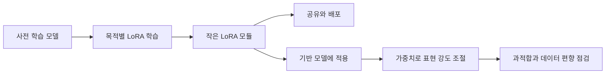

> [!abstract] 이 강의가 답하는 질문
> 거대한 사전 학습 모델 전체를 다시 만들지 않고, 작은 LoRA 모듈만 학습·배포하면서 스타일의 강도와 과적합 위험을 어떻게 다룰 수 있는가?

## LoRA가 바꾸는 파인튜닝의 단위

LoRA는 ==Low-Rank Adaptation==의 약자다. 강의 자료는 이 방법을 거대 모델을 비교적 적은 비용으로 목적에 맞게 조정하게 해 주는 대표적인 PEFT 기법으로 소개한다. 핵심은 이미 학습된 기반 모델 자체를 새 파일로 통째로 교체하는 데 있지 않다. 기존 모델에 목적별 변화분을 담는 작은 조정 모듈을 붙여 필요한 행동이나 표현을 추가하는 쪽으로 학습 단위를 바꾸는 데 있다.

자료에는 LoRA와 함께 LoHa, LoKr도 대표적인 파라미터 효율 미세조정 계열로 제시된다. 이 세 방법의 수학적 차이는 추출 텍스트에 전개되어 있지 않으므로 여기서 임의의 식이나 행렬 차원을 덧붙이지 않는다. 확인할 수 있는 결론은 사전 학습 모델을 목적에 맞게 조금씩 조정하는 수요가 커질수록, 전체 모델 대신 일부 변화만 학습하는 PEFT가 실무자에게 중요한 선택지가 된다는 점이다.



> [!important] 전체 모델과 LoRA를 구분하는 기준
> 기반 모델은 넓은 생성 능력을 제공하고 LoRA는 특정 캐릭터·그림체·인물 같은 추가 성향을 전달한다. 둘을 같은 파일로 취급하면 어떤 요소가 결과를 바꿨는지 설명하기 어렵다.

## 학습 도구와 배포 경로

강의는 OneTrainer를 Stable Diffusion 학습 요구를 한곳에서 다루는 도구로 소개한다. 추출 텍스트가 밝히는 범위는 “one-stop solution”이라는 성격과 프로젝트 이름까지다. 화면별 옵션이나 지원 모델 목록은 이미지 의존 정보이므로 임의로 복원하지 않는다. 따라서 OneTrainer는 이 노트에서 특정 설정값을 외우는 대상이 아니라, LoRA 모듈을 만들어 내는 학습 단계의 사례로만 배치한다.

학습이 끝난 LoRA는 모델 전체가 아니라 ==수 MB 규모의 작은 모듈==로 공유·교환할 수 있다고 자료에 적혀 있다. 파일이 작다는 점은 한 기반 모델 위에서 캐릭터, 스타일, 특정 인물 같은 여러 목적의 모듈을 별도로 보관할 수 있게 한다. 또한 자료는 여러 LoRA를 합성해 여러 스타일을 동시에 적용하는 사용 방식도 언급한다. 작은 배포 단위와 조합 가능성은 동일한 장점이지만, 여러 모듈을 함께 썼을 때 각 모듈의 영향이 자동으로 분리되는 것은 아니다. 결과를 비교하려면 적용한 모듈과 가중치를 함께 기록해야 한다.

<Tabs>
  <Tab label="학습">OneTrainer는 LoRA를 만드는 학습 도구 사례다. 자료가 제공하지 않은 세부 설정은 추정하지 않고, 어떤 데이터가 어떤 성향을 학습시켰는지를 기록 대상으로 삼는다.</Tab>
  <Tab label="배포">전체 checkpoint 대신 수 MB 규모의 모듈을 전달한다. 캐릭터·그림체·특정 인물처럼 목적별 파일을 따로 공유할 수 있다.</Tab>
  <Tab label="적용">AUTOMATIC1111 안내에서는 WebUI를 갱신하고 LoRA 폴더에 파일을 복사한 뒤 모듈을 선택하고 지시에 맞게 가중치를 바꾸는 순서가 제시된다.</Tab>
</Tabs>

```html preview
<div style="font-family:system-ui,sans-serif;padding:20px">
  <div id="cards" style="display:flex;gap:14px;flex-wrap:wrap"></div>
  <script>
    var stats = [
      ['배포 단위', '수 MB', '전체 모델 대신 작은 모듈', 'var(--chart-2)'],
      ['기본 가중치 안내', '1', 'AUTOMATIC1111 사례', 'var(--chart-1)'],
      ['학습 도구 사례', 'OneTrainer', 'Stable Diffusion 훈련', 'var(--chart-5)']
    ];
    document.getElementById('cards').innerHTML = stats.map(function (s) {
      return '<div style="flex:1;min-width:150px;padding:16px;background:var(--card);' +
        'color:var(--card-foreground);border:1px solid var(--border);' +
        'border-radius:var(--radius)">' +
        '<div style="font-size:13px;color:var(--muted-foreground)">' + s[0] + '</div>' +
        '<div style="font-size:26px;font-weight:700;margin-top:4px">' + s[1] + '</div>' +
        '<div style="font-size:12px;font-weight:600;margin-top:4px;color:' + s[3] + '">' +
        s[2] + '</div>' +
        '</div>';
    }).join('');
  </script>
</div>
```

세 카드는 성능 비교가 아니다. 자료에 실제로 적힌 배포 크기, 기본 가중치 표기, 학습 도구 이름을 서로 다른 운영 정보로 분리한 것이다.

## Gear Fifth Luffy 사례가 보여 주는 제어 가능성

SeaArt의 Gear Fifth Luffy LoRA는 캐릭터의 특정 변신 스타일을 학습한 사례다. 설명문은 이 모듈이 Luffy뿐 아니라 다른 캐릭터에도 적용될 수 있고, 머리 색이나 의상을 바꿀 수 있을 만큼 trigger에 지나치게 과적합되지 않았다고 밝힌다. 이것은 스타일이 강하게 보이는 것과 입력의 모든 변형 가능성을 막는 것을 같은 현상으로 보지 말아야 한다는 사례다.

동시에 자료는 데이터셋이 작아서 모델이 ==cartoon style 편향==을 일부 학습했다고 적는다. 원하는 개념을 배우는 과정에서 데이터에 반복적으로 나타난 배경 성향까지 함께 흡수한 것이다. 설명문은 이 편향을 작품의 원래 설정과 어울리는 특성으로 받아들이지만, 다른 목적에서는 결함이 될 수 있다. 따라서 “예시에서 문제로 느껴지지 않았다”는 판단과 “과적합이 존재하지 않는다”는 판단은 다르다.

가중치를 낮추면 drawing effect를 줄일 수 있다는 안내도 있다. 기본 표기는 1이며, 실제 사용에서는 제작자가 제공한 지시에 맞춰 가중치를 바꾸라고 한다. 가중치는 단순히 결과의 품질을 올리는 점수가 아니라 LoRA가 기반 모델의 결과에 개입하는 정도를 조절하는 입력이다. 너무 낮으면 학습한 특징이 희미해질 수 있고, 너무 강하면 작은 데이터셋에서 따라온 부수적 스타일이 더 두드러질 수 있다. 자료는 최적값을 하나로 고정하지 않으므로 특정 숫자를 보편적인 권장값으로 만들면 안 된다.

> [!warning] 과적합을 한 문장으로 판단하지 않는다
> 머리 색과 의상을 바꿀 수 있다는 유연성, 다른 캐릭터에 trigger를 적용할 수 있다는 전이성, 작은 데이터셋에서 cartoon style이 따라온 편향을 각각 확인해야 한다. 셋은 서로 다른 관찰이다.

| 관찰 항목 | 자료의 사례 | 해석 범위 |
| :-- | :-- | :-- |
| trigger 유연성 | 머리 색·의상 변경 가능 | 특정 속성이 완전히 고정되지는 않음 |
| 캐릭터 전이 | 다른 캐릭터에도 Gear Fifth 적용 가능 | 개념이 한 인물에만 묶이지 않음 |
| 데이터 편향 | 작은 데이터셋의 cartoon style 습득 | 의도하지 않은 공통 특성이 함께 학습됨 |
| 강도 제어 | 가중치를 낮추면 drawing effect 감소 | 적용 강도를 조절할 수 있음 |
| 조합 | Wano style LoRA와 함께 사용 | 복수 모듈 사용 사례가 존재함 |

<details>
<summary>AUTOMATIC1111 적용 순서와 기록 항목</summary>

자료의 안내 순서는 WebUI 갱신, stable-diffusion-webui/models/lora 위치에 파일 복사, LoRA 선택, 지시에 맞춘 가중치 변경이다. 이 순서는 모델을 새로 훈련하는 절차가 아니라 이미 배포된 모듈을 적용하는 절차다.

재현을 위해서는 기반 모델 이름, LoRA 파일, trigger, 가중치, 함께 쓴 다른 LoRA를 한 묶음으로 기록해야 한다. Gear Fifth 사례는 AnyLoRA와 NED에서 시험했으며 Wano style LoRA도 함께 사용했다고 밝힌다. 이 기록이 빠지면 결과 차이가 모듈 때문인지 기반 모델 또는 조합 때문인지 분리하기 어렵다.

</details>

## SDXL·DreamBooth와 스타일 데이터셋 사례의 증거 경계

후반 자료에는 SDXL LoRA DreamBooth인 onepiece-finalsdxl, Yarn-art-style 데이터셋과 yarn QLoRA Flux, PaperCutoutStyle 데이터셋과 Flux LoRA가 사례 이름으로 제시된다. 이 목록은 LoRA가 캐릭터 한 종류에만 머물지 않고 실·종이 오리기 같은 재질과 표현 양식에도 사용된다는 탐색 출발점은 제공한다.

그러나 해당 슬라이드들의 추출 텍스트는 저장소·데이터셋 이름과 링크 위주다. 학습 이미지 수, epoch, loss, 정량 성능, 권장 가중치는 확인되지 않는다. SDXL과 DreamBooth라는 이름이 함께 적혀 있다는 사실만으로 학습 세부 구성을 복원하거나 서로의 우열을 말해서는 안 된다.

<details>
<summary>사례를 검토할 때 분리할 질문</summary>

- 무엇을 학습했는가: 캐릭터, 재질, 그림체 가운데 어느 범주인가?
- 무엇을 배포했는가: 전체 checkpoint인가, 작은 LoRA 모듈인가?
- 무엇을 바꿀 수 있는가: 색, 의상, 캐릭터, 표현 강도 가운데 어떤 속성인가?
- 무엇이 함께 따라왔는가: 작은 데이터셋의 반복 배경이나 공통 스타일이 섞였는가?
- 어떤 근거가 비어 있는가: 이름과 링크만 있는 사례에 수치나 결과를 덧붙이지 않았는가?

</details>

> [!tip] 실무 판단의 중심
> 작은 파일이라는 이유만으로 좋은 LoRA가 되는 것은 아니다. 원하는 개념은 유지하면서 바꾸고 싶은 속성은 열어 두고, 데이터셋의 우연한 공통점은 덜 따라오는지를 사례별로 확인해야 한다.

> [!question]- Gear Fifth 사례에서 “과적합되지 않았다”는 설명만으로 충분하지 않은 이유는 무엇인가?
> **답.** 머리 색·의상 변경과 다른 캐릭터 적용이라는 유연성은 확인되지만, 작은 데이터셋에서 cartoon style 편향도 함께 나타났기 때문이다. 원하는 개념의 유지와 부수적 스타일의 동반 학습을 따로 평가해야 한다.
