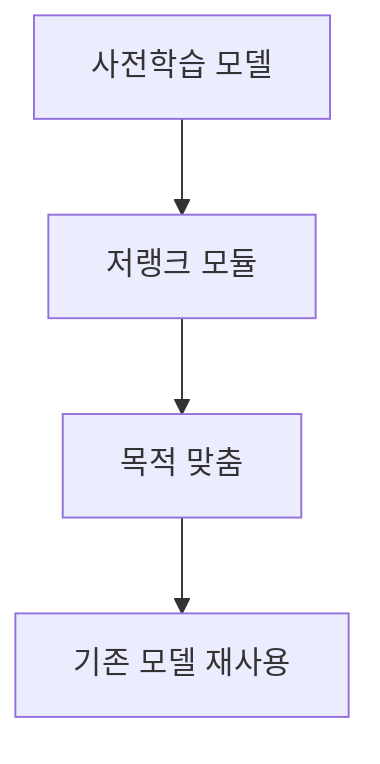
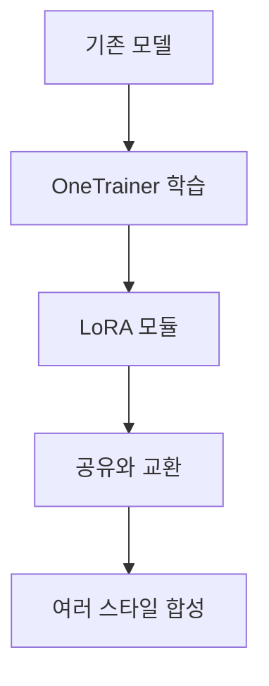

> [!NOTE]
> 거대 사전학습 모델 전체를 다시 만드는 대신 작은 LoRA 계열 모듈을 목적에 맞게 학습하면 비용을 낮추고, 배포와 스타일 조합도 가볍게 만들 수 있다.

---

## PEFT가 맡는 자리

**핵심:** LoRA는 사전학습 모델을 목적에 맞게 조금씩 조정하는 파라미터 효율 미세조정 기법이다.

- **비용 경계:** 거대 모델 전체를 다시 학습하지 않고 필요한 조정에 집중한다.
- **학습 목표:** 범용 모델을 특정 작업·캐릭터·화풍에 맞게 적응시킨다.
- **활용 맥락:** AI 엔지니어와 연구자가 사전학습 모델을 실제 목적에 연결하는 방법으로 제시된다.

---

## LoRA·LoHa·LoKr의 범위

<Tabs>
  <Tab label="LoRA">저랭크 적응으로 큰 모델을 적은 비용에 파인튜닝하는 대표 PEFT 기법이다.</Tab>
  <Tab label="LoHa">LoRA를 개선하려는 수학적·경험적 아이디어에서 나온 대표 계열로 소개된다. 이 구간에는 세부 수식이 없다.</Tab>
  <Tab label="LoKr">LoRA 개선 계열의 또 다른 대표 방법으로 열거된다. 이 구간은 이름과 위치만 제시한다.</Tab>
</Tabs>

| 확인할 질문 | 이 구간이 제공하는 답 | 남겨 둔 경계 |
| :-- | :-- | :-- |
| 왜 쓰는가 | 거대 모델을 적은 비용으로 목적에 맞게 조정한다 | 성능 수치와 학습 설정은 제시되지 않는다 |
| 무엇을 비교하는가 | LoRA, LoHa, LoKr을 대표 PEFT 계열로 묶는다 | 세 방법의 수학적 차이는 설명하지 않는다 |
| 어디에 연결되는가 | Stable Diffusion의 캐릭터·화풍·인물 재현에 연결된다 | 특정 체크포인트 우열은 판단하지 않는다 |

---

## OneTrainer에서 소형 모듈까지

> [!TIP]
> OneTrainer는 Stable Diffusion 학습 요구를 한곳에서 다루는 도구로 소개된다.

| 구성 요소 | 원문에서 확인되는 역할 | 결과 |
| :-- | :-- | :-- |
| 개별 LoRA | 캐릭터 스타일, 그림체, 특정 인물을 학습 | 전체 모델이 아닌 모듈로 선택 적용 |
| 소형 배포 | 모듈 크기를 수 MB 수준으로 배포 | 크리에이터 사이 공유·교환이 쉬움 |
| LoRA 합성 | 여러 LoRA를 함께 적용 | 둘 이상의 스타일을 한 생성에 조합 |

---

## Gear Fifth 사례가 보여 주는 조정 가능성

| 관찰 지점 | 사례에서 확인되는 내용 | 사용 시 해석 |
| :-- | :-- | :-- |
| 적용 대상 | Luffy뿐 아니라 다른 캐릭터에도 Gear Fifth 개념을 적용 | 특정 캐릭터 하나에만 고정된 모듈은 아님 |
| 표현 변경 | 머리색과 옷을 바꿀 수 있음 | 트리거가 지나치게 과적합되지 않았다고 설명 |
| 가중치 | 낮추면 그림 같은 효과가 약해짐 | 가중치가 스타일 강도를 조절 |
| 데이터 규모 | 데이터셋이 매우 작았음 | 만화풍 편향을 함께 학습 |
| 시험 환경 | AnyLoRA와 NED에서 시험하고 Wano 스타일 LoRA도 함께 사용 | 합성 가능한 실제 사용 사례를 제시 |

> [!WARNING]
> 작은 데이터셋이 Gear Fifth의 특징뿐 아니라 만화풍까지 함께 학습했다. 사례 설명은 이를 설정과 어울리는 특징으로 받아들이지만, 다른 목적에서는 데이터 편향으로 검토해야 한다.

auto1111에서 LoRA를 불러오는 원문 절차

1. WebUI를 업데이트한다.
2. LoRA 파일을 `stable-diffusion-webui/models/lora`에 복사한다.
3. WebUI에서 사용할 LoRA를 선택한다.
4. 안내에 맞춰 가중치를 바꾼다. 원문은 기본 표기를 `:1`로 제시한다.

---

## 이미지 스타일로 확장된 사례

| 사례 | 확인되는 자원 | 이 구간에서 말할 수 있는 범위 |
| :-- | :-- | :-- |
| One Piece | SDXL LoRA DreamBooth 모델 | 모델 이름과 배포 사례 |
| Yarn art | 스타일 데이터셋과 yarn qLoRA Flux 모델 | 데이터셋과 적응 모듈의 짝 |
| Paper cutout | PaperCutoutStyle 데이터셋과 Flux LoRA | 종이 오리기 화풍의 데이터·모듈 구성 |

> [!WARNING]
> 후반 사례는 추출 텍스트가 이름과 자원 식별자 위주로 매우 희박하다. 화면 구성, 학습 설정, 품질, 성능은 근거가 없어 이 노트에서 확장하지 않았다.

---

## 정리

| 핵심 개념 | 의미 | 적용 또는 경계 |
| :-- | :-- | :-- |
| PEFT | 사전학습 모델의 목적별 조정 비용을 줄이는 접근 | 이 구간에는 수식과 정량 비교가 없음 |
| LoRA 계열 | LoRA·LoHa·LoKr로 대표되는 적응 방법 | 변형별 원리는 추가 근거가 필요 |
| 소형 모듈 | 수 MB 규모로 배포·공유 가능한 스타일 단위 | 기반 모델과 사용 환경을 함께 고려 |
| LoRA 합성 | 여러 스타일 모듈을 동시에 적용 | 가중치와 데이터 편향을 확인 |
| 소량 데이터 | 빠른 특화의 재료가 될 수 있음 | 의도하지 않은 화풍도 함께 학습 가능 |
