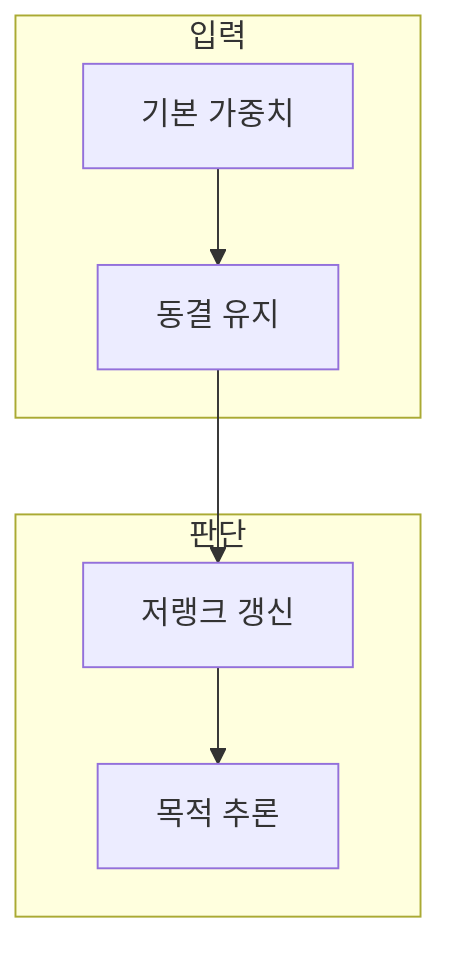

> [!abstract] 한 줄 요약
> 큰 모델의 목적별 변형을 왜 작은 업데이트 모듈로 표현할 수 있는가?

## 이 노트의 지도



## 1. 저랭크 업데이트

LoRA는 기본 가중치를 그대로 두고 작은 행렬 곱으로 변화량을 학습한다. ==저랭크 업데이트== 는 큰 변화 행렬을 작은 차원의 두 행렬 곱으로 표현하는 방식.

> [!note] 먼저 구분할 것
> 작은 모듈은 데이터 품질·목표 정의·평가를 생략해도 된다는 뜻이 아니다.

## 2. 학습과 배포의 분리

기반 모델과 목적별 어댑터를 분리하면 바꾸는 범위를 추적하고 여러 작업을 비교하기 쉽다.

<details>
<summary>차원과 순위</summary>

기본 행렬의 변화량은 다음처럼 쓴다.

$$
\Delta W = BA, \qquad W^{\prime} = W + \alpha BA \\
W \in \mathbb{R}^{d \times k},\; B \in \mathbb{R}^{d \times r},\; A \in \mathbb{R}^{r \times k},\; r \ll \min(d,k)
$$

</details>

## 데이터로 보기

```html preview
<div style="font-family:system-ui,sans-serif;padding:20px;color:var(--foreground)">
  <h3 style="margin:0 0 14px;font-size:15px;font-weight:600">업데이트 구성 요소</h3>
  <div id="bars" style="display:flex;align-items:flex-end;gap:14px;height:170px"></div>
  <script>
    var data = [["기본 가중치",1],["행렬 A",1],["행렬 B",1]];
    var max = Math.max.apply(null, data.map(function (d) { return d[1]; }));
    document.getElementById('bars').innerHTML = data.map(function (d, i) {
      return '<div style="flex:1;display:flex;flex-direction:column;align-items:center;' +
        'gap:6px;height:100%;justify-content:flex-end">' +
        '<span style="font-size:12px;font-weight:600">' + d[1] + '</span>' +
        '<div style="width:100%;height:' + (d[1] / max * 100) + '%;' +
        'background:var(--chart-' + (i + 1) + ');' +
        'border-radius:var(--radius) var(--radius) 0 0"></div>' +
        '<span style="font-size:12px;color:var(--muted-foreground)">' + d[0] + '</span>' +
        '</div>';
    }).join('');
  </script>
</div>
```

세 막대는 구성 요소의 개수 표시다. 실제 파라미터 수와 비용은 모델·레이어·순위에 따라 따로 계산한다.

```html preview
<div style="font-family:system-ui,sans-serif;padding:20px;color:var(--foreground)">
  <label for="amt" style="font-size:14px;font-weight:600">예시 저랭크 순위 r</label>
  <div id="out" style="font-size:30px;font-weight:700;color:var(--chart-1);margin:6px 0">r = 8</div>
  <input id="amt" type="range" min="1" max="64" step="1" value="8"
    style="width:100%;accent-color:var(--primary)" />
  <p style="font-size:13px;color:var(--muted-foreground)">순위가 커지면 표현할 변화의 여지는 커지지만 학습 범위도 함께 커진다.</p>
  <script>
    var amt = document.getElementById('amt');
    var out = document.getElementById('out');
    amt.addEventListener('input', function () {
      out.textContent = 'r = ' + Number(amt.value).toLocaleString();
    });
  </script>
</div>
```

> [!important] 해석의 경계
> 슬라이더는 수학적 직관을 위한 제어다. 실제 메모리·시간·품질은 적용 레이어와 학습 설정을 포함해 측정해야 한다.

## 핵심 정리

| 개념 | 정의 | 왜 중요한가 |
| :-- | :-- | :-- |
| 동결 | 기본 가중치를 바꾸지 않음 | 기존 능력과 학습 범위를 분리 |
| 저랭크 | 작은 차원의 업데이트 | 학습 대상의 규모를 줄임 |
| 어댑터 | 목적별 변화 모듈 | 교체·비교·되돌리기를 돕는다 |

## 관련 개념

- 파인튜닝: 데이터로 모델 행동을 조정하는 넓은 과정
- 모델 배포: 기반 모델과 어댑터의 호환성을 관리하는 과정

> [!question]- 스스로 점검
> **Q.** LoRA의 학습 변수가 작아도 데이터 검토와 평가를 생략할 수 없는 이유는 무엇인가?
>
> **A.** 바꾸는 변수의 범위만 줄었을 뿐, 데이터가 가르치는 행동과 편향은 그대로 반영되기 때문이다.
