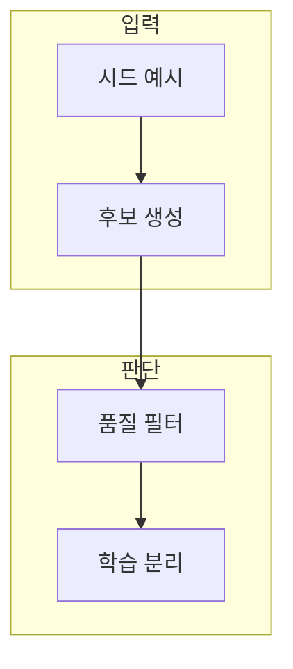

> [!abstract] 한 줄 요약
> 지시문 데이터의 품질은 양보다 어떤 행동 예시를 남기고 무엇을 제외했는지에 달려 있다.

## 이 노트의 지도



## 1. 한 학습 예시의 구조

지시문은 작업을, 입력은 맥락을, 응답은 기대 형식과 내용을 정한다. ==필터링== 는 중복·오류·목표 이탈을 찾아 학습 집합에서 처리하는 과정.

> [!note] 판단 기준
> 데이터는 문장 모음이 아니라 모델이 따라 할 행동 예시다.

## 2. 생성과 필터링

시드로 후보를 늘리는 과정은 속도를 높이지만, 통과·보류·제외 사유를 남겨야 다음 반복을 개선할 수 있다.

<details>
<summary>원문 표기</summary>

원문에는 `self-insturct`, `insturction` 표기가 있다. 이는 **원문 오류**로 보존하며, 일반적인 영문 표기로 자동 교정하지 않는다.

</details>

## 데이터로 보기

```html preview
<div style="font-family:system-ui,sans-serif;padding:20px">
  <div id="cards" style="display:flex;gap:14px;flex-wrap:wrap"></div>
  <script>
    var stats = [["지시","1","작업 경계","var(--chart-1)"],["입력","1","맥락 확인","var(--chart-2)"],["응답","1","형식 검토","var(--chart-3)"]];
    document.getElementById('cards').innerHTML = stats.map(function (s) {
      return '<div style="flex:1;min-width:150px;padding:16px;background:var(--card);' +
        'color:var(--card-foreground);border:1px solid var(--border);' +
        'border-radius:var(--radius)">' +
        '<div style="font-size:13px;color:var(--muted-foreground)">' + s[0] + '</div>' +
        '<div style="font-size:26px;font-weight:700;margin-top:4px">' + s[1] + '</div>' +
        '<div style="font-size:12px;font-weight:600;margin-top:4px;color:' + s[3] + '">' +
        s[2] + '</div>' +
        '</div>';
    }).join('');
  </script>
</div>
```

> [!important] 해석의 경계
> 카드의 1은 세 필드를 모두 확인한다는 표시다. 데이터 품질이나 학습 효과의 수치가 아니다.

## 핵심 정리

| 개념 | 정의 | 왜 중요한가 |
| :-- | :-- | :-- |
| 시드 | 확장의 출발 예시 | 작업 범위와 형식을 정한다 |
| 후보 | 자동·수동으로 만든 예시 | 다양성과 오류를 함께 검토 |
| 분리 | 학습과 평가를 나눔 | 과적합 판정을 돕는다 |

## 관련 개념

- 대화 설계: 역할과 턴 경계를 명확히 하는 방법
- 데이터 거버넌스: 개인정보·동의·재사용 범위를 확인하는 방법

> [!question]- 스스로 점검
> **Q.** 자동 생성 후보를 모두 학습에 넣으면 왜 문제가 되는가?
>
> **A.** 중복·모순·부정확한 응답이 함께 학습되어 모델 행동에 굳어질 수 있기 때문이다.
