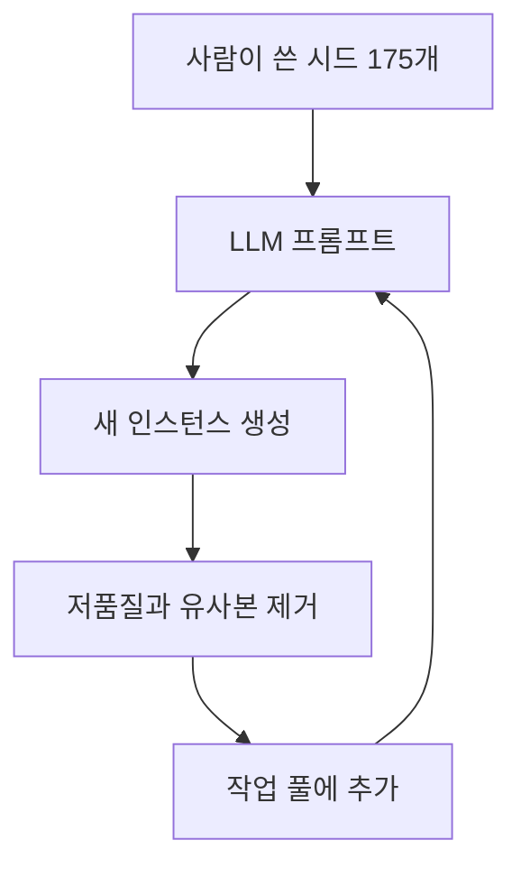
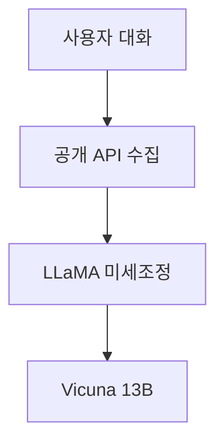
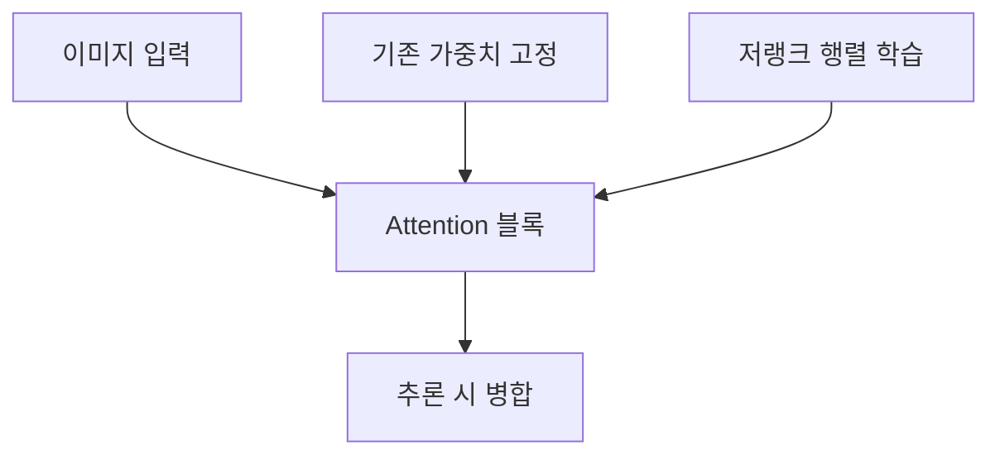

> [!NOTE]
> 지시 튜닝은 소수의 사람이 만든 시드에서 학습 데이터를 늘리고, 대화 튜닝은 공개 대화를 재구성하며, 비전 LoRA는 기존 가중치를 고정한 채 작은 업데이트만 학습한다.

---

## Alpaca가 시작하는 최소 시드

**핵심:** LLaMA 공개 이후 Alpaca는 큰 자본 없이 지시문 학습 데이터를 만드는 학계형 사례로 제시된다.

| 시드 필드 | 담는 내용 | 다음 단계에서의 역할 |
| :-- | :-- | :-- |
| Instruction | 수행할 지시사항 | 새 지시문 생성을 위한 조건 |
| Input | 작업에 필요한 데이터 값 | 지시가 적용될 맥락 |
| Output | 기대하는 결과 | 생성 결과의 형식과 응답 예시 |



- **초기 규모:** 사람이 작성한 시드 175개로 시작한다.
- **증식 단위:** 새로운 instruction·input·output 인스턴스를 만든다.
- **품질 관리:** 품질이 낮거나 비슷한 결과를 거른다.
- **반복 효과:** 남은 데이터를 다시 작업 풀에 넣어 대량의 지시문 데이터를 만든다.

<details>
<summary>간략화된 self-instruct의 의미</summary>

Alpaca는 self-instruct를 사용하되 간략화된 방식을 택한다. 이 구간은 세부 알고리즘 차이보다 사람이 직접 대규모 데이터를 구축하지 않고 시드·생성·필터·재투입을 반복한다는 운영 원리를 강조한다.

</details>

---

## Vicuna의 대화 데이터 경로

| 항목 | 원문에 적힌 내용 | 해석 경계 |
| :-- | :-- | :-- |
| 모델 | Vicuna-13B | LLaMA를 대화 데이터로 미세조정 |
| 개발 주체 | UC Berkeley, UCSD, CMU, MBZUAI | 여러 대학의 공동 개발 |
| 계보 | LLaMA와 Alpaca에서 영감 | 기반 모델과 지시 튜닝 사례를 연결 |
| 대화 규모 | 약 70K | 공개 API로 수집한 사용자 대화 |
| 품질 표제 | 90%* ChatGPT Quality | 별표의 정의는 이 구간에 없음 |
| 수집처 표기 | ShardGPT와 ShareGPT가 함께 등장 | 원문 내부의 상충 표기 |



> [!WARNING]
> 원문은 수집처를 먼저 `ShardGPT`라고 쓰고 뒤에서는 `ShareGPT`라고 쓴다. 또한 제목의 `90%*`에 대한 평가 절차나 별표 설명이 없다. 두 항목 모두 임의로 정정하거나 검증된 성능으로 바꾸지 않았다.

---

## ViT LoRA는 무엇을 학습하는가

```html preview
<div style="font-family:system-ui,sans-serif;padding:20px;display:flex;align-items:center;gap:20px;color:var(--foreground)">
  <svg width="120" height="120" viewBox="0 0 120 120" role="img" aria-label="0.77 percent trainable">
    <circle cx="60" cy="60" r="46" stroke-width="14" style="fill: none; stroke: var(--border)" />
    <circle cx="60" cy="60" r="46" stroke-width="14"
      stroke-linecap="round" stroke-dasharray="289" stroke-dashoffset="286.8"
      transform="rotate(-90 60 60)" style="fill: none; stroke: var(--chart-1)" />
    <text x="60" y="67" text-anchor="middle" font-size="22" font-weight="700"
      style="fill: var(--foreground)">0.77%</text>
  </svg>
  <div>
    <div style="font-weight:600;font-size:15px">ViT LoRA 학습 비율</div>
    <div style="font-size:13px;color:var(--muted-foreground);margin-top:2px">원래 모델의 0.77%만 학습</div>
  </div>
</div>
```



- LoRA 업데이트 행렬은 attention block 같은 특정 블록에 추가된다.
- 미세조정 중에는 저랭크 행렬만 학습하고 원래 모델 파라미터는 바꾸지 않는다.
- 추론 시 업데이트 행렬을 원래 파라미터와 병합해 최종 분류 결과를 만든다.

| 분류 작업 | 학습 방식 | 분리 원칙 |
| :-- | :-- | :-- |
| Food Item Identification | Google 기반 모델을 LoRA로 조정 | 작업별로 따로 학습·추론 |
| Human Action Identification | 같은 기반 모델을 LoRA로 조정 | 작업별로 따로 학습·추론 |

---

## Vision LoRA의 확장 방향

<Tabs>
  <Tab label="멀티모달">Vision as LoRA는 LLM 내부에 vision-specific LoRA를 넣어 이미지 인코더 역할을 맡기고, block-wise distillation을 활용한다.</Tab>
  <Tab label="도메인 변화">ExPLoRA는 self-supervised 전이 단계에서 일부 블록만 풀고 나머지 레이어에 LoRA를 적용해 위성 이미지 같은 도메인 변화에 대응한다.</Tab>
  <Tab label="견고성">FullLoRA는 learnable layer normalization과 LoRA를 합친 LNLoRA로 약 5%의 파라미터만 학습하며 적대적 견고성을 강화한다. 별도 연구는 LoRA를 경량 보안 패치로 적용한다.</Tab>
  <Tab label="멀티태스크">MoEfied LoRA, Quality Retaining, router fading으로 학습 중 MoE 구조를 만들고 추론 때 재매개변수화해 LoRA 오버헤드를 줄인다.</Tab>
</Tabs>

| 연구 | 맥락 | 핵심 설계 |
| :-- | :-- | :-- |
| Vision as LoRA | CVPR 2025, ByteDance·University of Birmingham | 외부 비전 모듈 대신 LoRA에 시각 정보 내재화 |
| ExPLoRA | ICML 2025 | 일부 블록 unfreeze와 나머지 LoRA를 결합 |
| FullLoRA | IEEE Transactions on Image Processing | LNLoRA로 ViT의 적대적 견고성 강화 |
| Flexible Security Patch | Clarkson University | 중요 비전 시스템에 경량 방어 패치 적용 |
| Asynchronous Multi-Task | Beihang University | MoE 구성과 추론 시 재매개변수화 |

> [!IMPORTANT]
> `0.77%`와 `약 5%`는 서로 다른 안내·연구 맥락의 수치다. 동일 실험의 대안처럼 막대그래프로 비교하지 않는다.

---

## 원문 표기와 해석 경계

> [!WARNING]
> 원문에는 `self-insturct`와 `insturction`이라는 철자 오류가 있다. 본문은 이해를 위해 `self-instruct`와 `instruction`을 사용했지만, 오류 자체는 여기 명시해 보존한다.

| 확인한 수치 | 정확히 말할 수 있는 것 | 말할 수 없는 것 |
| :-- | :-- | :-- |
| 175 | Alpaca 작업 풀의 사람 작성 시드 수 | 최종 데이터 전체 규모 |
| 70K | Vicuna 설명에 나온 사용자 대화 규모 | 정제 후 샘플 수와 품질 분포 |
| 90%* | Vicuna 제목에 붙은 품질 표제 | 독립 검증된 절대 성능 |
| 0.77% | ViT LoRA 안내의 원본 대비 학습 파라미터 비율 | FullLoRA와의 직접 우열 |
| 약 5% | FullLoRA 설명의 학습 파라미터 비율 | 0.77% 사례와 동일 조건 비교 |
