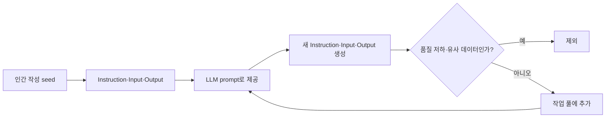

## Alpaca는 seed를 순환해 instruction 데이터를 늘린다

간략화된 self-instruct는 인간 작성 seed, LLM 생성, 필터링, 작업 풀 갱신을 반복한다.



1. **초기 작업 풀** — 인간이 작성한 seed를 넣는다.
2. **데이터 구조** — 각 seed는 Instruction, Input, Output으로 구성된다.
3. **자동 생성** — seed를 LLM prompt로 제공해 새 instruction·input·output을 만든다.
4. **필터링** — 품질이 낮거나 비슷한 생성 결과를 제외한다.
5. **반복** — 남은 결과를 작업 풀에 다시 넣어 대량의 instruction 데이터를 만든다.

- **배경** — Meta가 LLaMA를 공개한 뒤 학계의 저비용 LLM 개발 사례로 Stanford Alpaca가 제시된다.
- **비용 맥락** — 대규모 데이터 구축 비용을 감당하기 어려운 학계에 적합한 방안으로 평가된다.

> [!warning] 원문 철자 오기
> 추출문에는 self-insturct와 insturction이 남아 있다. 개념은 self-instruct와 instruction으로 읽되 원문 오류를 숨기지 않는다.

## Vicuna는 사용자 대화로 LLaMA를 조정한다

Vicuna-13B는 ShareGPT 대화를 학습 재료로 삼은 open-source chatbot 사례다.

- **영감** — Meta LLaMA와 Stanford Alpaca에서 영감을 받았다.
- **개발 기관** — UC Berkeley, UCSD, CMU, MBZUAI가 공동 개발했다.
- **수집** — 공개 API로 ShareGPT의 사용자 대화를 모았다.
- **학습 대상** — 수집한 대화로 LLaMA를 fine-tuning했다.
- **표제 주장** — “GPT-4 with 90%* ChatGPT Quality”가 제목에 적히지만 평가 절차는 추출문에 없다.

> [!warning] ShardGPT와 ShareGPT의 충돌
> 첫 문장은 ShardGPT라고 쓰고 뒤 문장은 ShareGPT라고 쓴다. 두 데이터원으로 늘리지 않고 ShardGPT를 원문 오기 후보로 남긴다.

<Tabs>
  <Tab label="Alpaca">인간 seed에서 instruction 데이터를 자동 생성하고 필터링한다.</Tab>
  <Tab label="Vicuna">ShareGPT 사용자 대화로 LLaMA를 fine-tuning한다.</Tab>
  <Tab label="Vision LoRA">원본 가중치를 유지하고 일부 low-rank update matrix만 학습한다.</Tab>
</Tabs>

## ViT LoRA는 원본 가중치를 유지한다

Image classification guide는 attention block 등에 update matrix를 추가해 학습 범위를 제한한다.

- **추가 위치** — attention block 같은 특정 block에 low-rank update matrix를 넣는다.
- **Fine-tuning** — update matrix만 학습하고 원래 model parameter는 바꾸지 않는다.
- **Inference** — update matrix를 원본 parameter와 merge해 최종 분류 결과를 만든다.
- **별도 pipeline** — Food Item Identification과 Human Action Identification을 각각 학습·추론한다.
- **출발 문제** — 큰 Vision Transformer를 작업별로 전체 fine-tuning하는 계산 부담이 제시된다.

## 핵심 수치는 서로 다른 단위를 가리킨다

두 데이터 수와 두 학습 parameter 비율은 같은 축의 크기 비교가 아니다.

```html preview
<div style="font-family:system-ui,sans-serif;padding:20px">
  <div id="cards" style="display:flex;gap:14px;flex-wrap:wrap"></div>
  <script>
    var stats = [
      ['Alpaca seed', '175', '인간 작성 예시', 'var(--chart-2)'],
      ['Vicuna 대화', '약 70K', 'ShareGPT 수집', 'var(--chart-1)'],
      ['ViT LoRA', '0.77%', '학습 parameter', 'var(--chart-5)'],
      ['FullLoRA', '약 5%', '학습 parameter', 'var(--chart-3)']
    ];
    document.getElementById('cards').innerHTML = stats.map(function (s) {
      return '<div style="flex:1;min-width:150px;padding:16px;background:var(--card);' +
        'color:var(--card-foreground);border:1px solid var(--border);' +
        'border-radius:var(--radius)">' +
        '<div style="font-size:13px;color:var(--muted-foreground)">' + s[0] + '</div>' +
        '<div style="font-size:26px;font-weight:700;margin-top:4px">' + s[1] + '</div>' +
        '<div style="font-size:12px;font-weight:600;margin-top:4px;color:' + s[3] + '">' +
        s[2] + '</div>' +
        '</div>';
    }).join('');
  </script>
</div>
```

> [!warning] 단위가 다른 수치
> Seed와 대화는 데이터 수이고 ViT LoRA와 FullLoRA는 학습 parameter 비율이다. 네 값을 하나의 크기 순위로 해석하지 않는다.

## Vision LoRA 연구는 적용 위치와 목적을 확장한다

다섯 연구는 MLLM 통합, domain shift, robustness, security patch, multi-task learning을 각각 다룬다.

| 연구 | 조정 방식 | 목표·범위 |
| :-- | :-- | :-- |
| Vision as LoRA | LLM 내부 vision-specific LoRA와 block-wise distillation | 외부 vision module 없이 MLLM으로 작동, CVPR 2025 |
| ExPLoRA | 일부 block unfreeze, 나머지 layer에 LoRA 적용 | self-supervised pre-training과 domain shift, 위성 이미지 사례 |
| FullLoRA | learnable layer normalization과 LoRA를 결합한 LNLoRA | 전체 fine-tuning 없이 ViT adversarial robustness 강화 |
| LoRA security patch | 작은 perturbation에 대응하는 lightweight patch | 중요 vision system의 adversarial resilience |
| Multi-task asynchronous | MoEfied LoRA·Quality Retaining·router fading | training 중 MoE 구성, inference 때 reparameterize |

<details>
<summary>연구 설명에서 넘겨짚지 않을 것</summary>

- **Vision as LoRA** — 한 연구의 내부 통합 구조를 모든 MLLM 구조로 일반화하지 않는다.
- **ExPLoRA** — “성능을 크게 개선”했다는 문구에 수치가 없으므로 고정 우위로 바꾸지 않는다.
- **FullLoRA** — parameter 비율을 모든 ViT와 dataset의 고정값으로 쓰지 않는다.
- **Security patch** — 공격 조건과 측정치가 없으므로 보안 보장을 선언하지 않는다.
- **Multi-task** — inference overhead 설명을 training 비용이 없다는 뜻으로 확대하지 않는다.

</details>

> [!warning] 연구 주장 범위
> “성능을 크게 개선”, “견고성이 크게 향상”, “overhead 없음”은 추출문 요약이다. 조건과 측정값이 없는 항목을 보편적 성능 보장으로 바꾸지 않는다.

## 점검 질문

- **Q.** 이 구간의 네 핵심 수치를 한 그래프의 크기 순위로 묶을 수 있는가?
- **A.** 없다. Seed 수, 대화 수, 학습 parameter 비율이라는 단위와 대상이 서로 다르다.
