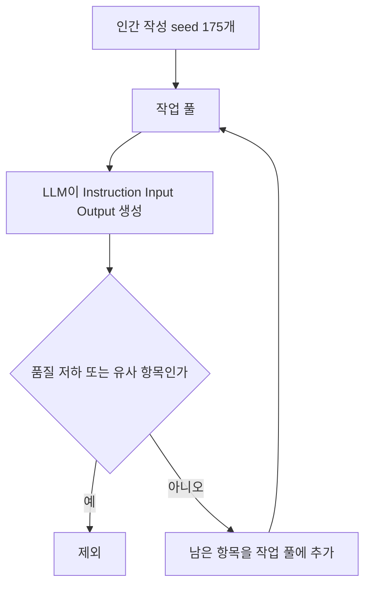

> [!abstract] 이 구간의 핵심
> 적은 인간 작성 seed에서 instruction 데이터를 늘리는 Alpaca, 실제 사용자 대화로 LLaMA를 조정한 Vicuna, 원본 가중치를 유지하며 일부 파라미터만 학습하는 vision LoRA는 서로 다른 데이터와 조정 단위를 보여 준다.

## Alpaca의 self-instruct는 데이터를 순환시킨다

Alpaca는 Meta가 공개한 LLaMA를 바탕으로 학계가 비교적 낮은 비용으로 instruction-following 모델을 연구한 사례로 소개된다. 자료가 강조하는 출발점은 인간이 직접 작성한 ==175개 seed 데이터==다. 각 seed는 지시사항을 담은 Instruction, 작업에 필요한 값을 담은 Input, 기대 결과를 담은 Output으로 구성된다. 세 필드는 단순한 문서 형식이 아니라 새 학습 예시를 생성할 때 LLM에 전달되는 기준 사례다.

Seed는 작업 풀에 들어가고, 그중 일부가 새로운 instruction·input·output 인스턴스를 만들기 위한 prompt로 사용된다. 생성된 결과를 그대로 전부 받아들이지 않는다. 품질이 낮거나 기존 항목과 비슷한 결과를 걸러 낸 뒤 남은 항목만 다시 작업 풀에 추가한다. 확장된 풀이 다음 생성의 입력이 되면서 순환이 반복되고, 적은 인간 작성 seed에서 더 큰 instruction 집합이 만들어진다.



이 구조의 핵심은 자동 생성 자체보다 ==필터링과 재투입==이다. 생성량만 늘리고 유사 항목과 저품질 항목을 제거하지 않으면 작업 풀이 커져도 학습 예시의 폭과 신뢰성이 함께 커진다고 말할 수 없다. 반대로 175개 seed만으로 최종 데이터의 모든 품질이 보장된다고 해석해서도 안 된다. 자료는 최소 인간 seed로 대량 데이터를 만드는 절차를 설명하지만, 필터의 세부 기준이나 최종 데이터 규모는 제시하지 않는다.

> [!warning] 원문 오기를 보존해 읽기
> 추출 원문에는 self-insturct와 insturction이라는 철자 오기가 있다. 개념명은 self-instruct와 instruction으로 설명하되, 원문에 오기가 있었다는 사실을 숨기지 않는다.

<details>
<summary>Instruction·Input·Output을 나누는 이유</summary>

Instruction은 무엇을 해야 하는지, Input은 그 작업에 사용할 구체적인 값이 무엇인지, Output은 기대하는 결과가 무엇인지 구분한다. 이 셋을 나누면 LLM이 새 사례를 만들 때 작업의 지시와 개별 데이터 값을 뒤섞지 않고 참고할 수 있다.

자료는 사람이 만든 175개 seed를 대규모 학습 데이터의 시작점으로 사용한다. 따라서 seed의 역할은 완성된 전체 데이터셋을 대표하는 것이 아니라 생성 규칙을 보여 주는 초기 예시가 되는 것이다. 이후 생성물은 품질과 유사성 검사를 통과해야만 다시 풀에 들어간다.

</details>

## Vicuna는 사용자 대화를 학습 재료로 삼는다

Vicuna-13B는 LLaMA와 Alpaca에서 영감을 받은 오픈소스 chatbot으로 소개된다. 개발 참여 기관으로 UC Berkeley, UCSD, CMU, MBZUAI가 적혀 있다. Alpaca가 instruction 예시의 자동 확장 절차를 보여 준다면, Vicuna는 사용자가 공유한 실제 prompt와 ChatGPT 응답의 대화 묶음을 LLaMA fine-tuning에 사용한 사례다.

자료는 ShareGPT에서 모은 ==약 70K 사용자 대화==를 사용했다고 적고, 제목에는 GPT-4가 평가한 ChatGPT 품질의 90%라는 표기가 별표와 함께 나온다. 이 90%는 이 노트에서 독립적으로 재검증된 점수가 아니다. 평가 조건과 별표의 세부 의미가 추출 텍스트에 없으므로, Vicuna의 일반적인 성능으로 확장하지 않고 슬라이드 제목의 주장으로만 남겨야 한다.

> [!caution] ShardGPT와 ShareGPT
> 원문 첫 문장에는 ShardGPT라고 적혀 있지만 같은 문단 뒤에서는 ShareGPT라고 적는다. 서로 다른 데이터원으로 임의 해석하지 말고, ShardGPT를 원문 오기 후보로 표시한 뒤 대화 수치와 출처 표기는 ShareGPT 문장에 맞춰 읽어야 한다.

<Tabs>
  <Tab label="Alpaca">인간 작성 175개 seed와 LLM 생성·필터링·재투입 순환으로 instruction 데이터를 확장한다.</Tab>
  <Tab label="Vicuna">공유된 사용자 prompt와 ChatGPT 응답으로 이루어진 약 70K 대화를 사용해 LLaMA를 조정한다.</Tab>
  <Tab label="Vision LoRA">원본 모델 파라미터를 유지하고 특정 블록에 작은 update matrix를 추가해 image classification 또는 vision 적응을 수행한다.</Tab>
</Tabs>

두 사례는 모두 LLaMA 계열의 저비용 연구 맥락에 놓이지만 데이터의 기원은 다르다. Alpaca의 핵심 질문은 자동 생성한 instruction을 어떻게 선별하고 다시 풀에 넣는가이고, Vicuna의 핵심 질문은 사용자가 공유한 대화가 어떤 분포와 품질을 갖는가이다. 데이터 생성 절차와 실제 사용 대화 수집을 같은 파이프라인처럼 합치면 각 모델의 위험을 놓치게 된다.

## ViT LoRA는 학습할 파라미터를 제한한다

Image classification LoRA 안내는 사전 학습된 Vision Transformer의 원본 파라미터를 그대로 두고 attention block 같은 특정 위치에 low-rank update matrix를 추가한다고 설명한다. Fine-tuning 중에는 이 matrix만 학습하고 원본 파라미터는 변경하지 않는다. Inference 시에는 update matrix를 원본 파라미터와 합쳐 최종 classification 결과를 만든다.

이 사례에서 학습 가능한 파라미터는 원본의 ==0.77%==로 제시된다. 이는 LoRA 일반의 고정 비율이 아니라 해당 안내 사례의 수치다. 같은 자료는 Food Item Identification과 Human Action Identification이라는 두 classification task를 각각 별도로 학습하고 추론한다고 설명한다. 작은 학습 비율은 효율성을 보여 주지만, 두 task의 정확도나 데이터 크기는 추출 텍스트에 없으므로 성능 우열을 만들 수 없다.

```html preview
<div style="font-family:system-ui,sans-serif;padding:20px;color:var(--foreground)">
  <h3 style="margin:0 0 14px;font-size:15px;font-weight:600">자료에 제시된 학습 파라미터 비율</h3>
  <div id="bars" style="display:flex;align-items:flex-end;gap:14px;height:170px"></div>
  <script>
    var data = [ ['ViT LoRA guide 0.77%', 0.77], ['FullLoRA 약 5%', 5] ];
    var max = Math.max.apply(null, data.map(function (d) { return d[1]; }));
    document.getElementById('bars').innerHTML = data.map(function (d, i) {
      return '<div style="flex:1;display:flex;flex-direction:column;align-items:center;' +
        'gap:6px;height:100%;justify-content:flex-end">' +
        '<span style="font-size:12px;font-weight:600">' + d[1] + '</span>' +
        '<div style="width:100%;height:' + (d[1] / max * 100) + '%;' +
        'background:var(--chart-' + (i + 1) + ');' +
        'border-radius:var(--radius) var(--radius) 0 0"></div>' +
        '<span style="font-size:12px;color:var(--muted-foreground)">' + d[0] + '</span>' +
        '</div>';
    }).join('');
  </script>
</div>
```

그래프의 0.77%는 image classification 안내의 정확한 표기이고, 5%는 FullLoRA 설명에 나온 “약 5%”를 표시한 것이다. 두 값은 서로 다른 연구와 설정에서 나온 수치이므로 같은 benchmark의 성능 비교로 읽으면 안 된다.

## Vision LoRA 연구가 넓히는 적용 범위

후속 연구 목록은 LoRA를 image classification의 효율화에만 한정하지 않는다. 각각의 연구는 모델 안에서 비전 정보를 넣는 위치, domain shift에 적응하는 단계, adversarial robustness를 보강하는 방식, multi-task 실행 구조를 다르게 다룬다.

| 연구 | 자료가 설명하는 조정 방식 | 넘겨짚지 말아야 할 것 |
| :-- | :-- | :-- |
| Vision as LoRA | LLM 내부에 vision-specific LoRA layer를 넣고 block-wise distillation 사용 | 외부 vision module이 필요 없다는 사실을 모든 MLLM 구조에 일반화하지 않음 |
| ExPLoRA | self-supervised pre-training에서 일부 block을 unfreeze하고 나머지 layer에 LoRA 적용 | “크게 개선” 문구를 수치 없는 우월성으로 바꾸지 않음 |
| FullLoRA | LNLoRA를 결합하고 전체 fine-tuning 없이 약 5% 파라미터 학습 | 5%를 모든 ViT·dataset의 고정값으로 쓰지 않음 |
| LoRA security patch | 작은 perturbation에 대응하는 lightweight patch로 사용 | 공격 조건과 측정치가 없으므로 보안 보장을 선언하지 않음 |
| Multi-task asynchronous learning | MoEfied LoRA, Quality Retaining, router fading을 쓰고 inference 때 reparameterize | “overhead 없음”을 모든 학습 단계의 비용 없음으로 확대하지 않음 |

Vision as LoRA는 vision encoder 역할을 하는 LoRA layer를 LLM 내부에 통합해 multimodal LLM으로 작동하게 하는 방향을 제시한다. ExPLoRA는 domain shift에 대응하기 위해 pre-training 단계의 일부 block만 풀고 나머지에는 LoRA를 적용하며, 자료는 위성 이미지 같은 특정 domain을 예로 든다. FullLoRA는 learnable layer normalization과 LoRA를 묶은 LNLoRA로 robustness를 다루고 약 5%의 파라미터 학습을 언급한다.

LoRA as a Flexible Framework for Securing Large Vision Systems는 자율주행 같은 중요한 vision model에 lightweight security patch를 적용하는 사례로 소개된다. 마지막 multi-task 연구는 학습 중 MoE 구조를 구성하고 inference 시 reparameterize하여 LoRA overhead를 남기지 않는 방향을 설명한다. 이 문구들은 연구 목표와 구조를 알려 주지만, 추출 텍스트에는 실험표와 수치가 없다. 따라서 “크게 향상” 같은 원문 평가를 재현된 성능으로 바꾸지 않는다.

<details>
<summary>수치를 읽을 때 유지할 세 가지 경계</summary>

첫째, 175는 Alpaca의 인간 작성 seed 수이고 70K는 Vicuna의 대화 수다. 둘은 같은 데이터 단위가 아니다.

둘째, 0.77%와 약 5%는 서로 다른 vision LoRA 사례에서 학습한 파라미터 비율이다. 비율이 작다고 정확도가 자동으로 높거나 낮아지는 것은 아니다.

셋째, Vicuna의 90% 표기에는 별표가 붙어 있다. 평가 상세가 없는 상태에서는 모델 품질의 확정값이 아니라 슬라이드 제목에 실린 주장으로만 다룬다.

</details>

> [!note] 하나의 “LoRA 워크플로”로 합치지 않기
> Instruction 자동 생성, 사용자 대화 fine-tuning, ViT update matrix, vision security patch는 데이터와 목적이 다르다. 공통점은 조정 범위를 줄이려는 방향이지만, 검증 질문은 각 사례의 데이터 출처와 평가 목표에서 다시 시작해야 한다.

서로 다른 단위를 한 축에 놓지 않는지 마지막 질문으로 점검한다.

> [!question]- 175개 seed, 약 70K 대화, 0.77% 학습 파라미터를 한 그래프의 크기 비교로 묶으면 안 되는 이유는 무엇인가?
> **답.** 각각 instruction 생성의 시작 예시 수, 대화 데이터 수, 모델 파라미터 비율로 단위와 의미가 다르기 때문이다. 같은 축에서 크기를 비교하면 데이터 규모와 모델 조정 범위를 혼동한다.
