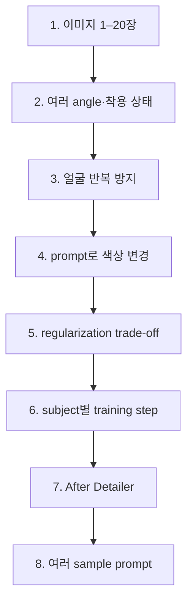

## Stable Diffusion 작업은 구성요소를 같은 파일로 묶지 않는다

Checkpoint·LoRA·VAE는 기반 생성, 추가 학습, 출력 보정이라는 서로 다른 위치를 맡는다.

<Tabs>
  <Tab label="Checkpoint">기존에 학습된 모델이며 Stable Diffusion 이미지 생성의 기반이 된다.</Tab>
  <Tab label="LoRA">기반 모델에 새 이미지·캐릭터·스타일을 추가 학습한 파일이다.</Tab>
  <Tab label="VAE">생성 이미지가 흐리거나 표현 보정이 필요할 때 적용한다.</Tab>
</Tabs>

| 구성요소 | 사용 방식 | source의 선택 정보 |
| :-- | :-- | :-- |
| Checkpoint | LoRA가 붙는 기존 학습 모델 | 별도 선택 기준은 없음 |
| LoRA | 직접 만들거나 사이트에서 다운로드 | prompt에 적용해 원하는 이미지 생성 |
| VAE | 생성 결과 보정에 적용 | 2D animation style 또는 photorealistic image |

- **기초 항목** — 설치, checkpoint 추가, txt2img, img2img가 학습 경로에 열거된다.
- **확장 항목** — LoRA, VAE, embedding, 배경 삭제, pose 제어, tag keyword가 이어진다.
- **Civitai** — models 화면이 배포 모델 탐색 경로로 제시된다.
- **게임 사례** — 주인공 LoRA를 만들어 여러 주인공 이미지를 생성할 수 있다고 설명한다.

## LoRA 가중치는 0.1–1.0 적용 강도로 제시된다

값 1은 LoRA를 100% 적용한다는 뜻이며 품질 점수로 설명되지 않는다.

```html preview
<div style="font-family:system-ui,sans-serif;padding:20px;color:var(--foreground)">
  <label for="amt" style="font-size:14px;font-weight:600">LoRA 가중치</label>
  <div id="out" style="font-size:30px;font-weight:700;color:var(--chart-1);margin:6px 0">1.0</div>
  <input id="amt" type="range" min="0.1" max="1.0" step="0.1" value="1.0"
    style="width:100%;accent-color:var(--primary)" />
  <p style="font-size:13px;color:var(--muted-foreground)">자료의 0.1–1.0 범위에서 적용 강도를 확인한다. 1은 100% 적용을 뜻한다.</p>
  <script>
    var amt = document.getElementById('amt');
    var out = document.getElementById('out');
    amt.addEventListener('input', function () {
      out.textContent = Number(amt.value).toFixed(1);
    });
  </script>
</div>
```

> [!warning] 가중치 시작점의 source 충돌
> 같은 문단은 범위를 0.1–1.0으로 적은 뒤 “0부터 각 단계별 변화”라고 말한다. Slider는 명시 범위 0.1–1.0만 사용하고 0은 원문 충돌로 남긴다.

## BlindBox는 최신 버전과 안정 버전을 다르게 제시한다

V3의 변경점은 눈 표현이고 현재 상태는 experimental이며 안정성 추천은 v1_mix다.

- **V3 변경** — 눈을 조정했다.
- **상태** — V3는 아직 experimental이다.
- **안정성 추천** — 안정성 관점에서는 v1_mix를 권한다.
- **판단 경계** — 최신 버전이라는 사실을 안정성 우위로 바꾸지 않는다.

> [!warning] Experimental 버전
> V3의 눈 조정은 확인되지만 안정성 추천은 v1_mix다. 두 버전을 하나의 품질 순위로 합치지 않는다.

## 의류 LoRA는 데이터와 학습 조건을 여덟 단계로 점검한다

목표는 mannequin이나 인물이 입은 옷을 새 인물·자세·배경에 적용하고 caption으로 mannequin 영향을 줄이는 것이다.



1. **이미지 수** — 1장부터 20장까지 사용할 수 있으며 많을수록 좋다고 적는다.
2. **각도와 착용** — 여러 angle에서 본 옷과 mannequin 또는 실제 인물의 착용 모습을 포함한다.
3. **얼굴 반복** — 같은 mannequin이나 인물 얼굴이 대부분의 이미지에서 반복되지 않게 한다.
4. **색상 변경** — 대부분의 경우 이후 prompt로 옷 색을 바꿀 수 있다.
5. **Regularization** — flexibility를 높일 수 있지만 resemblance가 조금 줄 수 있다.
6. **다중 subject** — 가능하지만 subject마다 필요한 training step이 달라 더 번거롭고 덜 flexible할 수 있다.
7. **얼굴 후처리** — training target의 full body face 품질을 위해 After Detailer를 사용한다.
8. **Sample prompt** — Kohya ss의 sample image generation box에 prompt를 한 줄씩 넣는다.

- **사진 선택** — 옷만 찍은 사진도 가능하지만 mannequin을 사용한 결과가 더 좋았다고 적는다.
- **비교 항목** — regularized와 non-regularized set의 결과를 비교한다.
- **학습 범위** — multiple subject training과 object training method를 다룬다.

> [!warning] 의류 항목의 원문 오기
> 추출문에는 angels, felxible, full boy faces가 남아 있다. 문맥상 angle, flexible, full body faces로 읽되 원문 표기를 오류로 보존한다.

## DreamBooth와 LoRA는 조정 범위와 산출물이 다르다

DreamBooth는 전용 모델, LoRA는 기존 모델의 일부 low-rank 조정을 중심으로 설명된다.

| 비교 축 | DreamBooth | LoRA |
| :-- | :-- | :-- |
| 데이터 | 사용자 지정 dataset과 특정 소수 이미지 | 적은 데이터로도 조정 가능 |
| 조정 | 특정 요구에 맞게 모델을 세부 조정 | 전체 대신 low-rank matrix만 update |
| 결과 | 특정 인물·스타일의 전용 모델 | 기존 모델 대부분을 유지한 추가 조정 |
| 장점 | 세밀한 특징, 높은 품질, 일관된 결과 | 메모리·계산 효율, 빠른 학습 |

- **DreamBooth** — Google Research가 개발한 기술로 소개된다.
- **적용 모델** — image generation과 text-to-image model에 자주 사용된다고 적는다.
- **LoRA** — 주로 text generation model에서 사용되며 특정 부분을 저랭크 행렬로 대체한다고 설명한다.

## 응용 사례는 네 가지 제작 목적을 확인한다

광고·게임·예술·교육은 source가 직접 열거한 Stable Diffusion fine-tuning의 응용 분야다.

| 응용 | source가 제시한 생성 대상 |
| :-- | :-- |
| 광고 디자인 | 특정 brand 이미지와 style에 맞춘 광고 이미지 |
| 게임 개발 | text 설명에 따른 캐릭터 또는 배경 이미지 |
| 예술 창작 | 작가의 style에 맞춘 예술 작품 |
| 교육 자료 제작 | 교육 content와 관련된 이미지 |

<details>
<summary>응용 사례를 읽는 체크리스트</summary>

- [ ] 네 분야를 source가 열거한 제작 목적으로만 기록했는가?
- [ ] 구현 절차나 정량 품질이 제시된 사례로 확대하지 않았는가?
- [ ] 분야 이름만으로 비용·권리·안전 검토가 끝났다고 쓰지 않았는가?

</details>

## 후반 sparse 화면은 후속 경로만 확인한다

마지막 일곱 화면은 링크·제목 수준이므로 구현 절차와 산업 성과를 추가하지 않는다.

- **DreamBooth 구현** — 코드와 구현 방법이라는 링크 제목만 남아 있다.
- **IP-Adapter** — Stable Diffusion 개선 활용이라는 링크 제목만 남아 있다.
- **PEFT inference** — Diffusers의 using PEFT for inference 문서 주소가 제시된다.
- **추가 자료** — 연구·blog 링크와 영상 주소가 이어진다.
- **자동차 디자인** — Autodesk의 Kia 생성형 AI 디자인 글과 Kia design 페이지가 제시된다.
- **제조 설계** — 생성형 AI 기반 제품 설계, 딥러닝 발전, DX 가상제품개발 환경이라는 표제가 나온다.

> [!warning] Sparse source의 한계
> 제목과 주소만으로 IP-Adapter 구조, PEFT 설정, 자동차 디자인 절차, 제조 설계 성능을 만들 수 없다.

## 점검 질문

- **Q.** 의류 LoRA에서 이미지 수만 늘리면 충분한가?
- **A.** 아니다. Angle·착용 상태·반복 얼굴·caption·regularization·subject별 step을 함께 확인해야 한다.
