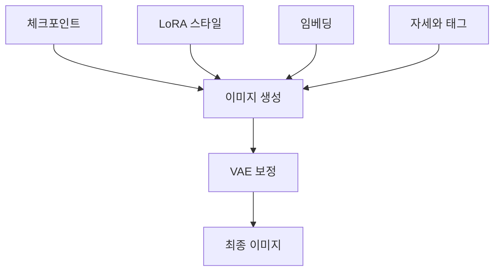
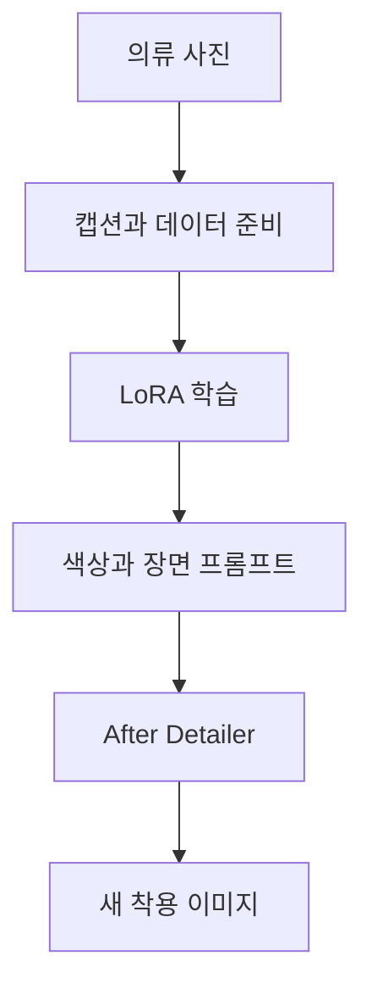

> [!NOTE]
> 이미지 LoRA는 체크포인트를 유지한 채 캐릭터·스타일·의류 특징을 덧붙이는 파일이며, 결과 품질은 가중치보다 데이터 구성과 적용 도구의 역할 구분에 먼저 좌우된다.

---

## Stable Diffusion 생태계에서의 위치

<Tabs>
  <Tab label="준비">Windows 설치와 체크포인트 추가가 생성 환경의 기반을 이룬다.</Tab>
  <Tab label="생성">txt2img와 img2img가 텍스트 또는 기존 이미지에서 결과를 만든다.</Tab>
  <Tab label="적응">LoRA는 원하는 스타일을 더하고, VAE는 이미지를 보정하며, embedding은 프롬프트 표현을 확장한다.</Tab>
  <Tab label="제어">배경 삭제, 자세 제어, 태그 키워드가 결과의 구도와 후처리를 돕는다.</Tab>
  <Tab label="공유">Civitai 같은 모델 저장소에서 LoRA와 관련 모델을 찾아 적용한다.</Tab>
</Tabs>



---

## LoRA 파일과 가중치

**핵심:** LoRA는 기존 체크포인트에 새 이미지의 스타일이나 대상을 추가 학습한 파일이다.

- 직접 만들거나 배포 사이트에서 내려받아 사용할 수 있다.
- 프롬프트에 LoRA를 적용해 원하는 이미지 방향을 강화한다.
- 게임 제작에서는 주인공 캐릭터 LoRA로 여러 장면의 주인공 이미지를 만들 수 있다.

```html preview
<div style="font-family:system-ui,sans-serif;padding:20px">
  <div id="cards" style="display:flex;gap:14px;flex-wrap:wrap"></div>
  <script>
    var stats = [
      ['LoRA 가중치', '0.1–1.0', '적용 가능한 범위', 'var(--chart-2)'],
      ['가중치 1', '100%', '원문 기준 전체 반영', 'var(--chart-1)'],
      ['의류 학습 이미지', '1–20장', '많을수록 유리', 'var(--chart-5)']
    ];
    document.getElementById('cards').innerHTML = stats.map(function (s) {
      return '<div style="flex:1;min-width:150px;padding:16px;background:var(--card);' +
        'color:var(--card-foreground);border:1px solid var(--border);' +
        'border-radius:var(--radius)">' +
        '<div style="font-size:13px;color:var(--muted-foreground)">' + s[0] + '</div>' +
        '<div style="font-size:26px;font-weight:700;margin-top:4px">' + s[1] + '</div>' +
        '<div style="font-size:12px;font-weight:600;margin-top:4px;color:' + s[3] + '">' +
        s[2] + '</div>' +
        '</div>';
    }).join('');
  </script>
</div>
```

> [!IMPORTANT]
> 원문은 가중치의 최소·최대와 `1 = 100%` 의미만 제시한다. 단계 간격과 권장 기본값이 없으므로 조절 슬라이더를 만들 근거는 없다.

---

## VAE와 BlindBox 버전 선택

| 구성 요소 | 역할 | 선택 기준 |
| :-- | :-- | :-- |
| VAE | 흐린 이미지를 보정하고 품질을 높임 | 2D 애니메이션풍과 실사 이미지 스타일에 맞춰 선택 |
| LoRA | 체크포인트에 대상·스타일을 덧붙임 | 프롬프트와 가중치로 반영 강도 조절 |
| 체크포인트 | 기본 생성 모델 | LoRA와 VAE가 작동할 기반 제공 |

| BlindBox 버전 | 원문 상태 | 선택 판단 |
| :-- | :-- | :-- |
| v3 | 눈 표현을 조정한 업데이트 | 아직 실험적 |
| v1_mix | 기존 혼합 버전 | 안정성 관점에서 권장 |

> [!CAUTION]
> 새 버전이라는 이유만으로 v3를 기본 선택하지 않는다. 이 자료의 설명은 안정성을 원하면 v1_mix를 권한다.

---

## 의류 LoRA의 데이터 조건

**목표:** 플라스틱 마네킹이나 사람에게 입힌 의류 사진으로 학습해, 새 인물·자세·배경에서 같은 옷을 재현한다.

| 데이터 형태 | 원문 관찰 | 결과 경향 |
| :-- | :-- | :-- |
| 의류만 촬영 | 학습 가능 | 마네킹이 있는 경우보다 결과가 좋지 않음 |
| 마네킹 착용 | 서로 다른 방향의 착용 형태를 제공 | 의류 형태 학습에 유리 |
| 실제 인물 착용 | 실제 착용 맥락을 제공 | 얼굴 반복을 피해야 함 |
| 캡셔닝과 준비 | 마네킹 정보를 분리하도록 도움 | 생성 결과에서 마네킹을 제거하는 데 활용 |



---

## 원문 순서 그대로의 8단계

| 단계 | 원문 지침 | 경계 또는 이유 |
| :-- | :-- | :-- |
| 1 | 학습에 1장부터 20장까지 사용하며 많을수록 좋다 | 데이터 규모 범위 |
| 2 | 의류를 여러 방향에서 보고 마네킹이나 실제 인물의 착용 모습도 담는다 | 형태와 착용 정보 |
| 3 | 마네킹이나 인물의 얼굴이 대부분의 이미지에서 반복되지 않게 한다 | 얼굴까지 함께 학습하는 것 방지 |
| 4 | 대부분의 경우 프롬프트로 의류 색상을 나중에 바꿀 수 있다 | 색상 제어 가능성 |
| 5 | 정규화는 유연성을 높일 수 있지만 닮음은 조금 줄일 수 있다 | 유연성·재현성 절충 |
| 6 | 여러 대상을 함께 학습할 수 있으나 대상별 학습 단계 수가 달라 단일 대상보다 번거롭고 덜 유연하다 | 다중 대상 비용 |
| 7 | After Detailer를 사용해 원문 표현상 `good full boy faces`를 얻는다 | 원문 표현을 임의 교정하지 않음 |
| 8 | Kohya ss의 sample image generation box에 줄마다 프롬프트 하나를 넣어 여러 프롬프트를 생성한다 | 샘플 생성 설정 |

<details>
<summary>정규화 세트와 다중 대상의 선택</summary>

정규화는 모델의 유연성을 높일 수 있지만 대상과의 닮음을 조금 줄일 수 있다. 여러 대상을 한 번에 학습할 수도 있으나 각 대상이 요구하는 학습 단계 수가 다를 수 있어 단일 대상 학습보다 조정이 복잡하다.

</details>

---

## DreamBooth와 LoRA의 역할 비교

| 기준 | DreamBooth | LoRA |
| :-- | :-- | :-- |
| 조정 대상 | 사용자 지정 데이터로 생성 모델을 특정 요구에 맞춤 | 모델의 특정 부분에 저랭크 행렬을 적용 |
| 데이터 | 특정한 소수 이미지로 세부 조정 | 적은 데이터로도 효율적 미세조정 |
| 출력 성격 | 특정 인물·스타일의 세밀한 특징과 일관성 | 기존 모델 대부분을 유지한 빠른 적응 |
| 자원 특성 | 전용 모델 생성에 초점 | 메모리·계산 효율과 빠른 학습에 초점 |
| 자료의 설명 맥락 | 텍스트-이미지 생성에서 자주 사용 | 텍스트 생성 중심 기법으로 소개한 뒤 이미지 사례에 연결 |

| 응용 분야 | 생성 목표 |
| :-- | :-- |
| 광고 디자인 | 브랜드 이미지와 스타일에 맞춘 광고 |
| 게임 개발 | 캐릭터나 배경을 텍스트 설명으로 생성 |
| 예술 창작 | 작가의 스타일에 맞춘 작품 |
| 교육 자료 | 교육 콘텐츠에 맞는 이미지 |

---

## 원문 오류와 추출 한계

> [!WARNING]
> 의류 학습 원문에는 `different angels`, `felxible`, `good full boy faces`, `it is possible to generated`라는 표기가 있다. 문맥상 교정 가능한 부분도 있지만, 이 노트는 오류를 숨기지 않고 해당 표현을 명시했다.

> [!WARNING]
> 후반 자료는 DreamBooth 구현, IP-Adapter, PEFT 추론, 관련 연구·영상의 식별자만 있고 설명 텍스트가 거의 없다. 따라서 설치 절차, 성능, 권장 설정을 추가로 추론하지 않았다.

| 최종 점검 | 확인 질문 |
| :-- | :-- |
| 기반 모델 | 어떤 체크포인트 위에 적용하는가 |
| LoRA | 대상·스타일을 무엇으로 학습했는가 |
| 가중치 | 0.1–1.0 범위에서 어떤 효과를 원하는가 |
| 데이터 | 얼굴·마네킹·배경 편향이 반복되지 않는가 |
| 버전 | 실험성보다 안정성을 우선하는가 |
| 후처리 | VAE와 After Detailer가 필요한가 |
