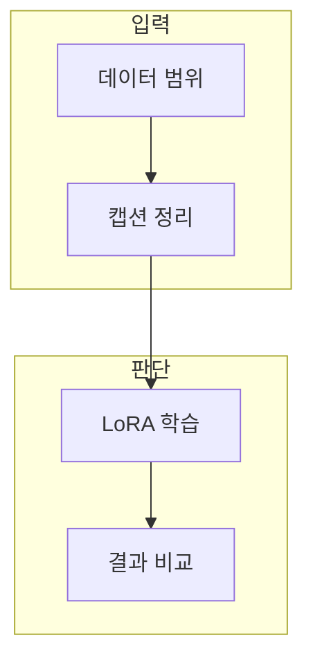

> [!abstract] 한 줄 요약
> 이미지 LoRA는 데이터 범위와 적용 강도를 분리해 비교할 때 목표 추종과 과도한 재현을 판별할 수 있다.

## 이 노트의 지도



## 1. 무엇을 학습시키는가

대상·스타일·표현 규칙 중 무엇을 유지하고 무엇을 배제할지 데이터와 캡션에서 분리한다. ==데이터 다양성== 는 목표와 무관한 우연한 배경 대신 필요한 조건 변화를 포함하는 정도.

> [!caution] 강도 비교
> 가중치 조절은 부족한 데이터 범위를 새로 가르치지 못한다.

## 2. 적용 강도와 결과 변화

같은 프롬프트·시드·해상도에서 강도만 바꾼 결과와 LoRA를 끈 결과를 함께 비교한다.

<details>
<summary>비교 실험 체크</summary>

- 목표 특징과 제외할 특징을 적는다.
- 고정 조건에서 가중치만 바꾼다.
- 학습 사례 밖의 조건도 평가한다.

</details>

## 데이터로 보기

```html preview
<div style="font-family:system-ui,sans-serif;padding:20px;color:var(--foreground)">
  <label for="amt" style="font-size:14px;font-weight:600">예시 적용 강도</label>
  <div id="out" style="font-size:30px;font-weight:700;color:var(--chart-1);margin:6px 0">강도 7</div>
  <input id="amt" type="range" min="0" max="15" step="1" value="7"
    style="width:100%;accent-color:var(--primary)" />
  <p style="font-size:13px;color:var(--muted-foreground)">값을 바꿔 목표 특징과 부작용을 같은 평가 조건에서 비교하는 순서를 생각한다.</p>
  <script>
    var amt = document.getElementById('amt');
    var out = document.getElementById('out');
    amt.addEventListener('input', function () {
      out.textContent = '강도 ' + Number(amt.value).toLocaleString();
    });
  </script>
</div>
```

**해석의 경계.** 강도 하나로 품질을 판정할 수 없다. 데이터 범위와 프롬프트 조건을 고정한 비교가 필요하다.

## 핵심 정리

| 개념 | 정의 | 왜 중요한가 |
| :-- | :-- | :-- |
| 캡션 | 학습할 속성을 설명 | 원하는 특징을 데이터에 연결 |
| 강도 | 어댑터 적용 정도 | 변화를 비교할 제어 변수 |
| 평가 | 고정 조건의 결과 비교 | 목표 추종과 과도한 재현을 구분 |

## 관련 개념

- LoRA: 저랭크 업데이트로 변화를 분리하는 방법
- 생성 이미지 검수: 결과의 일관성과 위험을 확인하는 과정

> [!question]- 스스로 점검
> **Q.** 데이터가 적을수록 적용 강도를 높이면 해결되는가?
>
> **A.** 아니다. 강도는 반영되는 변화를 조절할 뿐, 데이터가 대표하지 못한 조건을 가르치지 못한다.
